# contracts/control/bounded for-loop

```solidity -no-opt
// SPDX-License-Identifier: UNLICENSED
// Metadata ipfs://QmYPjcvsjL1MSEMDtdGswmUaxVMuxyeHsfaQgTgbUtUoKo
pragma solidity 0.7.6;

contract Contract {

    unknown var1__1; // Slot #0

    fallback() external payable {
        undefined local0 = 0x0; // #refs 4
        if (~(local0 < block.number) == 0) {
            var_1 = local0;
            undefined local1 = 0x1 + local0; // #refs 4
            if (~(local1 < block.number) == 0) {
                var_1 = local1;
                undefined local2 = 0x1 + local1; // #refs 4
                if (~(local2 < block.number) == 0) {
                    var_1 = local2;
                    undefined local3 = 0x1 + local2; // #refs 4
                    if (~(local3 < block.number) == 0) {
                        var_1 = local3;
                        undefined local4 = 0x1 + local3; // #refs 4
                        if (~(local4 < block.number) == 0) {
                            var_1 = local4;
                            undefined local5 = 0x1 + local4; // #refs 4
                            if (~(local5 < block.number) == 0) {
                                var_1 = local5;
                                undefined local6 = 0x1 + local5; // #refs 4
                                if (~(local6 < block.number) == 0) {
                                    var_1 = local6;
                                    undefined local7 = 0x1 + local6; // #refs 4
                                    if (~(local7 < block.number) == 0) {
                                        var_1 = local7;
                                        undefined local8 = 0x1 + local7; // #refs 4
                                        if (~(local8 < block.number) == 0) {
                                            var_1 = local8;
                                            undefined local9 = 0x1 + local8; // #refs 4
                                            if (~(local9 < block.number) == 0) {
                                                var_1 = local9;
                                                undefined local10 = 0x1 + local9; // #refs 4
                                                if (~(local10 < block.number) == 0) {
                                                    var_1 = local10;
                                                }
                                                return;
                                            }
                                            return;
                                        }
                                        return;
                                    }
                                    return;
                                }
                                return;
                            }
                            return;
                        }
                        return;
                    }
                    return;
                }
                return;
            }
            return;
        }
        return;
    }

}

```

```yul -no-opt
object "runtime" {
    code {
        mstore(0x40, 0x80)
        let local0 = 0x0 // #refs 4
        if (not(iszero(lt(local0, number())))) {
            sstore(0x0, local0)
            let local1 = add(0x1, local0) // #refs 4
            if (not(iszero(lt(local1, number())))) {
                sstore(0x0, local1)
                let local2 = add(0x1, local1) // #refs 4
                if (not(iszero(lt(local2, number())))) {
                    sstore(0x0, local2)
                    let local3 = add(0x1, local2) // #refs 4
                    if (not(iszero(lt(local3, number())))) {
                        sstore(0x0, local3)
                        let local4 = add(0x1, local3) // #refs 4
                        if (not(iszero(lt(local4, number())))) {
                            sstore(0x0, local4)
                            let local5 = add(0x1, local4) // #refs 4
                            if (not(iszero(lt(local5, number())))) {
                                sstore(0x0, local5)
                                let local6 = add(0x1, local5) // #refs 4
                                if (not(iszero(lt(local6, number())))) {
                                    sstore(0x0, local6)
                                    let local7 = add(0x1, local6) // #refs 4
                                    if (not(iszero(lt(local7, number())))) {
                                        sstore(0x0, local7)
                                        let local8 = add(0x1, local7) // #refs 4
                                        if (not(iszero(lt(local8, number())))) {
                                            sstore(0x0, local8)
                                            let local9 = add(0x1, local8) // #refs 4
                                            if (not(iszero(lt(local9, number())))) {
                                                sstore(0x0, local9)
                                                let local10 = add(0x1, local9) // #refs 4
                                                if (not(iszero(lt(local10, number())))) {
                                                    sstore(0x0, local10)
                                                }
                                                stop()
                                            }
                                            stop()
                                        }
                                        stop()
                                    }
                                    stop()
                                }
                                stop()
                            }
                            stop()
                        }
                        stop()
                    }
                    stop()
                }
                stop()
            }
            stop()
        }
        stop()

    }
}

```


```errors -no-opt
[]
```

```solidity -opt
// SPDX-License-Identifier: UNLICENSED
// Metadata ipfs://QmNeUP433KicpZd6iGR1rFCCUNQkYqaFR684J4LNiJSuaL
pragma solidity 0.7.6;

contract Contract {

    unknown var1__1; // Slot #0

    fallback() external payable {
        undefined local0 = 0x0; // #refs 1
        if (~(local0 < block.number) == 0) {
            var_1 = local0;
            undefined local1 = 0x1 + local0; // #refs 1
            if (~(local1 < block.number) == 0) {
                var_1 = local1;
                undefined local2 = 0x1 + local1; // #refs 1
                if (~(local2 < block.number) == 0) {
                    var_1 = local2;
                    undefined local3 = 0x1 + local2; // #refs 1
                    if (~(local3 < block.number) == 0) {
                        var_1 = local3;
                        undefined local4 = 0x1 + local3; // #refs 1
                        if (~(local4 < block.number) == 0) {
                            var_1 = local4;
                            undefined local5 = 0x1 + local4; // #refs 1
                            if (~(local5 < block.number) == 0) {
                                var_1 = local5;
                                undefined local6 = 0x1 + local5; // #refs 1
                                if (~(local6 < block.number) == 0) {
                                    var_1 = local6;
                                    undefined local7 = 0x1 + local6; // #refs 1
                                    if (~(local7 < block.number) == 0) {
                                        var_1 = local7;
                                        undefined local8 = 0x1 + local7; // #refs 1
                                        if (~(local8 < block.number) == 0) {
                                            var_1 = local8;
                                            undefined local9 = 0x1 + local8; // #refs 1
                                            if (~(local9 < block.number) == 0) {
                                                var_1 = local9;
                                                undefined local10 = 0x1 + local9; // #refs 1
                                                if (~(local10 < block.number) == 0) {
                                                    var_1 = local10;
                                                }
                                                return;
                                            }
                                            return;
                                        }
                                        return;
                                    }
                                    return;
                                }
                                return;
                            }
                            return;
                        }
                        return;
                    }
                    return;
                }
                return;
            }
            return;
        }
        return;
    }

}

```

```yul -opt
object "runtime" {
    code {
        mstore(0x40, 0x80)
        let local0 = 0x0 // #refs 1
        if (not(iszero(lt(local0, number())))) {
            sstore(0x0, local0)
            let local1 = add(0x1, local0) // #refs 1
            if (not(iszero(lt(local1, number())))) {
                sstore(0x0, local1)
                let local2 = add(0x1, local1) // #refs 1
                if (not(iszero(lt(local2, number())))) {
                    sstore(0x0, local2)
                    let local3 = add(0x1, local2) // #refs 1
                    if (not(iszero(lt(local3, number())))) {
                        sstore(0x0, local3)
                        let local4 = add(0x1, local3) // #refs 1
                        if (not(iszero(lt(local4, number())))) {
                            sstore(0x0, local4)
                            let local5 = add(0x1, local4) // #refs 1
                            if (not(iszero(lt(local5, number())))) {
                                sstore(0x0, local5)
                                let local6 = add(0x1, local5) // #refs 1
                                if (not(iszero(lt(local6, number())))) {
                                    sstore(0x0, local6)
                                    let local7 = add(0x1, local6) // #refs 1
                                    if (not(iszero(lt(local7, number())))) {
                                        sstore(0x0, local7)
                                        let local8 = add(0x1, local7) // #refs 1
                                        if (not(iszero(lt(local8, number())))) {
                                            sstore(0x0, local8)
                                            let local9 = add(0x1, local8) // #refs 1
                                            if (not(iszero(lt(local9, number())))) {
                                                sstore(0x0, local9)
                                                let local10 = add(0x1, local9) // #refs 1
                                                if (not(iszero(lt(local10, number())))) {
                                                    sstore(0x0, local10)
                                                }
                                                stop()
                                            }
                                            stop()
                                        }
                                        stop()
                                    }
                                    stop()
                                }
                                stop()
                            }
                            stop()
                        }
                        stop()
                    }
                    stop()
                }
                stop()
            }
            stop()
        }
        stop()

    }
}

```



```mermaid -opt
---
title: bounded for-loop-opt
---
flowchart TD
  classDef state text-align:left
  subgraph cluster_0 ["pc @0"]
    s_0[["pc @0 (s_0)
=|0x0
memory[0x40] = 0x80;
fall: 7:
"]]
    class s_0 state
    style s_0 fill:#471C21
  end
  subgraph cluster_7 ["pc @7"]
    s_1("pc @7 (s_1)
=|local0
undefined local0 = 0x0; // #refs 1
when (local0 < block.number) == 0 goto 26 or fall 15
")
    class s_1 state
    s_2("pc @7 (s_2)
=|local1
undefined local1 = 0x1 + local0; // #refs 1
when (local1 < block.number) == 0 goto 26 or fall 15
")
    class s_2 state
    s_3("pc @7 (s_3)
=|local2
undefined local2 = 0x1 + local1; // #refs 1
when (local2 < block.number) == 0 goto 26 or fall 15
")
    class s_3 state
    s_4("pc @7 (s_4)
=|local3
undefined local3 = 0x1 + local2; // #refs 1
when (local3 < block.number) == 0 goto 26 or fall 15
")
    class s_4 state
    s_5("pc @7 (s_5)
=|local4
undefined local4 = 0x1 + local3; // #refs 1
when (local4 < block.number) == 0 goto 26 or fall 15
")
    class s_5 state
    s_6("pc @7 (s_6)
=|local5
undefined local5 = 0x1 + local4; // #refs 1
when (local5 < block.number) == 0 goto 26 or fall 15
")
    class s_6 state
    s_7("pc @7 (s_7)
=|local6
undefined local6 = 0x1 + local5; // #refs 1
when (local6 < block.number) == 0 goto 26 or fall 15
")
    class s_7 state
    s_8("pc @7 (s_8)
=|local7
undefined local7 = 0x1 + local6; // #refs 1
when (local7 < block.number) == 0 goto 26 or fall 15
")
    class s_8 state
    s_9("pc @7 (s_9)
=|local8
undefined local8 = 0x1 + local7; // #refs 1
when (local8 < block.number) == 0 goto 26 or fall 15
")
    class s_9 state
    s_10("pc @7 (s_10)
=|local9
undefined local9 = 0x1 + local8; // #refs 1
when (local9 < block.number) == 0 goto 26 or fall 15
")
    class s_10 state
    s_11("pc @7 (s_11)
=|local10
undefined local10 = 0x1 + local9; // #refs 1
when (local10 < block.number) == 0 goto 26 or fall 15
")
    class s_11 state
  end
  subgraph cluster_15 ["pc @15"]
    s_12("pc @15 (s_12)
=|add(0x1, local0)
var_1 = local0;
goto :[J]0x7 branch:7
")
    class s_12 state
    s_13("pc @15 (s_13)
=|add(0x1, local1)
var_1 = local1;
goto :[J]0x7 branch:7
")
    class s_13 state
    s_14("pc @15 (s_14)
=|add(0x1, local2)
var_1 = local2;
goto :[J]0x7 branch:7
")
    class s_14 state
    s_15("pc @15 (s_15)
=|add(0x1, local3)
var_1 = local3;
goto :[J]0x7 branch:7
")
    class s_15 state
    s_16("pc @15 (s_16)
=|add(0x1, local4)
var_1 = local4;
goto :[J]0x7 branch:7
")
    class s_16 state
    s_17("pc @15 (s_17)
=|add(0x1, local5)
var_1 = local5;
goto :[J]0x7 branch:7
")
    class s_17 state
    s_18("pc @15 (s_18)
=|add(0x1, local6)
var_1 = local6;
goto :[J]0x7 branch:7
")
    class s_18 state
    s_19("pc @15 (s_19)
=|add(0x1, local7)
var_1 = local7;
goto :[J]0x7 branch:7
")
    class s_19 state
    s_20("pc @15 (s_20)
=|add(0x1, local8)
var_1 = local8;
goto :[J]0x7 branch:7
")
    class s_20 state
    s_21("pc @15 (s_21)
=|add(0x1, local9)
var_1 = local9;
goto :[J]0x7 branch:7
")
    class s_21 state
    s_22("pc @15 (s_22)
=|add(0x1, local10)
var_1 = local10;
goto :[J]0x7 branch:7
")
    class s_22 state
  end
  subgraph cluster_26 ["pc @26"]
    s_23("pc @26 (s_23)
=|
return;
")
    class s_23 state
    s_24("pc @26 (s_24)
=|
return;
")
    class s_24 state
    s_25("pc @26 (s_25)
=|
return;
")
    class s_25 state
    s_26("pc @26 (s_26)
=|
return;
")
    class s_26 state
    s_27("pc @26 (s_27)
=|
return;
")
    class s_27 state
    s_28("pc @26 (s_28)
=|
return;
")
    class s_28 state
    s_29("pc @26 (s_29)
=|
return;
")
    class s_29 state
    s_30("pc @26 (s_30)
=|
return;
")
    class s_30 state
    s_31("pc @26 (s_31)
=|
return;
")
    class s_31 state
    s_32("pc @26 (s_32)
=|
return;
")
    class s_32 state
    s_33("pc @26 (s_33)
=|
return;
")
    class s_33 state
  end
  s_0 -. jumpdest .-> s_1;
  s_1 -- jumpi --> s_33;
  s_1 -. fall .-> s_12;
  s_2 -- jumpi --> s_32;
  s_2 -. fall .-> s_13;
  s_3 -- jumpi --> s_31;
  s_3 -. fall .-> s_14;
  s_4 -- jumpi --> s_30;
  s_4 -. fall .-> s_15;
  s_5 -- jumpi --> s_29;
  s_5 -. fall .-> s_16;
  s_6 -- jumpi --> s_28;
  s_6 -. fall .-> s_17;
  s_7 -- jumpi --> s_27;
  s_7 -. fall .-> s_18;
  s_8 -- jumpi --> s_26;
  s_8 -. fall .-> s_19;
  s_9 -- jumpi --> s_25;
  s_9 -. fall .-> s_20;
  s_10 -- jumpi --> s_24;
  s_10 -. fall .-> s_21;
  s_11 -- jumpi --> s_23;
  s_11 -. fall .-> s_22;
  s_12 -- jump --> s_2;
  s_13 -- jump --> s_3;
  s_14 -- jump --> s_4;
  s_15 -- jump --> s_5;
  s_16 -- jump --> s_6;
  s_17 -- jump --> s_7;
  s_18 -- jump --> s_8;
  s_19 -- jump --> s_9;
  s_20 -- jump --> s_10;
  s_21 -- jump --> s_11;
  s_22 -- jump --> undefined;

```

```errors -opt
[]
```
