# contracts/control/constant for-loop

```solidity -no-opt
// SPDX-License-Identifier: UNLICENSED
// Metadata ipfs://QmWjwERbMLXZ7K6YY5DH837AxWUFLdA8dPUuYd8343cPjL
pragma solidity 0.7.6;

contract Contract {

    event Deposit(uint256 _arg0);

    fallback() external payable {
        undefined local0 = 0x0; // #refs 3
        emit Deposit(local0);
        undefined local3 = 0x1 + local0; // #refs 3
        emit Deposit(local3);
        undefined local6 = 0x1 + local3; // #refs 3
        emit Deposit(local6);
        undefined local9 = 0x1 + local6; // #refs 3
        emit Deposit(local9);
        undefined local12 = 0x1 + local9; // #refs 3
        emit Deposit(local12);
        undefined local15 = 0x1 + local12; // #refs 3
        emit Deposit(local15);
        undefined local18 = 0x1 + local15; // #refs 3
        emit Deposit(local18);
        undefined local21 = 0x1 + local18; // #refs 3
        emit Deposit(local21);
        undefined local24 = 0x1 + local21; // #refs 3
        emit Deposit(local24);
        undefined local27 = 0x1 + local24; // #refs 3
        emit Deposit(local27);
        return;
    }

}

```

```yul -no-opt
object "runtime" {
    code {
        mstore(0x40, 0x80)
        let local0 = 0x0 // #refs 3
        let local1 = mload(0x40) // #refs 0
        mstore(local1, local0)
        let local2 = mload(0x40) // #refs 0
        log1(local2, sub(add(0x20, local1), local2), 0x4d6ce1e535dbade1c23defba91e23b8f791ce5edc0cc320257a2b364e4e38426)
        let local3 = add(0x1, local0) // #refs 3
        let local4 = mload(0x40) // #refs 0
        mstore(local4, local3)
        let local5 = mload(0x40) // #refs 0
        log1(local5, sub(add(0x20, local4), local5), 0x4d6ce1e535dbade1c23defba91e23b8f791ce5edc0cc320257a2b364e4e38426)
        let local6 = add(0x1, local3) // #refs 3
        let local7 = mload(0x40) // #refs 0
        mstore(local7, local6)
        let local8 = mload(0x40) // #refs 0
        log1(local8, sub(add(0x20, local7), local8), 0x4d6ce1e535dbade1c23defba91e23b8f791ce5edc0cc320257a2b364e4e38426)
        let local9 = add(0x1, local6) // #refs 3
        let local10 = mload(0x40) // #refs 0
        mstore(local10, local9)
        let local11 = mload(0x40) // #refs 0
        log1(local11, sub(add(0x20, local10), local11), 0x4d6ce1e535dbade1c23defba91e23b8f791ce5edc0cc320257a2b364e4e38426)
        let local12 = add(0x1, local9) // #refs 3
        let local13 = mload(0x40) // #refs 0
        mstore(local13, local12)
        let local14 = mload(0x40) // #refs 0
        log1(local14, sub(add(0x20, local13), local14), 0x4d6ce1e535dbade1c23defba91e23b8f791ce5edc0cc320257a2b364e4e38426)
        let local15 = add(0x1, local12) // #refs 3
        let local16 = mload(0x40) // #refs 0
        mstore(local16, local15)
        let local17 = mload(0x40) // #refs 0
        log1(local17, sub(add(0x20, local16), local17), 0x4d6ce1e535dbade1c23defba91e23b8f791ce5edc0cc320257a2b364e4e38426)
        let local18 = add(0x1, local15) // #refs 3
        let local19 = mload(0x40) // #refs 0
        mstore(local19, local18)
        let local20 = mload(0x40) // #refs 0
        log1(local20, sub(add(0x20, local19), local20), 0x4d6ce1e535dbade1c23defba91e23b8f791ce5edc0cc320257a2b364e4e38426)
        let local21 = add(0x1, local18) // #refs 3
        let local22 = mload(0x40) // #refs 0
        mstore(local22, local21)
        let local23 = mload(0x40) // #refs 0
        log1(local23, sub(add(0x20, local22), local23), 0x4d6ce1e535dbade1c23defba91e23b8f791ce5edc0cc320257a2b364e4e38426)
        let local24 = add(0x1, local21) // #refs 3
        let local25 = mload(0x40) // #refs 0
        mstore(local25, local24)
        let local26 = mload(0x40) // #refs 0
        log1(local26, sub(add(0x20, local25), local26), 0x4d6ce1e535dbade1c23defba91e23b8f791ce5edc0cc320257a2b364e4e38426)
        let local27 = add(0x1, local24) // #refs 3
        let local28 = mload(0x40) // #refs 0
        mstore(local28, local27)
        let local29 = mload(0x40) // #refs 0
        log1(local29, sub(add(0x20, local28), local29), 0x4d6ce1e535dbade1c23defba91e23b8f791ce5edc0cc320257a2b364e4e38426)
        let local30 = add(0x1, local27) // #refs 0
        stop()

    }
}

```



```mermaid -no-opt
---
title: constant for-loop-no-opt
---
flowchart TD
  classDef state text-align:left
  subgraph cluster_0 ["pc @0"]
    s_0[["pc @0 (#s_0)
=|0x0
memory[0x40] = 0x80;
fall: 7:
"]]
    class s_0 state
    style s_0 fill:#471C21
  end
  subgraph cluster_7 ["pc @7"]
    s_1("pc @7 (#s_1)
=|local0
undefined local0 = 0x0; // #refs 3
when (local0 < 0xa) == 0 goto 82 or fall 16
")
    class s_1 state
    s_3("pc @7 (#s_3)
=|local3
undefined local3 = 0x1 + local0; // #refs 3
when (local3 < 0xa) == 0 goto 82 or fall 16
")
    class s_3 state
    s_5("pc @7 (#s_5)
=|local6
undefined local6 = 0x1 + local3; // #refs 3
when (local6 < 0xa) == 0 goto 82 or fall 16
")
    class s_5 state
    s_7("pc @7 (#s_7)
=|local9
undefined local9 = 0x1 + local6; // #refs 3
when (local9 < 0xa) == 0 goto 82 or fall 16
")
    class s_7 state
    s_9("pc @7 (#s_9)
=|local12
undefined local12 = 0x1 + local9; // #refs 3
when (local12 < 0xa) == 0 goto 82 or fall 16
")
    class s_9 state
    s_11("pc @7 (#s_11)
=|local15
undefined local15 = 0x1 + local12; // #refs 3
when (local15 < 0xa) == 0 goto 82 or fall 16
")
    class s_11 state
    s_13("pc @7 (#s_13)
=|local18
undefined local18 = 0x1 + local15; // #refs 3
when (local18 < 0xa) == 0 goto 82 or fall 16
")
    class s_13 state
    s_15("pc @7 (#s_15)
=|local21
undefined local21 = 0x1 + local18; // #refs 3
when (local21 < 0xa) == 0 goto 82 or fall 16
")
    class s_15 state
    s_17("pc @7 (#s_17)
=|local24
undefined local24 = 0x1 + local21; // #refs 3
when (local24 < 0xa) == 0 goto 82 or fall 16
")
    class s_17 state
    s_19("pc @7 (#s_19)
=|local27
undefined local27 = 0x1 + local24; // #refs 3
when (local27 < 0xa) == 0 goto 82 or fall 16
")
    class s_19 state
    s_21("pc @7 (#s_21)
=|local30
undefined local30 = 0x1 + local27; // #refs 0
when (0x1 + local27 < 0xa) == 0 goto 82 or fall 16
")
    class s_21 state
  end
  subgraph cluster_16 ["pc @16"]
    s_2("pc @16 (#s_2)
=|add(0x1, local0)
undefined local1 = memory[0x40]; // #refs 0
memory[memory[0x40]] = local0;
undefined local2 = memory[0x40]; // #refs 0
emit Deposit(local0);
goto :[J]0x7 branch:7
")
    class s_2 state
    s_4("pc @16 (#s_4)
=|add(0x1, local3)
undefined local4 = memory[0x40]; // #refs 0
memory[memory[0x40]] = local3;
undefined local5 = memory[0x40]; // #refs 0
emit Deposit(local3);
goto :[J]0x7 branch:7
")
    class s_4 state
    s_6("pc @16 (#s_6)
=|add(0x1, local6)
undefined local7 = memory[0x40]; // #refs 0
memory[memory[0x40]] = local6;
undefined local8 = memory[0x40]; // #refs 0
emit Deposit(local6);
goto :[J]0x7 branch:7
")
    class s_6 state
    s_8("pc @16 (#s_8)
=|add(0x1, local9)
undefined local10 = memory[0x40]; // #refs 0
memory[memory[0x40]] = local9;
undefined local11 = memory[0x40]; // #refs 0
emit Deposit(local9);
goto :[J]0x7 branch:7
")
    class s_8 state
    s_10("pc @16 (#s_10)
=|add(0x1, local12)
undefined local13 = memory[0x40]; // #refs 0
memory[memory[0x40]] = local12;
undefined local14 = memory[0x40]; // #refs 0
emit Deposit(local12);
goto :[J]0x7 branch:7
")
    class s_10 state
    s_12("pc @16 (#s_12)
=|add(0x1, local15)
undefined local16 = memory[0x40]; // #refs 0
memory[memory[0x40]] = local15;
undefined local17 = memory[0x40]; // #refs 0
emit Deposit(local15);
goto :[J]0x7 branch:7
")
    class s_12 state
    s_14("pc @16 (#s_14)
=|add(0x1, local18)
undefined local19 = memory[0x40]; // #refs 0
memory[memory[0x40]] = local18;
undefined local20 = memory[0x40]; // #refs 0
emit Deposit(local18);
goto :[J]0x7 branch:7
")
    class s_14 state
    s_16("pc @16 (#s_16)
=|add(0x1, local21)
undefined local22 = memory[0x40]; // #refs 0
memory[memory[0x40]] = local21;
undefined local23 = memory[0x40]; // #refs 0
emit Deposit(local21);
goto :[J]0x7 branch:7
")
    class s_16 state
    s_18("pc @16 (#s_18)
=|add(0x1, local24)
undefined local25 = memory[0x40]; // #refs 0
memory[memory[0x40]] = local24;
undefined local26 = memory[0x40]; // #refs 0
emit Deposit(local24);
goto :[J]0x7 branch:7
")
    class s_18 state
    s_20("pc @16 (#s_20)
=|add(0x1, local27)
undefined local28 = memory[0x40]; // #refs 0
memory[memory[0x40]] = local27;
undefined local29 = memory[0x40]; // #refs 0
emit Deposit(local27);
goto :[J]0x7 branch:7
")
    class s_20 state
  end
  subgraph cluster_82 ["pc @82"]
    s_22("pc @82 (#s_22)
=|
return;
")
    class s_22 state
  end
  s_0 -- jumpdest --> s_1;
  s_1 == jumpi1_1 ==> s_undefined;
  s_1 -- fall --> s_2;
  s_3 == jumpi3_3 ==> s_undefined;
  s_3 -- fall --> s_4;
  s_5 == jumpi5_5 ==> s_undefined;
  s_5 -- fall --> s_6;
  s_7 == jumpi7_7 ==> s_undefined;
  s_7 -- fall --> s_8;
  s_9 == jumpi9_9 ==> s_undefined;
  s_9 -- fall --> s_10;
  s_11 == jumpi11_11 ==> s_undefined;
  s_11 -- fall --> s_12;
  s_13 == jumpi13_13 ==> s_undefined;
  s_13 -- fall --> s_14;
  s_15 == jumpi15_15 ==> s_undefined;
  s_15 -- fall --> s_16;
  s_17 == jumpi17_17 ==> s_undefined;
  s_17 -- fall --> s_18;
  s_19 == jumpi19_19 ==> s_undefined;
  s_19 -- fall --> s_20;
  s_21 == jumpi21_21 ==> s_22;
  s_21 -- fall --> s_undefined;
  s_2 == jump2_2 ==> s_3;
  s_4 == jump4_4 ==> s_5;
  s_6 == jump6_6 ==> s_7;
  s_8 == jump8_8 ==> s_9;
  s_10 == jump10_10 ==> s_11;
  s_12 == jump12_12 ==> s_13;
  s_14 == jump14_14 ==> s_15;
  s_16 == jump16_16 ==> s_17;
  s_18 == jump18_18 ==> s_19;
  s_20 == jump20_20 ==> s_21;

```

```errors -no-opt
[]
```

```solidity -opt
// SPDX-License-Identifier: UNLICENSED
// Metadata ipfs://QmWGuptwUJ3KM1ikcPoF2WwvJo5XafJa96Egs2orHuuaaF
pragma solidity 0.7.6;

contract Contract {

    event Deposit(uint256 _arg0);

    fallback() external payable {
        emit Deposit(0x0);
        emit Deposit(0x1 + 0x0);
        emit Deposit(0x1 + 0x1 + 0x0);
        emit Deposit(0x1 + 0x1 + 0x1 + 0x0);
        emit Deposit(0x1 + 0x1 + 0x1 + 0x1 + 0x0);
        emit Deposit(0x1 + 0x1 + 0x1 + 0x1 + 0x1 + 0x0);
        emit Deposit(0x1 + 0x1 + 0x1 + 0x1 + 0x1 + 0x1 + 0x0);
        emit Deposit(0x1 + 0x1 + 0x1 + 0x1 + 0x1 + 0x1 + 0x1 + 0x0);
        emit Deposit(0x1 + 0x1 + 0x1 + 0x1 + 0x1 + 0x1 + 0x1 + 0x1 + 0x0);
        emit Deposit(0x1 + 0x1 + 0x1 + 0x1 + 0x1 + 0x1 + 0x1 + 0x1 + 0x1 + 0x0);
        return;
    }

}

```

```yul -opt
object "runtime" {
    code {
        mstore(0x40, 0x80)
        let local0 = 0x0 // #refs 0
        let local1 = 0x40 // #refs 0
        let local2 = mload(local1) // #refs -1
        mstore(local2, local0)
        let local3 = mload(local1) // #refs 0
        log1(local3, add(0x20, sub(local2, local3)), 0x4d6ce1e535dbade1c23defba91e23b8f791ce5edc0cc320257a2b364e4e38426)
        let local4 = add(0x1, local0) // #refs 0
        let local5 = 0x40 // #refs 0
        let local6 = mload(local5) // #refs -1
        mstore(local6, local4)
        let local7 = mload(local5) // #refs 0
        log1(local7, add(0x20, sub(local6, local7)), 0x4d6ce1e535dbade1c23defba91e23b8f791ce5edc0cc320257a2b364e4e38426)
        let local8 = add(0x1, local4) // #refs 0
        let local9 = 0x40 // #refs 0
        let local10 = mload(local9) // #refs -1
        mstore(local10, local8)
        let local11 = mload(local9) // #refs 0
        log1(local11, add(0x20, sub(local10, local11)), 0x4d6ce1e535dbade1c23defba91e23b8f791ce5edc0cc320257a2b364e4e38426)
        let local12 = add(0x1, local8) // #refs 0
        let local13 = 0x40 // #refs 0
        let local14 = mload(local13) // #refs -1
        mstore(local14, local12)
        let local15 = mload(local13) // #refs 0
        log1(local15, add(0x20, sub(local14, local15)), 0x4d6ce1e535dbade1c23defba91e23b8f791ce5edc0cc320257a2b364e4e38426)
        let local16 = add(0x1, local12) // #refs 0
        let local17 = 0x40 // #refs 0
        let local18 = mload(local17) // #refs -1
        mstore(local18, local16)
        let local19 = mload(local17) // #refs 0
        log1(local19, add(0x20, sub(local18, local19)), 0x4d6ce1e535dbade1c23defba91e23b8f791ce5edc0cc320257a2b364e4e38426)
        let local20 = add(0x1, local16) // #refs 0
        let local21 = 0x40 // #refs 0
        let local22 = mload(local21) // #refs -1
        mstore(local22, local20)
        let local23 = mload(local21) // #refs 0
        log1(local23, add(0x20, sub(local22, local23)), 0x4d6ce1e535dbade1c23defba91e23b8f791ce5edc0cc320257a2b364e4e38426)
        let local24 = add(0x1, local20) // #refs 0
        let local25 = 0x40 // #refs 0
        let local26 = mload(local25) // #refs -1
        mstore(local26, local24)
        let local27 = mload(local25) // #refs 0
        log1(local27, add(0x20, sub(local26, local27)), 0x4d6ce1e535dbade1c23defba91e23b8f791ce5edc0cc320257a2b364e4e38426)
        let local28 = add(0x1, local24) // #refs 0
        let local29 = 0x40 // #refs 0
        let local30 = mload(local29) // #refs -1
        mstore(local30, local28)
        let local31 = mload(local29) // #refs 0
        log1(local31, add(0x20, sub(local30, local31)), 0x4d6ce1e535dbade1c23defba91e23b8f791ce5edc0cc320257a2b364e4e38426)
        let local32 = add(0x1, local28) // #refs 0
        let local33 = 0x40 // #refs 0
        let local34 = mload(local33) // #refs -1
        mstore(local34, local32)
        let local35 = mload(local33) // #refs 0
        log1(local35, add(0x20, sub(local34, local35)), 0x4d6ce1e535dbade1c23defba91e23b8f791ce5edc0cc320257a2b364e4e38426)
        let local36 = add(0x1, local32) // #refs 0
        let local37 = 0x40 // #refs 0
        let local38 = mload(local37) // #refs -1
        mstore(local38, local36)
        let local39 = mload(local37) // #refs 0
        log1(local39, add(0x20, sub(local38, local39)), 0x4d6ce1e535dbade1c23defba91e23b8f791ce5edc0cc320257a2b364e4e38426)
        let local40 = add(0x1, local36) // #refs 0
        stop()

    }
}

```



```mermaid -opt
---
title: constant for-loop-opt
---
flowchart TD
  classDef state text-align:left
  subgraph cluster_0 ["pc @0"]
    s_0[["pc @0 (#s_0)
=|0x0
memory[0x40] = 0x80;
fall: 7:
"]]
    class s_0 state
    style s_0 fill:#471C21
  end
  subgraph cluster_7 ["pc @7"]
    s_1("pc @7 (#s_1)
=|local0
undefined local0 = 0x0; // #refs 0
when (0x0 < 0xa) == 0 goto 73 or fall 16
")
    class s_1 state
    s_3("pc @7 (#s_3)
=|local4
undefined local4 = 0x1 + 0x0; // #refs 0
when (0x1 + 0x0 < 0xa) == 0 goto 73 or fall 16
")
    class s_3 state
    s_5("pc @7 (#s_5)
=|local8
undefined local8 = 0x1 + 0x1 + 0x0; // #refs 0
when (0x1 + 0x1 + 0x0 < 0xa) == 0 goto 73 or fall 16
")
    class s_5 state
    s_7("pc @7 (#s_7)
=|local12
undefined local12 = 0x1 + 0x1 + 0x1 + 0x0; // #refs 0
when (0x1 + 0x1 + 0x1 + 0x0 < 0xa) == 0 goto 73 or fall 16
")
    class s_7 state
    s_9("pc @7 (#s_9)
=|local16
undefined local16 = 0x1 + 0x1 + 0x1 + 0x1 + 0x0; // #refs 0
when (0x1 + 0x1 + 0x1 + 0x1 + 0x0 < 0xa) == 0 goto 73 or fall 16
")
    class s_9 state
    s_11("pc @7 (#s_11)
=|local20
undefined local20 = 0x1 + 0x1 + 0x1 + 0x1 + 0x1 + 0x0; // #refs 0
when (0x1 + 0x1 + 0x1 + 0x1 + 0x1 + 0x0 < 0xa) == 0 goto 73 or fall 16
")
    class s_11 state
    s_13("pc @7 (#s_13)
=|local24
undefined local24 = 0x1 + 0x1 + 0x1 + 0x1 + 0x1 + 0x1 + 0x0; // #refs 0
when (0x1 + 0x1 + 0x1 + 0x1 + 0x1 + 0x1 + 0x0 < 0xa) == 0 goto 73 or fall 16
")
    class s_13 state
    s_15("pc @7 (#s_15)
=|local28
undefined local28 = 0x1 + 0x1 + 0x1 + 0x1 + 0x1 + 0x1 + 0x1 + 0x0; // #refs 0
when (0x1 + 0x1 + 0x1 + 0x1 + 0x1 + 0x1 + 0x1 + 0x0 < 0xa) == 0 goto 73 or fall 16
")
    class s_15 state
    s_17("pc @7 (#s_17)
=|local32
undefined local32 = 0x1 + 0x1 + 0x1 + 0x1 + 0x1 + 0x1 + 0x1 + 0x1 + 0x0; // #refs 0
when (0x1 + 0x1 + 0x1 + 0x1 + 0x1 + 0x1 + 0x1 + 0x1 + 0x0 < 0xa) == 0 goto 73 or fall 16
")
    class s_17 state
    s_19("pc @7 (#s_19)
=|local36
undefined local36 = 0x1 + 0x1 + 0x1 + 0x1 + 0x1 + 0x1 + 0x1 + 0x1 + 0x1 + 0x0; // #refs 0
when (0x1 + 0x1 + 0x1 + 0x1 + 0x1 + 0x1 + 0x1 + 0x1 + 0x1 + 0x0 < 0xa) == 0 goto 73 or fall 16
")
    class s_19 state
    s_21("pc @7 (#s_21)
=|local40
undefined local40 = 0x1 + 0x1 + 0x1 + 0x1 + 0x1 + 0x1 + 0x1 + 0x1 + 0x1 + 0x1 + 0x0; // #refs 0
when (0x1 + 0x1 + 0x1 + 0x1 + 0x1 + 0x1 + 0x1 + 0x1 + 0x1 + 0x1 + 0x0 < 0xa) == 0 goto 73 or fall 16
")
    class s_21 state
  end
  subgraph cluster_16 ["pc @16"]
    s_2("pc @16 (#s_2)
=|add(0x1, local0)
undefined local1 = 0x40; // #refs 0
undefined local2 = memory[0x40]; // #refs -1
memory[memory[0x40]] = 0x0;
undefined local3 = memory[0x40]; // #refs 0
emit Deposit(0x0);
goto :[J]0x7 branch:7
")
    class s_2 state
    s_4("pc @16 (#s_4)
=|add(0x1, local4)
undefined local5 = 0x40; // #refs 0
undefined local6 = memory[0x40]; // #refs -1
memory[memory[0x40]] = 0x1 + 0x0;
undefined local7 = memory[0x40]; // #refs 0
emit Deposit(0x1 + 0x0);
goto :[J]0x7 branch:7
")
    class s_4 state
    s_6("pc @16 (#s_6)
=|add(0x1, local8)
undefined local9 = 0x40; // #refs 0
undefined local10 = memory[0x40]; // #refs -1
memory[memory[0x40]] = 0x1 + 0x1 + 0x0;
undefined local11 = memory[0x40]; // #refs 0
emit Deposit(0x1 + 0x1 + 0x0);
goto :[J]0x7 branch:7
")
    class s_6 state
    s_8("pc @16 (#s_8)
=|add(0x1, local12)
undefined local13 = 0x40; // #refs 0
undefined local14 = memory[0x40]; // #refs -1
memory[memory[0x40]] = 0x1 + 0x1 + 0x1 + 0x0;
undefined local15 = memory[0x40]; // #refs 0
emit Deposit(0x1 + 0x1 + 0x1 + 0x0);
goto :[J]0x7 branch:7
")
    class s_8 state
    s_10("pc @16 (#s_10)
=|add(0x1, local16)
undefined local17 = 0x40; // #refs 0
undefined local18 = memory[0x40]; // #refs -1
memory[memory[0x40]] = 0x1 + 0x1 + 0x1 + 0x1 + 0x0;
undefined local19 = memory[0x40]; // #refs 0
emit Deposit(0x1 + 0x1 + 0x1 + 0x1 + 0x0);
goto :[J]0x7 branch:7
")
    class s_10 state
    s_12("pc @16 (#s_12)
=|add(0x1, local20)
undefined local21 = 0x40; // #refs 0
undefined local22 = memory[0x40]; // #refs -1
memory[memory[0x40]] = 0x1 + 0x1 + 0x1 + 0x1 + 0x1 + 0x0;
undefined local23 = memory[0x40]; // #refs 0
emit Deposit(0x1 + 0x1 + 0x1 + 0x1 + 0x1 + 0x0);
goto :[J]0x7 branch:7
")
    class s_12 state
    s_14("pc @16 (#s_14)
=|add(0x1, local24)
undefined local25 = 0x40; // #refs 0
undefined local26 = memory[0x40]; // #refs -1
memory[memory[0x40]] = 0x1 + 0x1 + 0x1 + 0x1 + 0x1 + 0x1 + 0x0;
undefined local27 = memory[0x40]; // #refs 0
emit Deposit(0x1 + 0x1 + 0x1 + 0x1 + 0x1 + 0x1 + 0x0);
goto :[J]0x7 branch:7
")
    class s_14 state
    s_16("pc @16 (#s_16)
=|add(0x1, local28)
undefined local29 = 0x40; // #refs 0
undefined local30 = memory[0x40]; // #refs -1
memory[memory[0x40]] = 0x1 + 0x1 + 0x1 + 0x1 + 0x1 + 0x1 + 0x1 + 0x0;
undefined local31 = memory[0x40]; // #refs 0
emit Deposit(0x1 + 0x1 + 0x1 + 0x1 + 0x1 + 0x1 + 0x1 + 0x0);
goto :[J]0x7 branch:7
")
    class s_16 state
    s_18("pc @16 (#s_18)
=|add(0x1, local32)
undefined local33 = 0x40; // #refs 0
undefined local34 = memory[0x40]; // #refs -1
memory[memory[0x40]] = 0x1 + 0x1 + 0x1 + 0x1 + 0x1 + 0x1 + 0x1 + 0x1 + 0x0;
undefined local35 = memory[0x40]; // #refs 0
emit Deposit(0x1 + 0x1 + 0x1 + 0x1 + 0x1 + 0x1 + 0x1 + 0x1 + 0x0);
goto :[J]0x7 branch:7
")
    class s_18 state
    s_20("pc @16 (#s_20)
=|add(0x1, local36)
undefined local37 = 0x40; // #refs 0
undefined local38 = memory[0x40]; // #refs -1
memory[memory[0x40]] = 0x1 + 0x1 + 0x1 + 0x1 + 0x1 + 0x1 + 0x1 + 0x1 + 0x1 + 0x0;
undefined local39 = memory[0x40]; // #refs 0
emit Deposit(0x1 + 0x1 + 0x1 + 0x1 + 0x1 + 0x1 + 0x1 + 0x1 + 0x1 + 0x0);
goto :[J]0x7 branch:7
")
    class s_20 state
  end
  subgraph cluster_73 ["pc @73"]
    s_22("pc @73 (#s_22)
=|
return;
")
    class s_22 state
  end
  s_0 -- jumpdest --> s_1;
  s_1 == jumpi1_1 ==> s_undefined;
  s_1 -- fall --> s_2;
  s_3 == jumpi3_3 ==> s_undefined;
  s_3 -- fall --> s_4;
  s_5 == jumpi5_5 ==> s_undefined;
  s_5 -- fall --> s_6;
  s_7 == jumpi7_7 ==> s_undefined;
  s_7 -- fall --> s_8;
  s_9 == jumpi9_9 ==> s_undefined;
  s_9 -- fall --> s_10;
  s_11 == jumpi11_11 ==> s_undefined;
  s_11 -- fall --> s_12;
  s_13 == jumpi13_13 ==> s_undefined;
  s_13 -- fall --> s_14;
  s_15 == jumpi15_15 ==> s_undefined;
  s_15 -- fall --> s_16;
  s_17 == jumpi17_17 ==> s_undefined;
  s_17 -- fall --> s_18;
  s_19 == jumpi19_19 ==> s_undefined;
  s_19 -- fall --> s_20;
  s_21 == jumpi21_21 ==> s_22;
  s_21 -- fall --> s_undefined;
  s_2 == jump2_2 ==> s_3;
  s_4 == jump4_4 ==> s_5;
  s_6 == jump6_6 ==> s_7;
  s_8 == jump8_8 ==> s_9;
  s_10 == jump10_10 ==> s_11;
  s_12 == jump12_12 ==> s_13;
  s_14 == jump14_14 ==> s_15;
  s_16 == jump16_16 ==> s_17;
  s_18 == jump18_18 ==> s_19;
  s_20 == jump20_20 ==> s_21;

```

```errors -opt
[]
```
