```mermaid -opt
---
title: if-else-opt
---
flowchart TD
  classDef state text-align:left
  subgraph cluster_0 ["pc @0"]
    s_0[["pc @0 (s_0)
=|0x0
memory[0x40] = 0x80;
when 0x7 != block.number goto 21 or fall 15
"]]
    class s_0 state
    style s_0 fill:#471C21
  end
  subgraph cluster_15 ["pc @15"]
    s_1("pc @15 (s_1)
=|0x3
goto :[J]0x19 branch:25
")
    class s_1 state
  end
  subgraph cluster_25 ["pc @25"]
    s_2("pc @25 (s_2)
=|
var_1 = 0x3;
return;
")
    class s_2 state
    s_3("pc @25 (s_3)
=|
var_1 = 0x5;
return;
")
    class s_3 state
  end
  subgraph cluster_21 ["pc @21"]
    s_4("pc @21 (s_4)
=|0x5
fall: 25:
")
    class s_4 state
  end
  s_0 -- jumpi --> s_4;
  s_0 -. fall .-> s_1;
  s_1 -- jump --> s_2;
  s_4 -. jumpdest .-> s_3;

```

# contracts/control/if-else

```solidity -no-opt
// SPDX-License-Identifier: UNLICENSED
// Metadata ipfs://QmSK1gqLPM6JZDei7kNjcpHtiWDUhGpizXC3UD7Py7PiXQ
pragma solidity 0.7.6;

contract Contract {

unknown var1__1; // Slot #0
    fallback() external payable {
        if (~block.number != 0x7) {
            undefined local0 = 0x3; // #refs 1
            var_1 = local0;
            return;
        }
        undefined local0 = 0x5; // #refs 1
        var_1 = local0;
        return;
    }

}

```

```yul -no-opt
object "runtime" {
    code {
        mstore(0x40, 0x80)
        if (not(iszero(eq(number(), 0x7)))) {
            let local0 = 0x3 // #refs 1
            sstore(0x0, local0)
            stop()
        }
        let local0 = 0x5 // #refs 1
        sstore(0x0, local0)
        stop()

    }
}

```



```mermaid -no-opt
---
title: if-else-no-opt
---
flowchart TD
  classDef state text-align:left
  subgraph cluster_0 ["pc @0"]
    s_0[["pc @0 (s_0)
=|0x0
memory[0x40] = 0x80;
when block.number != 0x7 goto 22 or fall 15
"]]
    class s_0 state
    style s_0 fill:#471C21
  end
  subgraph cluster_15 ["pc @15"]
    s_1("pc @15 (s_1)
=|0x3
goto :[J]0x1b branch:27
")
    class s_1 state
  end
  subgraph cluster_27 ["pc @27"]
    s_2("pc @27 (s_2)
=|
undefined local0 = 0x3; // #refs 1
var_1 = local0;
return;
")
    class s_2 state
    s_3("pc @27 (s_3)
=|
undefined local0 = 0x5; // #refs 1
var_1 = local0;
return;
")
    class s_3 state
  end
  subgraph cluster_22 ["pc @22"]
    s_4("pc @22 (s_4)
=|0x5
fall: 27:
")
    class s_4 state
  end
  s_0 -- jumpi --> s_4;
  s_0 -. fall .-> s_1;
  s_1 -- jump --> s_2;
  s_4 -. jumpdest .-> s_3;

```

```solidity -opt
// SPDX-License-Identifier: UNLICENSED
// Metadata ipfs://QmfDLKLryZvxaZrwkDPTiRrvukfFKF88ir6f2YXbrGbexw
pragma solidity 0.7.6;

contract Contract {

bigint var1__1; // Slot #0
    fallback() external payable {
        if (~0x7 != block.number) {
            var_1 = 0x3;
            return;
        }
        var_1 = 0x5;
        return;
    }

}

```

```yul -opt
object "runtime" {
    code {
        mstore(0x40, 0x80)
        if (not(iszero(eq(0x7, number())))) {
            sstore(0x0, 0x3)
            stop()
        }
        sstore(0x0, 0x5)
        stop()

    }
}

```


