# contracts/control/if

```solidity -no-opt
// SPDX-License-Identifier: UNLICENSED
// Metadata ipfs://QmeLEug3wvRGLQpiyRKfrqD9D9BCkx5TDZXBtQpWeV6UE9
pragma solidity 0.7.6;

contract Contract {

    unknown var1__1; // Slot #0

    fallback() external payable {
        if (block.number != 0x8 == 0) {
            var_1 = 0x3;
            var_1 += 0x5;
            return;
        }
        var_1 += 0x5;
        return;
    }

}

```

```yul -no-opt
object "runtime" {
    code {
        mstore(0x40, 0x80)
        if (iszero(iszero(eq(number(), 0x8)))) {
            let local0 := 0x3 // #refs 0
            sstore(0x0, local0)
            let local1 := 0x0 // #refs 0
            let local2 := 0x5 // #refs 0
            let local3 := add(sload(local1), local2) // #refs 0
            sstore(local1, local3)
            stop()
        }
        let local0 := 0x0 // #refs 0
        let local1 := 0x5 // #refs 0
        let local2 := add(sload(local0), local1) // #refs 0
        sstore(local0, local2)
        stop()

    }
}

```



```mermaid -no-opt
---
title: if-no-opt
---
flowchart TD
  classDef state text-align:left
  subgraph cluster_0 ["pc @0"]
    s_0[["pc @0 (#s_0)
=|
memory[0x40] = 0x80;
when block.number != 0x8 goto 21 or fall 13
"]]
    class s_0 state
    style s_0 fill:#471C21
  end
  subgraph cluster_13 ["pc @13"]
    s_1("pc @13 (#s_1)
=|
undefined local0 = 0x3; // #refs 0
var_1 = 0x3;
fall: 21:
")
    class s_1 state
  end
  subgraph cluster_21 ["pc @21"]
    s_2("pc @21 (#s_2)
=|
undefined local1 = 0x0; // #refs 0
undefined local2 = 0x5; // #refs 0
undefined local3 = var_1 + 0x5; // #refs 0
var_1 += 0x5;
return;
")
    class s_2 state
    s_3("pc @21 (#s_3)
=|
undefined local0 = 0x0; // #refs 0
undefined local1 = 0x5; // #refs 0
undefined local2 = var_1 + 0x5; // #refs 0
var_1 += 0x5;
return;
")
    class s_3 state
  end
  s_0 == jumpi0_0 ==> s_3;
  s_0 -- fall --> s_1;
  s_1 -- jumpdest --> s_2;

```

```errors -no-opt
[]
```

```solidity -opt
// SPDX-License-Identifier: UNLICENSED
// Metadata ipfs://QmY4fzsxvqdX54a1LJcxkXbyqtrPxjJ23WftQ3ujBKCswb
pragma solidity 0.7.6;

contract Contract {

    uint256 var1__1; // Slot #0

    fallback() external payable {
        if (0x8 != block.number == 0) {
            var_1 = 0x3;
            var_1 += 0x5;
            return;
        }
        var_1 += 0x5;
        return;
    }

}

```

```yul -opt
object "runtime" {
    code {
        mstore(0x40, 0x80)
        if (iszero(iszero(eq(0x8, number())))) {
            sstore(0x0, 0x3)
            let local0 := 0x0 // #refs -1
            sstore(local0, add(0x5, sload(local0)))
            stop()
        }
        let local0 := 0x0 // #refs -1
        sstore(local0, add(0x5, sload(local0)))
        stop()

    }
}

```



```mermaid -opt
---
title: if-opt
---
flowchart TD
  classDef state text-align:left
  subgraph cluster_0 ["pc @0"]
    s_0[["pc @0 (#s_0)
=|
memory[0x40] = 0x80;
when 0x8 != block.number goto 18 or fall 13
"]]
    class s_0 state
    style s_0 fill:#471C21
  end
  subgraph cluster_13 ["pc @13"]
    s_1("pc @13 (#s_1)
=|
var_1 = 0x3;
fall: 18:
")
    class s_1 state
  end
  subgraph cluster_18 ["pc @18"]
    s_2("pc @18 (#s_2)
=|
undefined local0 = 0x0; // #refs -1
var_1 += 0x5;
return;
")
    class s_2 state
    s_3("pc @18 (#s_3)
=|
undefined local0 = 0x0; // #refs -1
var_1 += 0x5;
return;
")
    class s_3 state
  end
  s_0 == jumpi0_0 ==> s_3;
  s_0 -- fall --> s_1;
  s_1 -- jumpdest --> s_2;

```

```errors -opt
[]
```
