# contracts/control/infinite for-loop

```solidity -no-opt
// SPDX-License-Identifier: UNLICENSED
// Metadata ipfs://QmeB2XinhUfRtEcVCDH8yPbszn695BQrDn7RBUxkieMbL1
pragma solidity 0.7.6;

contract Contract {

    event Deposit(uint256 _arg0);

    fallback() external payable {
        undefined local0 = 0x0; // #refs 21
        if ((local0 < block.number) == 0 == 0) {
            emit Deposit(local0);
            if ((local0 < block.number) == 0 == 0) {
                emit Deposit(local0);
                if ((local0 < block.number) == 0 == 0) {
                    emit Deposit(local0);
                    if ((local0 < block.number) == 0 == 0) {
                        emit Deposit(local0);
                        if ((local0 < block.number) == 0 == 0) {
                            emit Deposit(local0);
                            if ((local0 < block.number) == 0 == 0) {
                                emit Deposit(local0);
                                if ((local0 < block.number) == 0 == 0) {
                                    emit Deposit(local0);
                                    if ((local0 < block.number) == 0 == 0) {
                                        emit Deposit(local0);
                                        if ((local0 < block.number) == 0 == 0) {
                                            emit Deposit(local0);
                                            if ((local0 < block.number) == 0 == 0) {
                                                emit Deposit(local0);
                                                if ((local0 < block.number) == 0 == 0) {
                                                    emit Deposit(local0);
                                                }
                                                return;
                                            }
                                            return;
                                        }
                                        return;
                                    }
                                    return;
                                }
                                return;
                            }
                            return;
                        }
                        return;
                    }
                    return;
                }
                return;
            }
            return;
        }
        return;
    }

}

```

```yul -no-opt
object "runtime" {
    code {
        mstore(0x40, 0x80)
        let local0 := 0x0 // #refs 21
        if (iszero(iszero(lt(local0, number())))) {
            let local1 := mload(0x40) // #refs 0
            mstore(local1, local0)
            let local2 := mload(0x40) // #refs 0
            log1(local2, sub(add(0x20, local1), local2), 0x4d6ce1e535dbade1c23defba91e23b8f791ce5edc0cc320257a2b364e4e38426)
            if (iszero(iszero(lt(local0, number())))) {
                let local3 := mload(0x40) // #refs 0
                mstore(local3, local0)
                let local4 := mload(0x40) // #refs 0
                log1(local4, sub(add(0x20, local3), local4), 0x4d6ce1e535dbade1c23defba91e23b8f791ce5edc0cc320257a2b364e4e38426)
                if (iszero(iszero(lt(local0, number())))) {
                    let local5 := mload(0x40) // #refs 0
                    mstore(local5, local0)
                    let local6 := mload(0x40) // #refs 0
                    log1(local6, sub(add(0x20, local5), local6), 0x4d6ce1e535dbade1c23defba91e23b8f791ce5edc0cc320257a2b364e4e38426)
                    if (iszero(iszero(lt(local0, number())))) {
                        let local7 := mload(0x40) // #refs 0
                        mstore(local7, local0)
                        let local8 := mload(0x40) // #refs 0
                        log1(local8, sub(add(0x20, local7), local8), 0x4d6ce1e535dbade1c23defba91e23b8f791ce5edc0cc320257a2b364e4e38426)
                        if (iszero(iszero(lt(local0, number())))) {
                            let local9 := mload(0x40) // #refs 0
                            mstore(local9, local0)
                            let local10 := mload(0x40) // #refs 0
                            log1(local10, sub(add(0x20, local9), local10), 0x4d6ce1e535dbade1c23defba91e23b8f791ce5edc0cc320257a2b364e4e38426)
                            if (iszero(iszero(lt(local0, number())))) {
                                let local11 := mload(0x40) // #refs 0
                                mstore(local11, local0)
                                let local12 := mload(0x40) // #refs 0
                                log1(local12, sub(add(0x20, local11), local12), 0x4d6ce1e535dbade1c23defba91e23b8f791ce5edc0cc320257a2b364e4e38426)
                                if (iszero(iszero(lt(local0, number())))) {
                                    let local13 := mload(0x40) // #refs 0
                                    mstore(local13, local0)
                                    let local14 := mload(0x40) // #refs 0
                                    log1(local14, sub(add(0x20, local13), local14), 0x4d6ce1e535dbade1c23defba91e23b8f791ce5edc0cc320257a2b364e4e38426)
                                    if (iszero(iszero(lt(local0, number())))) {
                                        let local15 := mload(0x40) // #refs 0
                                        mstore(local15, local0)
                                        let local16 := mload(0x40) // #refs 0
                                        log1(local16, sub(add(0x20, local15), local16), 0x4d6ce1e535dbade1c23defba91e23b8f791ce5edc0cc320257a2b364e4e38426)
                                        if (iszero(iszero(lt(local0, number())))) {
                                            let local17 := mload(0x40) // #refs 0
                                            mstore(local17, local0)
                                            let local18 := mload(0x40) // #refs 0
                                            log1(local18, sub(add(0x20, local17), local18), 0x4d6ce1e535dbade1c23defba91e23b8f791ce5edc0cc320257a2b364e4e38426)
                                            if (iszero(iszero(lt(local0, number())))) {
                                                let local19 := mload(0x40) // #refs 0
                                                mstore(local19, local0)
                                                let local20 := mload(0x40) // #refs 0
                                                log1(local20, sub(add(0x20, local19), local20), 0x4d6ce1e535dbade1c23defba91e23b8f791ce5edc0cc320257a2b364e4e38426)
                                                if (iszero(iszero(lt(local0, number())))) {
                                                    let local21 := mload(0x40) // #refs 0
                                                    mstore(local21, local0)
                                                    let local22 := mload(0x40) // #refs 0
                                                    log1(local22, sub(add(0x20, local21), local22), 0x4d6ce1e535dbade1c23defba91e23b8f791ce5edc0cc320257a2b364e4e38426)
                                                }
                                                stop()
                                            }
                                            stop()
                                        }
                                        stop()
                                    }
                                    stop()
                                }
                                stop()
                            }
                            stop()
                        }
                        stop()
                    }
                    stop()
                }
                stop()
            }
            stop()
        }
        stop()

    }
}

```



```mermaid -no-opt
---
title: infinite for-loop-no-opt
---
flowchart TD
  classDef state text-align:left
  subgraph cluster_0 ["pc @0"]
    s_0[["pc @0 (#s_0)
=|0x0
memory[0x40] = 0x80;
fall: 7:
"]]
    class s_0 state
    style s_0 fill:#471C21
  end
  subgraph cluster_7 ["pc @7"]
    s_1("pc @7 (#s_1)
=|local0
undefined local0 = 0x0; // #refs 21
when (local0 < block.number) == 0 goto 73 or fall 15
")
    class s_1 state
    s_3("pc @7 (#s_3)
=|local0
when (local0 < block.number) == 0 goto 73 or fall 15
")
    class s_3 state
    s_5("pc @7 (#s_5)
=|local0
when (local0 < block.number) == 0 goto 73 or fall 15
")
    class s_5 state
    s_7("pc @7 (#s_7)
=|local0
when (local0 < block.number) == 0 goto 73 or fall 15
")
    class s_7 state
    s_9("pc @7 (#s_9)
=|local0
when (local0 < block.number) == 0 goto 73 or fall 15
")
    class s_9 state
    s_11("pc @7 (#s_11)
=|local0
when (local0 < block.number) == 0 goto 73 or fall 15
")
    class s_11 state
    s_13("pc @7 (#s_13)
=|local0
when (local0 < block.number) == 0 goto 73 or fall 15
")
    class s_13 state
    s_15("pc @7 (#s_15)
=|local0
when (local0 < block.number) == 0 goto 73 or fall 15
")
    class s_15 state
    s_17("pc @7 (#s_17)
=|local0
when (local0 < block.number) == 0 goto 73 or fall 15
")
    class s_17 state
    s_19("pc @7 (#s_19)
=|local0
when (local0 < block.number) == 0 goto 73 or fall 15
")
    class s_19 state
    s_21("pc @7 (#s_21)
=|local0
when (local0 < block.number) == 0 goto 73 or fall 15
")
    class s_21 state
  end
  subgraph cluster_15 ["pc @15"]
    s_2("pc @15 (#s_2)
=|local0
undefined local1 = memory[0x40]; // #refs 0
memory[memory[0x40]] = local0;
undefined local2 = memory[0x40]; // #refs 0
emit Deposit(local0);
goto :[J]0x7 branch:7
")
    class s_2 state
    s_4("pc @15 (#s_4)
=|local0
undefined local3 = memory[0x40]; // #refs 0
memory[memory[0x40]] = local0;
undefined local4 = memory[0x40]; // #refs 0
emit Deposit(local0);
goto :[J]0x7 branch:7
")
    class s_4 state
    s_6("pc @15 (#s_6)
=|local0
undefined local5 = memory[0x40]; // #refs 0
memory[memory[0x40]] = local0;
undefined local6 = memory[0x40]; // #refs 0
emit Deposit(local0);
goto :[J]0x7 branch:7
")
    class s_6 state
    s_8("pc @15 (#s_8)
=|local0
undefined local7 = memory[0x40]; // #refs 0
memory[memory[0x40]] = local0;
undefined local8 = memory[0x40]; // #refs 0
emit Deposit(local0);
goto :[J]0x7 branch:7
")
    class s_8 state
    s_10("pc @15 (#s_10)
=|local0
undefined local9 = memory[0x40]; // #refs 0
memory[memory[0x40]] = local0;
undefined local10 = memory[0x40]; // #refs 0
emit Deposit(local0);
goto :[J]0x7 branch:7
")
    class s_10 state
    s_12("pc @15 (#s_12)
=|local0
undefined local11 = memory[0x40]; // #refs 0
memory[memory[0x40]] = local0;
undefined local12 = memory[0x40]; // #refs 0
emit Deposit(local0);
goto :[J]0x7 branch:7
")
    class s_12 state
    s_14("pc @15 (#s_14)
=|local0
undefined local13 = memory[0x40]; // #refs 0
memory[memory[0x40]] = local0;
undefined local14 = memory[0x40]; // #refs 0
emit Deposit(local0);
goto :[J]0x7 branch:7
")
    class s_14 state
    s_16("pc @15 (#s_16)
=|local0
undefined local15 = memory[0x40]; // #refs 0
memory[memory[0x40]] = local0;
undefined local16 = memory[0x40]; // #refs 0
emit Deposit(local0);
goto :[J]0x7 branch:7
")
    class s_16 state
    s_18("pc @15 (#s_18)
=|local0
undefined local17 = memory[0x40]; // #refs 0
memory[memory[0x40]] = local0;
undefined local18 = memory[0x40]; // #refs 0
emit Deposit(local0);
goto :[J]0x7 branch:7
")
    class s_18 state
    s_20("pc @15 (#s_20)
=|local0
undefined local19 = memory[0x40]; // #refs 0
memory[memory[0x40]] = local0;
undefined local20 = memory[0x40]; // #refs 0
emit Deposit(local0);
goto :[J]0x7 branch:7
")
    class s_20 state
    s_22("pc @15 (#s_22)
=|local0
undefined local21 = memory[0x40]; // #refs 0
memory[memory[0x40]] = local0;
undefined local22 = memory[0x40]; // #refs 0
emit Deposit(local0);
goto :[J]0x7 branch:7
")
    class s_22 state
  end
  subgraph cluster_73 ["pc @73"]
    s_23("pc @73 (#s_23)
=|
return;
")
    class s_23 state
    s_24("pc @73 (#s_24)
=|
return;
")
    class s_24 state
    s_25("pc @73 (#s_25)
=|
return;
")
    class s_25 state
    s_26("pc @73 (#s_26)
=|
return;
")
    class s_26 state
    s_27("pc @73 (#s_27)
=|
return;
")
    class s_27 state
    s_28("pc @73 (#s_28)
=|
return;
")
    class s_28 state
    s_29("pc @73 (#s_29)
=|
return;
")
    class s_29 state
    s_30("pc @73 (#s_30)
=|
return;
")
    class s_30 state
    s_31("pc @73 (#s_31)
=|
return;
")
    class s_31 state
    s_32("pc @73 (#s_32)
=|
return;
")
    class s_32 state
    s_33("pc @73 (#s_33)
=|
return;
")
    class s_33 state
  end
  s_0 -- jumpdest --> s_1;
  s_1 == jumpi1_1 ==> s_33;
  s_1 -- fall --> s_2;
  s_3 == jumpi3_3 ==> s_32;
  s_3 -- fall --> s_4;
  s_5 == jumpi5_5 ==> s_31;
  s_5 -- fall --> s_6;
  s_7 == jumpi7_7 ==> s_30;
  s_7 -- fall --> s_8;
  s_9 == jumpi9_9 ==> s_29;
  s_9 -- fall --> s_10;
  s_11 == jumpi11_11 ==> s_28;
  s_11 -- fall --> s_12;
  s_13 == jumpi13_13 ==> s_27;
  s_13 -- fall --> s_14;
  s_15 == jumpi15_15 ==> s_26;
  s_15 -- fall --> s_16;
  s_17 == jumpi17_17 ==> s_25;
  s_17 -- fall --> s_18;
  s_19 == jumpi19_19 ==> s_24;
  s_19 -- fall --> s_20;
  s_21 == jumpi21_21 ==> s_23;
  s_21 -- fall --> s_22;
  s_2 == jump2_2 ==> s_3;
  s_4 == jump4_4 ==> s_5;
  s_6 == jump6_6 ==> s_7;
  s_8 == jump8_8 ==> s_9;
  s_10 == jump10_10 ==> s_11;
  s_12 == jump12_12 ==> s_13;
  s_14 == jump14_14 ==> s_15;
  s_16 == jump16_16 ==> s_17;
  s_18 == jump18_18 ==> s_19;
  s_20 == jump20_20 ==> s_21;
  s_22 == jump22_22 ==> s_undefined;

```

```errors -no-opt
[]
```

```solidity -opt
// SPDX-License-Identifier: UNLICENSED
// Metadata ipfs://QmRbc9VWW1iRCrUydtdu7igtsYRZ7YjasXoRE9Ug42EArS
pragma solidity 0.7.6;

contract Contract {

    event Deposit(uint256 _arg0);

    fallback() external payable {
        undefined local0 = 0x0; // #refs 10
        if ((local0 < block.number) == 0 == 0) {
            emit Deposit(local0);
            if ((local0 < block.number) == 0 == 0) {
                emit Deposit(local0);
                if ((local0 < block.number) == 0 == 0) {
                    emit Deposit(local0);
                    if ((local0 < block.number) == 0 == 0) {
                        emit Deposit(local0);
                        if ((local0 < block.number) == 0 == 0) {
                            emit Deposit(local0);
                            if ((local0 < block.number) == 0 == 0) {
                                emit Deposit(local0);
                                if ((local0 < block.number) == 0 == 0) {
                                    emit Deposit(local0);
                                    if ((local0 < block.number) == 0 == 0) {
                                        emit Deposit(local0);
                                        if ((local0 < block.number) == 0 == 0) {
                                            emit Deposit(local0);
                                            if ((local0 < block.number) == 0 == 0) {
                                                emit Deposit(local0);
                                                if ((local0 < block.number) == 0 == 0) {
                                                    emit Deposit(local0);
                                                }
                                                return;
                                            }
                                            return;
                                        }
                                        return;
                                    }
                                    return;
                                }
                                return;
                            }
                            return;
                        }
                        return;
                    }
                    return;
                }
                return;
            }
            return;
        }
        return;
    }

}

```

```yul -opt
object "runtime" {
    code {
        mstore(0x40, 0x80)
        let local0 := 0x0 // #refs 10
        if (iszero(iszero(lt(local0, number())))) {
            let local1 := 0x40 // #refs 0
            let local2 := mload(local1) // #refs -1
            mstore(local2, local0)
            let local3 := mload(local1) // #refs 0
            log1(local3, add(0x20, sub(local2, local3)), 0x4d6ce1e535dbade1c23defba91e23b8f791ce5edc0cc320257a2b364e4e38426)
            if (iszero(iszero(lt(local0, number())))) {
                let local4 := 0x40 // #refs 0
                let local5 := mload(local4) // #refs -1
                mstore(local5, local0)
                let local6 := mload(local4) // #refs 0
                log1(local6, add(0x20, sub(local5, local6)), 0x4d6ce1e535dbade1c23defba91e23b8f791ce5edc0cc320257a2b364e4e38426)
                if (iszero(iszero(lt(local0, number())))) {
                    let local7 := 0x40 // #refs 0
                    let local8 := mload(local7) // #refs -1
                    mstore(local8, local0)
                    let local9 := mload(local7) // #refs 0
                    log1(local9, add(0x20, sub(local8, local9)), 0x4d6ce1e535dbade1c23defba91e23b8f791ce5edc0cc320257a2b364e4e38426)
                    if (iszero(iszero(lt(local0, number())))) {
                        let local10 := 0x40 // #refs 0
                        let local11 := mload(local10) // #refs -1
                        mstore(local11, local0)
                        let local12 := mload(local10) // #refs 0
                        log1(local12, add(0x20, sub(local11, local12)), 0x4d6ce1e535dbade1c23defba91e23b8f791ce5edc0cc320257a2b364e4e38426)
                        if (iszero(iszero(lt(local0, number())))) {
                            let local13 := 0x40 // #refs 0
                            let local14 := mload(local13) // #refs -1
                            mstore(local14, local0)
                            let local15 := mload(local13) // #refs 0
                            log1(local15, add(0x20, sub(local14, local15)), 0x4d6ce1e535dbade1c23defba91e23b8f791ce5edc0cc320257a2b364e4e38426)
                            if (iszero(iszero(lt(local0, number())))) {
                                let local16 := 0x40 // #refs 0
                                let local17 := mload(local16) // #refs -1
                                mstore(local17, local0)
                                let local18 := mload(local16) // #refs 0
                                log1(local18, add(0x20, sub(local17, local18)), 0x4d6ce1e535dbade1c23defba91e23b8f791ce5edc0cc320257a2b364e4e38426)
                                if (iszero(iszero(lt(local0, number())))) {
                                    let local19 := 0x40 // #refs 0
                                    let local20 := mload(local19) // #refs -1
                                    mstore(local20, local0)
                                    let local21 := mload(local19) // #refs 0
                                    log1(local21, add(0x20, sub(local20, local21)), 0x4d6ce1e535dbade1c23defba91e23b8f791ce5edc0cc320257a2b364e4e38426)
                                    if (iszero(iszero(lt(local0, number())))) {
                                        let local22 := 0x40 // #refs 0
                                        let local23 := mload(local22) // #refs -1
                                        mstore(local23, local0)
                                        let local24 := mload(local22) // #refs 0
                                        log1(local24, add(0x20, sub(local23, local24)), 0x4d6ce1e535dbade1c23defba91e23b8f791ce5edc0cc320257a2b364e4e38426)
                                        if (iszero(iszero(lt(local0, number())))) {
                                            let local25 := 0x40 // #refs 0
                                            let local26 := mload(local25) // #refs -1
                                            mstore(local26, local0)
                                            let local27 := mload(local25) // #refs 0
                                            log1(local27, add(0x20, sub(local26, local27)), 0x4d6ce1e535dbade1c23defba91e23b8f791ce5edc0cc320257a2b364e4e38426)
                                            if (iszero(iszero(lt(local0, number())))) {
                                                let local28 := 0x40 // #refs 0
                                                let local29 := mload(local28) // #refs -1
                                                mstore(local29, local0)
                                                let local30 := mload(local28) // #refs 0
                                                log1(local30, add(0x20, sub(local29, local30)), 0x4d6ce1e535dbade1c23defba91e23b8f791ce5edc0cc320257a2b364e4e38426)
                                                if (iszero(iszero(lt(local0, number())))) {
                                                    let local31 := 0x40 // #refs 0
                                                    let local32 := mload(local31) // #refs -1
                                                    mstore(local32, local0)
                                                    let local33 := mload(local31) // #refs 0
                                                    log1(local33, add(0x20, sub(local32, local33)), 0x4d6ce1e535dbade1c23defba91e23b8f791ce5edc0cc320257a2b364e4e38426)
                                                }
                                                stop()
                                            }
                                            stop()
                                        }
                                        stop()
                                    }
                                    stop()
                                }
                                stop()
                            }
                            stop()
                        }
                        stop()
                    }
                    stop()
                }
                stop()
            }
            stop()
        }
        stop()

    }
}

```



```mermaid -opt
---
title: infinite for-loop-opt
---
flowchart TD
  classDef state text-align:left
  subgraph cluster_0 ["pc @0"]
    s_0[["pc @0 (#s_0)
=|0x0
memory[0x40] = 0x80;
fall: 7:
"]]
    class s_0 state
    style s_0 fill:#471C21
  end
  subgraph cluster_7 ["pc @7"]
    s_1("pc @7 (#s_1)
=|local0
undefined local0 = 0x0; // #refs 10
when (local0 < block.number) == 0 goto 69 or fall 15
")
    class s_1 state
    s_3("pc @7 (#s_3)
=|local0
when (local0 < block.number) == 0 goto 69 or fall 15
")
    class s_3 state
    s_5("pc @7 (#s_5)
=|local0
when (local0 < block.number) == 0 goto 69 or fall 15
")
    class s_5 state
    s_7("pc @7 (#s_7)
=|local0
when (local0 < block.number) == 0 goto 69 or fall 15
")
    class s_7 state
    s_9("pc @7 (#s_9)
=|local0
when (local0 < block.number) == 0 goto 69 or fall 15
")
    class s_9 state
    s_11("pc @7 (#s_11)
=|local0
when (local0 < block.number) == 0 goto 69 or fall 15
")
    class s_11 state
    s_13("pc @7 (#s_13)
=|local0
when (local0 < block.number) == 0 goto 69 or fall 15
")
    class s_13 state
    s_15("pc @7 (#s_15)
=|local0
when (local0 < block.number) == 0 goto 69 or fall 15
")
    class s_15 state
    s_17("pc @7 (#s_17)
=|local0
when (local0 < block.number) == 0 goto 69 or fall 15
")
    class s_17 state
    s_19("pc @7 (#s_19)
=|local0
when (local0 < block.number) == 0 goto 69 or fall 15
")
    class s_19 state
    s_21("pc @7 (#s_21)
=|local0
when (local0 < block.number) == 0 goto 69 or fall 15
")
    class s_21 state
  end
  subgraph cluster_15 ["pc @15"]
    s_2("pc @15 (#s_2)
=|local0
undefined local1 = 0x40; // #refs 0
undefined local2 = memory[0x40]; // #refs -1
memory[memory[0x40]] = local0;
undefined local3 = memory[0x40]; // #refs 0
emit Deposit(local0);
goto :[J]0x7 branch:7
")
    class s_2 state
    s_4("pc @15 (#s_4)
=|local0
undefined local4 = 0x40; // #refs 0
undefined local5 = memory[0x40]; // #refs -1
memory[memory[0x40]] = local0;
undefined local6 = memory[0x40]; // #refs 0
emit Deposit(local0);
goto :[J]0x7 branch:7
")
    class s_4 state
    s_6("pc @15 (#s_6)
=|local0
undefined local7 = 0x40; // #refs 0
undefined local8 = memory[0x40]; // #refs -1
memory[memory[0x40]] = local0;
undefined local9 = memory[0x40]; // #refs 0
emit Deposit(local0);
goto :[J]0x7 branch:7
")
    class s_6 state
    s_8("pc @15 (#s_8)
=|local0
undefined local10 = 0x40; // #refs 0
undefined local11 = memory[0x40]; // #refs -1
memory[memory[0x40]] = local0;
undefined local12 = memory[0x40]; // #refs 0
emit Deposit(local0);
goto :[J]0x7 branch:7
")
    class s_8 state
    s_10("pc @15 (#s_10)
=|local0
undefined local13 = 0x40; // #refs 0
undefined local14 = memory[0x40]; // #refs -1
memory[memory[0x40]] = local0;
undefined local15 = memory[0x40]; // #refs 0
emit Deposit(local0);
goto :[J]0x7 branch:7
")
    class s_10 state
    s_12("pc @15 (#s_12)
=|local0
undefined local16 = 0x40; // #refs 0
undefined local17 = memory[0x40]; // #refs -1
memory[memory[0x40]] = local0;
undefined local18 = memory[0x40]; // #refs 0
emit Deposit(local0);
goto :[J]0x7 branch:7
")
    class s_12 state
    s_14("pc @15 (#s_14)
=|local0
undefined local19 = 0x40; // #refs 0
undefined local20 = memory[0x40]; // #refs -1
memory[memory[0x40]] = local0;
undefined local21 = memory[0x40]; // #refs 0
emit Deposit(local0);
goto :[J]0x7 branch:7
")
    class s_14 state
    s_16("pc @15 (#s_16)
=|local0
undefined local22 = 0x40; // #refs 0
undefined local23 = memory[0x40]; // #refs -1
memory[memory[0x40]] = local0;
undefined local24 = memory[0x40]; // #refs 0
emit Deposit(local0);
goto :[J]0x7 branch:7
")
    class s_16 state
    s_18("pc @15 (#s_18)
=|local0
undefined local25 = 0x40; // #refs 0
undefined local26 = memory[0x40]; // #refs -1
memory[memory[0x40]] = local0;
undefined local27 = memory[0x40]; // #refs 0
emit Deposit(local0);
goto :[J]0x7 branch:7
")
    class s_18 state
    s_20("pc @15 (#s_20)
=|local0
undefined local28 = 0x40; // #refs 0
undefined local29 = memory[0x40]; // #refs -1
memory[memory[0x40]] = local0;
undefined local30 = memory[0x40]; // #refs 0
emit Deposit(local0);
goto :[J]0x7 branch:7
")
    class s_20 state
    s_22("pc @15 (#s_22)
=|local0
undefined local31 = 0x40; // #refs 0
undefined local32 = memory[0x40]; // #refs -1
memory[memory[0x40]] = local0;
undefined local33 = memory[0x40]; // #refs 0
emit Deposit(local0);
goto :[J]0x7 branch:7
")
    class s_22 state
  end
  subgraph cluster_69 ["pc @69"]
    s_23("pc @69 (#s_23)
=|
return;
")
    class s_23 state
    s_24("pc @69 (#s_24)
=|
return;
")
    class s_24 state
    s_25("pc @69 (#s_25)
=|
return;
")
    class s_25 state
    s_26("pc @69 (#s_26)
=|
return;
")
    class s_26 state
    s_27("pc @69 (#s_27)
=|
return;
")
    class s_27 state
    s_28("pc @69 (#s_28)
=|
return;
")
    class s_28 state
    s_29("pc @69 (#s_29)
=|
return;
")
    class s_29 state
    s_30("pc @69 (#s_30)
=|
return;
")
    class s_30 state
    s_31("pc @69 (#s_31)
=|
return;
")
    class s_31 state
    s_32("pc @69 (#s_32)
=|
return;
")
    class s_32 state
    s_33("pc @69 (#s_33)
=|
return;
")
    class s_33 state
  end
  s_0 -- jumpdest --> s_1;
  s_1 == jumpi1_1 ==> s_33;
  s_1 -- fall --> s_2;
  s_3 == jumpi3_3 ==> s_32;
  s_3 -- fall --> s_4;
  s_5 == jumpi5_5 ==> s_31;
  s_5 -- fall --> s_6;
  s_7 == jumpi7_7 ==> s_30;
  s_7 -- fall --> s_8;
  s_9 == jumpi9_9 ==> s_29;
  s_9 -- fall --> s_10;
  s_11 == jumpi11_11 ==> s_28;
  s_11 -- fall --> s_12;
  s_13 == jumpi13_13 ==> s_27;
  s_13 -- fall --> s_14;
  s_15 == jumpi15_15 ==> s_26;
  s_15 -- fall --> s_16;
  s_17 == jumpi17_17 ==> s_25;
  s_17 -- fall --> s_18;
  s_19 == jumpi19_19 ==> s_24;
  s_19 -- fall --> s_20;
  s_21 == jumpi21_21 ==> s_23;
  s_21 -- fall --> s_22;
  s_2 == jump2_2 ==> s_3;
  s_4 == jump4_4 ==> s_5;
  s_6 == jump6_6 ==> s_7;
  s_8 == jump8_8 ==> s_9;
  s_10 == jump10_10 ==> s_11;
  s_12 == jump12_12 ==> s_13;
  s_14 == jump14_14 ==> s_15;
  s_16 == jump16_16 ==> s_17;
  s_18 == jump18_18 ==> s_19;
  s_20 == jump20_20 ==> s_21;
  s_22 == jump22_22 ==> s_undefined;

```

```errors -opt
[]
```
