# contracts/control/modifier-no-inline

```solidity -no-opt
// SPDX-License-Identifier: UNLICENSED
// Metadata ipfs://QmZaztBATcSL1F6Bc3zih4Zhq98QRwy2mWBPE6uYYQesPQ
pragma solidity 0.7.6;

contract Contract {

    event Deposit(uint256 _arg0);

    fallback() external payable {
        require(msg.value == 0);
        if ((msg.data.length < 0x4) == 0) {
            undefined local1 = msg.data >>> 0xe0; // #refs 1
            if (msg.sig == 00ad800c) {
                $00ad800c();
            } else {
                if (msg.sig == 4e41a1fb) {
                    $4e41a1fb();
                } else {
                    revert();
                }
            }
        }
        revert();
    }

    function name(uint256 _arg0) public {
        undefined local2 = 0x4; // #refs 3
        require((msg.data.length - local2 < 0x20) == 0);
        undefined local4 = msg.data[local2]; // #refs 3
        require(local4 == 0x9);
        undefined local6 = 0x0; // #refs 2
        emit Deposit(local4 + block.number);
        return;
    }

    function symbol(uint256 _arg0) public returns (unknown) {
        undefined local2 = 0x4; // #refs 3
        require((msg.data.length - local2 < 0x20) == 0);
        undefined local4 = msg.data[local2]; // #refs 3
        require(local4 == 0x9);
        undefined local6 = 0x0; // #refs 2
        return _arg0 + block.number;
    }

}

```

```yul -no-opt
object "runtime" {
    code {
        mstore(0x40, 0x80)
        let local0 := callvalue() // #refs 0
        require(iszero(local0))
        if (iszero(lt(calldatasize(), 0x4))) {
            let local1 := shr(calldataload(0x0), 0xe0) // #refs 1
            if (eq(msg.sig, 00ad800c)) {
                $00ad800c();
            } else {
                if (eq(msg.sig, 4e41a1fb)) {
                    $4e41a1fb();
                } else {
                    let local2 := 0x0 // #refs 0
                    revert(local2, local2)
                }
            }
        }
        let local1 := 0x0 // #refs 0
        revert(local1, local1)

        function name(uint256) { // public
            let local2 := 0x4 // #refs 3
            let local3 := sub(calldatasize(), local2) // #refs 0
            require(iszero(lt(local3, 0x20)))
            let local4 := calldataload(local2) // #refs 3
            require(eq(local4, 0x9))
            let local5 := 0x0 // #refs 0
            let local6 := 0x0 // #refs 2
            let local7 := add(0x1, local6) // #refs 0
            let local8 := add(local4, number()) // #refs 0
            let local9 := mload(0x40) // #refs 0
            mstore(local9, local8)
            let local10 := mload(0x40) // #refs 0
            log1(local10, sub(add(0x20, local9), local10), 0x4d6ce1e535dbade1c23defba91e23b8f791ce5edc0cc320257a2b364e4e38426)
            stop()
        }

        function symbol(uint256) { // public
            let local2 := 0x4 // #refs 3
            let local3 := sub(calldatasize(), local2) // #refs 0
            require(iszero(lt(local3, 0x20)))
            let local4 := calldataload(local2) // #refs 3
            require(eq(local4, 0x9))
            let local5 := 0x0 // #refs 0
            let local6 := 0x0 // #refs 2
            let local7 := add(0x1, local6) // #refs 0
            let local8 := add(local4, number()) // #refs 0
            let local9 := mload(0x40) // #refs 0
            mstore(local9, local8)
            let local10 := mload(0x40) // #refs 0
            return(local10, sub(add(0x20, local9), local10)) // add(calldataload(0x4), number())
        }

    }
}

```



```mermaid -no-opt
---
title: modifier-no-inline-no-opt
---
flowchart TD
  classDef state text-align:left
  subgraph cluster_0 ["pc @0"]
    s_0[["pc @0 (#s_0)
=|local0
memory[0x40] = 0x80;
undefined local0 = msg.value; // #refs 0
when msg.value == 0 goto 16 or fall 12
"]]
    class s_0 state
    style s_0 fill:#471C21
  end
  subgraph cluster_12 ["pc @12"]
    s_1("pc @12 (#s_1)
=|local0
undefined local1 = 0x0; // #refs 0
revert();
")
    class s_1 state
  end
  subgraph cluster_16 ["pc @16"]
    s_2("pc @16 (#s_2)
=|
when msg.data.length < 0x4 goto 53 or fall 26
")
    class s_2 state
  end
  subgraph cluster_26 ["pc @26"]
    s_3("pc @26 (#s_3)
=|local1
undefined local1 = msg.data >>> 0xe0; // #refs 1
case when msg.sig == 00ad800c goto [J]0x3a or fall 42
")
    class s_3 state
  end
  subgraph cluster_42 ["pc @42"]
    s_4("pc @42 (#s_4)
=|local1
case when msg.sig == 4e41a1fb goto [J]0x68 or fall 53
")
    class s_4 state
  end
  subgraph cluster_53 ["pc @53"]
    s_5("pc @53 (#s_5)
=|local1
undefined local2 = 0x0; // #refs 0
revert();
")
    class s_5 state
    s_6("pc @53 (#s_6)
=|
undefined local1 = 0x0; // #refs 0
revert();
")
    class s_6 state
  end
  subgraph cluster_58 ["pc @58"]
    s_7[["pc @58 (#s_7)
=|local3|local2|[J]0x66|local1
undefined local2 = 0x4; // #refs 3
undefined local3 = msg.data.length - local2; // #refs 0
when (msg.data.length - local2 < 0x20) == 0 goto 80 or fall 76
"]]
    class s_7 state
    style s_7 fill:#5F021F
  end
  subgraph cluster_76 ["pc @76"]
    s_8("pc @76 (#s_8)
=|local3|local2|[J]0x66|local1
undefined local4 = 0x0; // #refs 0
revert();
")
    class s_8 state
  end
  subgraph cluster_80 ["pc @80"]
    s_9("pc @80 (#s_9)
=|calldataload(local2)|[J]0x66|local1
goto :[J]0xaa branch:170
")
    class s_9 state
  end
  subgraph cluster_170 ["pc @170"]
    s_10("pc @170 (#s_10)
=|local4|local4|[J]0x66|local1
undefined local4 = msg.data[local2]; // #refs 3
when local4 == 0x9 goto 184 or fall 180
")
    class s_10 state
  end
  subgraph cluster_180 ["pc @180"]
    s_11("pc @180 (#s_11)
=|local4|local4|[J]0x66|local1
undefined local5 = 0x0; // #refs 0
revert();
")
    class s_11 state
  end
  subgraph cluster_184 ["pc @184"]
    s_12("pc @184 (#s_12)
=|local4|[J]0xe2|0x4d6ce1e535dbade1c23defba91e23b8f791ce5edc0cc320257a2b364e4e38426|local4|local4|[J]0x66|local1
goto :[J]0x11c branch:284
")
    class s_12 state
  end
  subgraph cluster_284 ["pc @284"]
    s_13("pc @284 (#s_13)
=|0x0|local5|local4|[J]0xe2|0x4d6ce1e535dbade1c23defba91e23b8f791ce5edc0cc320257a2b364e4e38426|local4|local4|[J]0x66|local1
undefined local5 = 0x0; // #refs 0
fall: 292:
")
    class s_13 state
    s_26("pc @284 (#s_26)
=|0x0|local5|local4|[J]0x114|local4|0x0|local4|[J]0x94|local1
undefined local5 = 0x0; // #refs 0
fall: 292:
")
    class s_26 state
  end
  subgraph cluster_292 ["pc @292"]
    s_14("pc @292 (#s_14)
=|local6|local5|local4|[J]0xe2|0x4d6ce1e535dbade1c23defba91e23b8f791ce5edc0cc320257a2b364e4e38426|local4|local4|[J]0x66|local1
undefined local6 = 0x0; // #refs 2
when (local6 < 0x1) == 0 goto 319 or fall 302
")
    class s_14 state
    s_16("pc @292 (#s_16)
=|local7|local5|add(local4, number())|[J]0xe2|0x4d6ce1e535dbade1c23defba91e23b8f791ce5edc0cc320257a2b364e4e38426|local4|local4|[J]0x66|local1
undefined local7 = 0x1 + local6; // #refs 0
when (0x1 + local6 < 0x1) == 0 goto 319 or fall 302
")
    class s_16 state
    s_27("pc @292 (#s_27)
=|local6|local5|local4|[J]0x114|local4|0x0|local4|[J]0x94|local1
undefined local6 = 0x0; // #refs 2
when (local6 < 0x1) == 0 goto 319 or fall 302
")
    class s_27 state
    s_29("pc @292 (#s_29)
=|local7|local5|add(local4, number())|[J]0x114|local4|0x0|local4|[J]0x94|local1
undefined local7 = 0x1 + local6; // #refs 0
when (0x1 + local6 < 0x1) == 0 goto 319 or fall 302
")
    class s_29 state
  end
  subgraph cluster_302 ["pc @302"]
    s_15("pc @302 (#s_15)
=|add(0x1, local6)|local5|add(local4, number())|[J]0xe2|0x4d6ce1e535dbade1c23defba91e23b8f791ce5edc0cc320257a2b364e4e38426|local4|local4|[J]0x66|local1
goto :[J]0x124 branch:292
")
    class s_15 state
    s_28("pc @302 (#s_28)
=|add(0x1, local6)|local5|add(local4, number())|[J]0x114|local4|0x0|local4|[J]0x94|local1
goto :[J]0x124 branch:292
")
    class s_28 state
  end
  subgraph cluster_319 ["pc @319"]
    s_17("pc @319 (#s_17)
=|local8|0x4d6ce1e535dbade1c23defba91e23b8f791ce5edc0cc320257a2b364e4e38426|local4|local4|[J]0x66|local1
undefined local8 = local4 + block.number; // #refs 0
goto :[J]0xe2 branch:226
")
    class s_17 state
    s_30("pc @319 (#s_30)
=|local8|local4|0x0|local4|[J]0x94|local1
undefined local8 = local4 + block.number; // #refs 0
goto :[J]0x114 branch:276
")
    class s_30 state
  end
  subgraph cluster_226 ["pc @226"]
    s_18("pc @226 (#s_18)
=|local1
undefined local9 = memory[0x40]; // #refs 0
memory[memory[0x40]] = local4 + block.number;
undefined local10 = memory[0x40]; // #refs 0
emit Deposit(local4 + block.number);
goto :[J]0x66 branch:102
")
    class s_18 state
  end
  subgraph cluster_102 ["pc @102"]
    s_19("pc @102 (#s_19)
=|local1
return;
")
    class s_19 state
  end
  subgraph cluster_104 ["pc @104"]
    s_20[["pc @104 (#s_20)
=|local3|local2|[J]0x94|local1
undefined local2 = 0x4; // #refs 3
undefined local3 = msg.data.length - local2; // #refs 0
when (msg.data.length - local2 < 0x20) == 0 goto 126 or fall 122
"]]
    class s_20 state
    style s_20 fill:#5F021F
  end
  subgraph cluster_122 ["pc @122"]
    s_21("pc @122 (#s_21)
=|local3|local2|[J]0x94|local1
undefined local4 = 0x0; // #refs 0
revert();
")
    class s_21 state
  end
  subgraph cluster_126 ["pc @126"]
    s_22("pc @126 (#s_22)
=|calldataload(local2)|[J]0x94|local1
goto :[J]0xfb branch:251
")
    class s_22 state
  end
  subgraph cluster_251 ["pc @251"]
    s_23("pc @251 (#s_23)
=|local4|0x0|local4|[J]0x94|local1
undefined local4 = msg.data[local2]; // #refs 3
when local4 == 0x9 goto 267 or fall 263
")
    class s_23 state
  end
  subgraph cluster_263 ["pc @263"]
    s_24("pc @263 (#s_24)
=|local4|0x0|local4|[J]0x94|local1
undefined local5 = 0x0; // #refs 0
revert();
")
    class s_24 state
  end
  subgraph cluster_267 ["pc @267"]
    s_25("pc @267 (#s_25)
=|local4|[J]0x114|local4|0x0|local4|[J]0x94|local1
goto :[J]0x11c branch:284
")
    class s_25 state
  end
  subgraph cluster_276 ["pc @276"]
    s_31("pc @276 (#s_31)
=|local8|local1
goto :[J]0x94 branch:148
")
    class s_31 state
  end
  subgraph cluster_148 ["pc @148"]
    s_32("pc @148 (#s_32)
=|local1
undefined local9 = memory[0x40]; // #refs 0
memory[memory[0x40]] = local4 + block.number;
undefined local10 = memory[0x40]; // #refs 0
return _arg0 + block.number;
")
    class s_32 state
  end
  s_0 == jumpi0_0 ==> s_2;
  s_0 -- fall --> s_1;
  s_2 == jumpi2_2 ==> s_6;
  s_2 -- fall --> s_3;
  s_3 -- fall --> s_4;
  s_4 -- fall --> s_5;
  s_7 == jumpi7_7 ==> s_9;
  s_7 -- fall --> s_8;
  s_9 == jump9_9 ==> s_10;
  s_10 == jumpi10_10 ==> s_12;
  s_10 -- fall --> s_11;
  s_12 == jump12_12 ==> s_13;
  s_13 -- jumpdest --> s_14;
  s_26 -- jumpdest --> s_27;
  s_14 == jumpi14_14 ==> s_undefined;
  s_14 -- fall --> s_15;
  s_16 == jumpi16_16 ==> s_17;
  s_16 -- fall --> s_undefined;
  s_27 == jumpi27_27 ==> s_undefined;
  s_27 -- fall --> s_28;
  s_29 == jumpi29_29 ==> s_30;
  s_29 -- fall --> s_undefined;
  s_15 == jump15_15 ==> s_16;
  s_28 == jump28_28 ==> s_29;
  s_17 == jump12_17 ==> s_18;
  s_12 -...- s_17;
  s_30 == jump25_30 ==> s_31;
  s_25 -...- s_30;
  s_18 == jump7_18 ==> s_19;
  s_7 -...- s_18;
  s_20 == jumpi20_20 ==> s_22;
  s_20 -- fall --> s_21;
  s_22 == jump22_22 ==> s_23;
  s_23 == jumpi23_23 ==> s_25;
  s_23 -- fall --> s_24;
  s_25 == jump25_25 ==> s_26;
  s_31 == jump20_31 ==> s_32;
  s_20 -...- s_31;

```

```errors -no-opt
[]
```

```solidity -opt
// SPDX-License-Identifier: UNLICENSED
// Metadata ipfs://QmUcC4yEsFaRn7iSJUdfQbZQ5PHrECcyMGQAFbYB2o8KxZ
pragma solidity 0.7.6;

contract Contract {

    event Deposit(uint256 _arg0);

    fallback() external payable {
        require(msg.value == 0);
        if ((msg.data.length < 0x4) == 0) {
            undefined local1 = msg.data >>> 0xe0; // #refs 1
            if (msg.sig == 00ad800c) {
                $00ad800c();
            } else {
                if (msg.sig == 4e41a1fb) {
                    $4e41a1fb();
                } else {
                    revert();
                }
            }
        }
        revert();
    }

    function name(uint256 _arg0) public {
        require((msg.data.length - 0x4 < 0x20) == 0);
        undefined local4 = msg.data[0x4]; // #refs 2
        require(0x9 == local4);
        undefined local5 = 0x0; // #refs 1
        emit Deposit(block.number + local4);
        return;
    }

    function symbol(uint256 _arg0) public returns (unknown) {
        require((msg.data.length - 0x4 < 0x20) == 0);
        undefined local4 = msg.data[0x4]; // #refs 2
        require(0x9 == local4);
        undefined local5 = 0x0; // #refs 1
        return block.number + _arg0;
    }

}

```

```yul -opt
object "runtime" {
    code {
        mstore(0x40, 0x80)
        let local0 := callvalue() // #refs 0
        require(iszero(local0))
        if (iszero(lt(calldatasize(), 0x4))) {
            let local1 := shr(calldataload(0x0), 0xe0) // #refs 1
            if (eq(msg.sig, 00ad800c)) {
                $00ad800c();
            } else {
                if (eq(msg.sig, 4e41a1fb)) {
                    $4e41a1fb();
                } else {
                    let local2 := 0x0 // #refs 0
                    revert(local2, local2)
                }
            }
        }
        let local1 := 0x0 // #refs 0
        revert(local1, local1)

        function name(uint256) { // public
            let local2 := 0x4 // #refs 0
            let local3 := sub(calldatasize(), local2) // #refs 0
            require(iszero(lt(local3, 0x20)))
            let local4 := calldataload(local2) // #refs 2
            require(eq(0x9, local4))
            let local5 := 0x0 // #refs 1
            let local6 := add(0x1, local5) // #refs 0
            let local7 := 0x40 // #refs 0
            let local8 := mload(local7) // #refs -1
            mstore(local8, add(number(), local4))
            let local9 := mload(local7) // #refs 0
            log1(local9, add(0x20, sub(local8, local9)), 0x4d6ce1e535dbade1c23defba91e23b8f791ce5edc0cc320257a2b364e4e38426)
            stop()
        }

        function symbol(uint256) { // public
            let local2 := 0x4 // #refs 0
            let local3 := sub(calldatasize(), local2) // #refs 0
            require(iszero(lt(local3, 0x20)))
            let local4 := calldataload(local2) // #refs 2
            require(eq(0x9, local4))
            let local5 := 0x0 // #refs 1
            let local6 := add(0x1, local5) // #refs 0
            let local7 := 0x40 // #refs 0
            let local8 := mload(local7) // #refs -1
            mstore(local8, add(number(), local4))
            let local9 := mload(local7) // #refs 0
            return(local9, add(0x20, sub(local8, local9))) // add(number(), calldataload(0x4))
        }

    }
}

```



```mermaid -opt
---
title: modifier-no-inline-opt
---
flowchart TD
  classDef state text-align:left
  subgraph cluster_0 ["pc @0"]
    s_0[["pc @0 (#s_0)
=|local0
memory[0x40] = 0x80;
undefined local0 = msg.value; // #refs 0
when msg.value == 0 goto 16 or fall 12
"]]
    class s_0 state
    style s_0 fill:#471C21
  end
  subgraph cluster_12 ["pc @12"]
    s_1("pc @12 (#s_1)
=|local0
undefined local1 = 0x0; // #refs 0
revert();
")
    class s_1 state
  end
  subgraph cluster_16 ["pc @16"]
    s_2("pc @16 (#s_2)
=|
when msg.data.length < 0x4 goto 53 or fall 26
")
    class s_2 state
  end
  subgraph cluster_26 ["pc @26"]
    s_3("pc @26 (#s_3)
=|local1
undefined local1 = msg.data >>> 0xe0; // #refs 1
case when msg.sig == 00ad800c goto [J]0x3a or fall 42
")
    class s_3 state
  end
  subgraph cluster_42 ["pc @42"]
    s_4("pc @42 (#s_4)
=|local1
case when msg.sig == 4e41a1fb goto [J]0x59 or fall 53
")
    class s_4 state
  end
  subgraph cluster_53 ["pc @53"]
    s_5("pc @53 (#s_5)
=|local1
undefined local2 = 0x0; // #refs 0
revert();
")
    class s_5 state
    s_6("pc @53 (#s_6)
=|
undefined local1 = 0x0; // #refs 0
revert();
")
    class s_6 state
  end
  subgraph cluster_58 ["pc @58"]
    s_7[["pc @58 (#s_7)
=|local3|local2|[J]0x57|local1
undefined local2 = 0x4; // #refs 0
undefined local3 = msg.data.length - 0x4; // #refs 0
when (msg.data.length - 0x4 < 0x20) == 0 goto 80 or fall 76
"]]
    class s_7 state
    style s_7 fill:#5F021F
  end
  subgraph cluster_76 ["pc @76"]
    s_8("pc @76 (#s_8)
=|local3|local2|[J]0x57|local1
undefined local4 = 0x0; // #refs 0
revert();
")
    class s_8 state
  end
  subgraph cluster_80 ["pc @80"]
    s_9("pc @80 (#s_9)
=|calldataload(local2)|[J]0x57|local1
goto :[J]0x88 branch:136
")
    class s_9 state
  end
  subgraph cluster_136 ["pc @136"]
    s_10("pc @136 (#s_10)
=|local4|local4|[J]0x57|local1
undefined local4 = msg.data[0x4]; // #refs 2
when 0x9 == local4 goto 150 or fall 146
")
    class s_10 state
  end
  subgraph cluster_146 ["pc @146"]
    s_11("pc @146 (#s_11)
=|local4|local4|[J]0x57|local1
undefined local5 = 0x0; // #refs 0
revert();
")
    class s_11 state
  end
  subgraph cluster_150 ["pc @150"]
    s_12("pc @150 (#s_12)
=|local4|[J]0xc0|0x4d6ce1e535dbade1c23defba91e23b8f791ce5edc0cc320257a2b364e4e38426|local4|local4|[J]0x57|local1
goto :[J]0xf5 branch:245
")
    class s_12 state
  end
  subgraph cluster_245 ["pc @245"]
    s_13("pc @245 (#s_13)
=|local5|local5|local4|[J]0xc0|0x4d6ce1e535dbade1c23defba91e23b8f791ce5edc0cc320257a2b364e4e38426|local4|local4|[J]0x57|local1
undefined local5 = 0x0; // #refs 1
fall: 249:
")
    class s_13 state
    s_26("pc @245 (#s_26)
=|local5|local5|local4|[J]0xee|local4|0x0|local4|[J]0x76|local1
undefined local5 = 0x0; // #refs 1
fall: 249:
")
    class s_26 state
  end
  subgraph cluster_249 ["pc @249"]
    s_14("pc @249 (#s_14)
=|local5|local5|local4|[J]0xc0|0x4d6ce1e535dbade1c23defba91e23b8f791ce5edc0cc320257a2b364e4e38426|local4|local4|[J]0x57|local1
when (local5 < 0x1) == 0 goto 272 or fall 259
")
    class s_14 state
    s_16("pc @249 (#s_16)
=|local6|local5|add(number(), local4)|[J]0xc0|0x4d6ce1e535dbade1c23defba91e23b8f791ce5edc0cc320257a2b364e4e38426|local4|local4|[J]0x57|local1
undefined local6 = 0x1 + local5; // #refs 0
when (0x1 + local5 < 0x1) == 0 goto 272 or fall 259
")
    class s_16 state
    s_27("pc @249 (#s_27)
=|local5|local5|local4|[J]0xee|local4|0x0|local4|[J]0x76|local1
when (local5 < 0x1) == 0 goto 272 or fall 259
")
    class s_27 state
    s_29("pc @249 (#s_29)
=|local6|local5|add(number(), local4)|[J]0xee|local4|0x0|local4|[J]0x76|local1
undefined local6 = 0x1 + local5; // #refs 0
when (0x1 + local5 < 0x1) == 0 goto 272 or fall 259
")
    class s_29 state
  end
  subgraph cluster_259 ["pc @259"]
    s_15("pc @259 (#s_15)
=|add(0x1, local5)|local5|add(number(), local4)|[J]0xc0|0x4d6ce1e535dbade1c23defba91e23b8f791ce5edc0cc320257a2b364e4e38426|local4|local4|[J]0x57|local1
goto :[J]0xf9 branch:249
")
    class s_15 state
    s_28("pc @259 (#s_28)
=|add(0x1, local5)|local5|add(number(), local4)|[J]0xee|local4|0x0|local4|[J]0x76|local1
goto :[J]0xf9 branch:249
")
    class s_28 state
  end
  subgraph cluster_272 ["pc @272"]
    s_17("pc @272 (#s_17)
=|add(number(), local4)|0x4d6ce1e535dbade1c23defba91e23b8f791ce5edc0cc320257a2b364e4e38426|local4|local4|[J]0x57|local1
goto :[J]0xc0 branch:192
")
    class s_17 state
    s_30("pc @272 (#s_30)
=|add(number(), local4)|local4|0x0|local4|[J]0x76|local1
goto :[J]0xee branch:238
")
    class s_30 state
  end
  subgraph cluster_192 ["pc @192"]
    s_18("pc @192 (#s_18)
=|local1
undefined local7 = 0x40; // #refs 0
undefined local8 = memory[0x40]; // #refs -1
memory[memory[0x40]] = block.number + local4;
undefined local9 = memory[0x40]; // #refs 0
emit Deposit(block.number + local4);
goto :[J]0x57 branch:87
")
    class s_18 state
  end
  subgraph cluster_87 ["pc @87"]
    s_19("pc @87 (#s_19)
=|local1
return;
")
    class s_19 state
  end
  subgraph cluster_89 ["pc @89"]
    s_20[["pc @89 (#s_20)
=|local3|local2|[J]0x76|local1
undefined local2 = 0x4; // #refs 0
undefined local3 = msg.data.length - 0x4; // #refs 0
when (msg.data.length - 0x4 < 0x20) == 0 goto 111 or fall 107
"]]
    class s_20 state
    style s_20 fill:#5F021F
  end
  subgraph cluster_107 ["pc @107"]
    s_21("pc @107 (#s_21)
=|local3|local2|[J]0x76|local1
undefined local4 = 0x0; // #refs 0
revert();
")
    class s_21 state
  end
  subgraph cluster_111 ["pc @111"]
    s_22("pc @111 (#s_22)
=|calldataload(local2)|[J]0x76|local1
goto :[J]0xd5 branch:213
")
    class s_22 state
  end
  subgraph cluster_213 ["pc @213"]
    s_23("pc @213 (#s_23)
=|local4|0x0|local4|[J]0x76|local1
undefined local4 = msg.data[0x4]; // #refs 2
when 0x9 == local4 goto 229 or fall 225
")
    class s_23 state
  end
  subgraph cluster_225 ["pc @225"]
    s_24("pc @225 (#s_24)
=|local4|0x0|local4|[J]0x76|local1
undefined local5 = 0x0; // #refs 0
revert();
")
    class s_24 state
  end
  subgraph cluster_229 ["pc @229"]
    s_25("pc @229 (#s_25)
=|local4|[J]0xee|local4|0x0|local4|[J]0x76|local1
goto :[J]0xf5 branch:245
")
    class s_25 state
  end
  subgraph cluster_238 ["pc @238"]
    s_31("pc @238 (#s_31)
=|add(number(), local4)|local1
goto :[J]0x76 branch:118
")
    class s_31 state
  end
  subgraph cluster_118 ["pc @118"]
    s_32("pc @118 (#s_32)
=|local1
undefined local7 = 0x40; // #refs 0
undefined local8 = memory[0x40]; // #refs -1
memory[memory[0x40]] = block.number + local4;
undefined local9 = memory[0x40]; // #refs 0
return block.number + _arg0;
")
    class s_32 state
  end
  s_0 == jumpi0_0 ==> s_2;
  s_0 -- fall --> s_1;
  s_2 == jumpi2_2 ==> s_6;
  s_2 -- fall --> s_3;
  s_3 -- fall --> s_4;
  s_4 -- fall --> s_5;
  s_7 == jumpi7_7 ==> s_9;
  s_7 -- fall --> s_8;
  s_9 == jump9_9 ==> s_10;
  s_10 == jumpi10_10 ==> s_12;
  s_10 -- fall --> s_11;
  s_12 == jump12_12 ==> s_13;
  s_13 -- jumpdest --> s_14;
  s_26 -- jumpdest --> s_27;
  s_14 == jumpi14_14 ==> s_undefined;
  s_14 -- fall --> s_15;
  s_16 == jumpi16_16 ==> s_17;
  s_16 -- fall --> s_undefined;
  s_27 == jumpi27_27 ==> s_undefined;
  s_27 -- fall --> s_28;
  s_29 == jumpi29_29 ==> s_30;
  s_29 -- fall --> s_undefined;
  s_15 == jump15_15 ==> s_16;
  s_28 == jump28_28 ==> s_29;
  s_17 == jump12_17 ==> s_18;
  s_12 -...- s_17;
  s_30 == jump25_30 ==> s_31;
  s_25 -...- s_30;
  s_18 == jump7_18 ==> s_19;
  s_7 -...- s_18;
  s_20 == jumpi20_20 ==> s_22;
  s_20 -- fall --> s_21;
  s_22 == jump22_22 ==> s_23;
  s_23 == jumpi23_23 ==> s_25;
  s_23 -- fall --> s_24;
  s_25 == jump25_25 ==> s_26;
  s_31 == jump20_31 ==> s_32;
  s_20 -...- s_31;

```

```errors -opt
[]
```
