# contracts/control/nested if

```solidity -no-opt
// SPDX-License-Identifier: UNLICENSED
// Metadata ipfs://QmRNbBJikZ1Pawd66swPdRrC26vLZrHdrHc7fLbUxZeWno
pragma solidity 0.7.6;

contract Contract {

    unknown var1__1; // Slot #0

    fallback() external payable {
        if (block.number != 0x8 == 0) {
            if (block.number != 0x9 == 0) {
                var_1 = 0x3;
                var_1 += 0x7;
                if (block.number != 0x1b == 0) {
                    var_1 += 0xb;
                    var_1 += 0x5;
                    return;
                }
                var_1 += 0xf;
                var_1 += 0x5;
                return;
            }
            var_1 += 0x7;
            if (block.number != 0x1b == 0) {
                var_1 += 0xb;
                var_1 += 0x5;
                return;
            }
            var_1 += 0xf;
            var_1 += 0x5;
            return;
        }
        var_1 += 0x5;
        return;
    }

}

```

```yul -no-opt
object "runtime" {
    code {
        mstore(0x40, 0x80)
        if (iszero(iszero(eq(number(), 0x8)))) {
            let local0 = 0x0 // #refs 0
            let local1 = sload(local0) // #refs 0
            if (iszero(iszero(eq(number(), 0x9)))) {
                let local2 = 0x3 // #refs 0
                sstore(0x0, local2)
                let local3 = 0x0 // #refs 0
                let local4 = 0x7 // #refs 0
                let local5 = add(sload(local3), local4) // #refs 0
                sstore(local3, local5)
                if (iszero(iszero(eq(number(), 0x1b)))) {
                    let local6 = 0x0 // #refs 0
                    let local7 = 0xb // #refs 0
                    let local8 = add(sload(local6), local7) // #refs 0
                    sstore(local6, local8)
                    let local9 = 0x0 // #refs 0
                    let local10 = 0x5 // #refs 0
                    let local11 = add(sload(local9), local10) // #refs 0
                    sstore(local9, local11)
                    stop()
                }
                let local6 = 0x0 // #refs 0
                let local7 = 0xf // #refs 0
                let local8 = add(sload(local6), local7) // #refs 0
                sstore(local6, local8)
                let local9 = 0x0 // #refs 0
                let local10 = 0x5 // #refs 0
                let local11 = add(sload(local9), local10) // #refs 0
                sstore(local9, local11)
                stop()
            }
            let local2 = 0x0 // #refs 0
            let local3 = 0x7 // #refs 0
            let local4 = add(sload(local2), local3) // #refs 0
            sstore(local2, local4)
            if (iszero(iszero(eq(number(), 0x1b)))) {
                let local5 = 0x0 // #refs 0
                let local6 = 0xb // #refs 0
                let local7 = add(sload(local5), local6) // #refs 0
                sstore(local5, local7)
                let local8 = 0x0 // #refs 0
                let local9 = 0x5 // #refs 0
                let local10 = add(sload(local8), local9) // #refs 0
                sstore(local8, local10)
                stop()
            }
            let local5 = 0x0 // #refs 0
            let local6 = 0xf // #refs 0
            let local7 = add(sload(local5), local6) // #refs 0
            sstore(local5, local7)
            let local8 = 0x0 // #refs 0
            let local9 = 0x5 // #refs 0
            let local10 = add(sload(local8), local9) // #refs 0
            sstore(local8, local10)
            stop()
        }
        let local0 = 0x0 // #refs 0
        let local1 = 0x5 // #refs 0
        let local2 = add(sload(local0), local1) // #refs 0
        sstore(local0, local2)
        stop()

    }
}

```



```mermaid -no-opt
---
title: nested if-no-opt
---
flowchart TD
  classDef state text-align:left
  subgraph cluster_0 ["pc @0"]
    s_0[["pc @0 (#s_0)
=|
memory[0x40] = 0x80;
when block.number != 0x8 goto 104 or fall 13
"]]
    class s_0 state
    style s_0 fill:#471C21
  end
  subgraph cluster_13 ["pc @13"]
    s_1("pc @13 (#s_1)
=|add(local1, 0xb)
undefined local0 = 0x0; // #refs 0
undefined local1 = var_1; // #refs 0
when block.number != 0x9 goto 41 or fall 33
")
    class s_1 state
  end
  subgraph cluster_33 ["pc @33"]
    s_2("pc @33 (#s_2)
=|add(local1, 0xb)
undefined local2 = 0x3; // #refs 0
var_1 = 0x3;
fall: 41:
")
    class s_2 state
  end
  subgraph cluster_41 ["pc @41"]
    s_3("pc @41 (#s_3)
=|add(local1, 0xb)
undefined local3 = 0x0; // #refs 0
undefined local4 = 0x7; // #refs 0
undefined local5 = var_1 + 0x7; // #refs 0
var_1 += 0x7;
when block.number != 0x1b goto 85 or fall 66
")
    class s_3 state
    s_10("pc @41 (#s_10)
=|add(local1, 0xb)
undefined local2 = 0x0; // #refs 0
undefined local3 = 0x7; // #refs 0
undefined local4 = var_1 + 0x7; // #refs 0
var_1 += 0x7;
when block.number != 0x1b goto 85 or fall 66
")
    class s_10 state
  end
  subgraph cluster_66 ["pc @66"]
    s_4("pc @66 (#s_4)
=|add(local1, 0xb)
undefined local6 = 0x0; // #refs 0
undefined local7 = 0xb; // #refs 0
undefined local8 = var_1 + 0xb; // #refs 0
var_1 += 0xb;
goto :[J]0x66 branch:102
")
    class s_4 state
    s_11("pc @66 (#s_11)
=|add(local1, 0xb)
undefined local5 = 0x0; // #refs 0
undefined local6 = 0xb; // #refs 0
undefined local7 = var_1 + 0xb; // #refs 0
var_1 += 0xb;
goto :[J]0x66 branch:102
")
    class s_11 state
  end
  subgraph cluster_102 ["pc @102"]
    s_5("pc @102 (#s_5)
=|
fall: 104:
")
    class s_5 state
    s_8("pc @102 (#s_8)
=|
fall: 104:
")
    class s_8 state
    s_12("pc @102 (#s_12)
=|
fall: 104:
")
    class s_12 state
    s_15("pc @102 (#s_15)
=|
fall: 104:
")
    class s_15 state
  end
  subgraph cluster_104 ["pc @104"]
    s_6("pc @104 (#s_6)
=|
undefined local9 = 0x0; // #refs 0
undefined local10 = 0x5; // #refs 0
undefined local11 = var_1 + 0x5; // #refs 0
var_1 += 0x5;
return;
")
    class s_6 state
    s_9("pc @104 (#s_9)
=|
undefined local9 = 0x0; // #refs 0
undefined local10 = 0x5; // #refs 0
undefined local11 = var_1 + 0x5; // #refs 0
var_1 += 0x5;
return;
")
    class s_9 state
    s_13("pc @104 (#s_13)
=|
undefined local8 = 0x0; // #refs 0
undefined local9 = 0x5; // #refs 0
undefined local10 = var_1 + 0x5; // #refs 0
var_1 += 0x5;
return;
")
    class s_13 state
    s_16("pc @104 (#s_16)
=|
undefined local8 = 0x0; // #refs 0
undefined local9 = 0x5; // #refs 0
undefined local10 = var_1 + 0x5; // #refs 0
var_1 += 0x5;
return;
")
    class s_16 state
    s_17("pc @104 (#s_17)
=|
undefined local0 = 0x0; // #refs 0
undefined local1 = 0x5; // #refs 0
undefined local2 = var_1 + 0x5; // #refs 0
var_1 += 0x5;
return;
")
    class s_17 state
  end
  subgraph cluster_85 ["pc @85"]
    s_7("pc @85 (#s_7)
=|add(local1, 0xb)
undefined local6 = 0x0; // #refs 0
undefined local7 = 0xf; // #refs 0
undefined local8 = var_1 + 0xf; // #refs 0
var_1 += 0xf;
fall: 102:
")
    class s_7 state
    s_14("pc @85 (#s_14)
=|add(local1, 0xb)
undefined local5 = 0x0; // #refs 0
undefined local6 = 0xf; // #refs 0
undefined local7 = var_1 + 0xf; // #refs 0
var_1 += 0xf;
fall: 102:
")
    class s_14 state
  end
  s_0 == jumpi0_0 ==> s_17;
  s_0 -- fall --> s_1;
  s_1 == jumpi1_1 ==> s_10;
  s_1 -- fall --> s_2;
  s_2 -- jumpdest --> s_3;
  s_3 == jumpi3_3 ==> s_7;
  s_3 -- fall --> s_4;
  s_10 == jumpi10_10 ==> s_14;
  s_10 -- fall --> s_11;
  s_4 == jump4_4 ==> s_5;
  s_11 == jump11_11 ==> s_12;
  s_5 -- jumpdest --> s_6;
  s_8 -- jumpdest --> s_9;
  s_12 -- jumpdest --> s_13;
  s_15 -- jumpdest --> s_16;
  s_7 -- jumpdest --> s_8;
  s_14 -- jumpdest --> s_15;

```

```errors -no-opt
[]
```

```solidity -opt
// SPDX-License-Identifier: UNLICENSED
// Metadata ipfs://QmTrXy9fNGv8Eeqtjey8waxDwsMu5zK3EUbyo67iwMD949
pragma solidity 0.7.6;

contract Contract {

    uint256 var1__1; // Slot #0

    fallback() external payable {
        if (0x8 != block.number == 0) {
            if (block.number != 0x9 == 0) {
                var_1 = 0x3;
                var_1 += 0x7;
                if (block.number != 0x1b == 0) {
                    var_1 += 0xb;
                    var_1 += 0x5;
                    return;
                }
                var_1 += 0xf;
                var_1 += 0x5;
                return;
            }
            var_1 += 0x7;
            if (block.number != 0x1b == 0) {
                var_1 += 0xb;
                var_1 += 0x5;
                return;
            }
            var_1 += 0xf;
            var_1 += 0x5;
            return;
        }
        var_1 += 0x5;
        return;
    }

}

```

```yul -opt
object "runtime" {
    code {
        mstore(0x40, 0x80)
        if (iszero(iszero(eq(0x8, number())))) {
            if (iszero(iszero(eq(number(), 0x9)))) {
                sstore(0x0, 0x3)
                let local0 = 0x0 // #refs -1
                sstore(local0, add(0x7, sload(local0)))
                if (iszero(iszero(eq(number(), 0x1b)))) {
                    let local1 = 0x0 // #refs -1
                    sstore(local1, add(0xb, sload(local1)))
                    let local2 = 0x0 // #refs -1
                    sstore(local2, add(0x5, sload(local2)))
                    stop()
                }
                let local1 = 0x0 // #refs -1
                sstore(local1, add(0xf, sload(local1)))
                let local2 = 0x0 // #refs -1
                sstore(local2, add(0x5, sload(local2)))
                stop()
            }
            let local0 = 0x0 // #refs -1
            sstore(local0, add(0x7, sload(local0)))
            if (iszero(iszero(eq(number(), 0x1b)))) {
                let local1 = 0x0 // #refs -1
                sstore(local1, add(0xb, sload(local1)))
                let local2 = 0x0 // #refs -1
                sstore(local2, add(0x5, sload(local2)))
                stop()
            }
            let local1 = 0x0 // #refs -1
            sstore(local1, add(0xf, sload(local1)))
            let local2 = 0x0 // #refs -1
            sstore(local2, add(0x5, sload(local2)))
            stop()
        }
        let local0 = 0x0 // #refs -1
        sstore(local0, add(0x5, sload(local0)))
        stop()

    }
}

```



```mermaid -opt
---
title: nested if-opt
---
flowchart TD
  classDef state text-align:left
  subgraph cluster_0 ["pc @0"]
    s_0[["pc @0 (#s_0)
=|
memory[0x40] = 0x80;
when 0x8 != block.number goto 74 or fall 13
"]]
    class s_0 state
    style s_0 fill:#471C21
  end
  subgraph cluster_13 ["pc @13"]
    s_1("pc @13 (#s_1)
=|add(0xb, sload(0x0))
when block.number != 0x9 goto 32 or fall 27
")
    class s_1 state
  end
  subgraph cluster_27 ["pc @27"]
    s_2("pc @27 (#s_2)
=|add(0xb, sload(0x0))
var_1 = 0x3;
fall: 32:
")
    class s_2 state
  end
  subgraph cluster_32 ["pc @32"]
    s_3("pc @32 (#s_3)
=|add(0xb, sload(0x0))
undefined local0 = 0x0; // #refs -1
var_1 += 0x7;
when block.number != 0x1b goto 62 or fall 50
")
    class s_3 state
    s_10("pc @32 (#s_10)
=|add(0xb, sload(0x0))
undefined local0 = 0x0; // #refs -1
var_1 += 0x7;
when block.number != 0x1b goto 62 or fall 50
")
    class s_10 state
  end
  subgraph cluster_50 ["pc @50"]
    s_4("pc @50 (#s_4)
=|add(0xb, sload(0x0))
undefined local1 = 0x0; // #refs -1
var_1 += 0xb;
goto :[J]0x48 branch:72
")
    class s_4 state
    s_11("pc @50 (#s_11)
=|add(0xb, sload(0x0))
undefined local1 = 0x0; // #refs -1
var_1 += 0xb;
goto :[J]0x48 branch:72
")
    class s_11 state
  end
  subgraph cluster_72 ["pc @72"]
    s_5("pc @72 (#s_5)
=|
fall: 74:
")
    class s_5 state
    s_8("pc @72 (#s_8)
=|
fall: 74:
")
    class s_8 state
    s_12("pc @72 (#s_12)
=|
fall: 74:
")
    class s_12 state
    s_15("pc @72 (#s_15)
=|
fall: 74:
")
    class s_15 state
  end
  subgraph cluster_74 ["pc @74"]
    s_6("pc @74 (#s_6)
=|
undefined local2 = 0x0; // #refs -1
var_1 += 0x5;
return;
")
    class s_6 state
    s_9("pc @74 (#s_9)
=|
undefined local2 = 0x0; // #refs -1
var_1 += 0x5;
return;
")
    class s_9 state
    s_13("pc @74 (#s_13)
=|
undefined local2 = 0x0; // #refs -1
var_1 += 0x5;
return;
")
    class s_13 state
    s_16("pc @74 (#s_16)
=|
undefined local2 = 0x0; // #refs -1
var_1 += 0x5;
return;
")
    class s_16 state
    s_17("pc @74 (#s_17)
=|
undefined local0 = 0x0; // #refs -1
var_1 += 0x5;
return;
")
    class s_17 state
  end
  subgraph cluster_62 ["pc @62"]
    s_7("pc @62 (#s_7)
=|add(0xb, sload(0x0))
undefined local1 = 0x0; // #refs -1
var_1 += 0xf;
fall: 72:
")
    class s_7 state
    s_14("pc @62 (#s_14)
=|add(0xb, sload(0x0))
undefined local1 = 0x0; // #refs -1
var_1 += 0xf;
fall: 72:
")
    class s_14 state
  end
  s_0 == jumpi0_0 ==> s_17;
  s_0 -- fall --> s_1;
  s_1 == jumpi1_1 ==> s_10;
  s_1 -- fall --> s_2;
  s_2 -- jumpdest --> s_3;
  s_3 == jumpi3_3 ==> s_7;
  s_3 -- fall --> s_4;
  s_10 == jumpi10_10 ==> s_14;
  s_10 -- fall --> s_11;
  s_4 == jump4_4 ==> s_5;
  s_11 == jump11_11 ==> s_12;
  s_5 -- jumpdest --> s_6;
  s_8 -- jumpdest --> s_9;
  s_12 -- jumpdest --> s_13;
  s_15 -- jumpdest --> s_16;
  s_7 -- jumpdest --> s_8;
  s_14 -- jumpdest --> s_15;

```

```errors -opt
[]
```
