# contracts/control/require

```solidity -no-opt
// SPDX-License-Identifier: UNLICENSED
// Metadata ipfs://QmZJm4yP1b5MCKM79r4gVrU9hvtTifaRQWudJijN88CidK
pragma solidity 0.7.6;

contract Contract {

    mapping (address => unknown) mapping1;

    fallback() external payable {
        require(msg.value == 0);
        if (~(msg.data.length < 0x4)) {
            if (msg.sig == b759f954) {
                $b759f954();
            } else {
                revert();
            }
        }
        revert();
    }

    function approve(uint256 _arg0) public {
        undefined local2 = 0x4; // #refs 3
        require((msg.data.length - local2 < 0x20) == 0);
        undefined local4 = msg.data[local2]; // #refs 3
        address local5 = msg.sender; // #refs 1
        require((0xffffffffffffffffffffffffffffffffffffffff & local5) != (0xffffffffffffffffffffffffffffffffffffffff & 0x0), 0x8c379a000000000000000000000000000000000000000000000000000000000, memory[0xa0], memory[0xc0], memory[0xe0]);
        require(local4 > 0x0, 0x8c379a000000000000000000000000000000000000000000000000000000000, memory[0xa0], memory[0xc0], memory[0xe0]);
        mapping1[msg.sender] = local4;
        return;
    }

}

```

```yul -no-opt
object "runtime" {
    code {
        mstore(0x40, 0x80)
        let local0 = callvalue() // #refs 0
        require(iszero(local0));
        if (not(lt(calldatasize(), 0x4))) {
            let local1 = shr(calldataload(0x0), 0xe0) // #refs 0
            if (eq(msg.sig, b759f954)) {
                $b759f954();
            } else {
                let local2 = 0x0 // #refs 0
                revert(local2, local2)
            }
        }
        let local1 = 0x0 // #refs 0
        revert(local1, local1)

        function approve(uint256) { // public
            let local2 = 0x4 // #refs 3
            let local3 = sub(calldatasize(), local2) // #refs 0
            require(iszero(lt(local3, 0x20)));
            let local4 = calldataload(local2) // #refs 3
            let local5 = caller() // #refs 1
            require(iszero(eq(and(0xffffffffffffffffffffffffffffffffffffffff, local5), and(0xffffffffffffffffffffffffffffffffffffffff, 0x0))), 0x8c379a000000000000000000000000000000000000000000000000000000000, mload(0xa0), mload(0xc0), mload(0xe0));
            require(gt(local4, 0x0), 0x8c379a000000000000000000000000000000000000000000000000000000000, mload(0xa0), mload(0xc0), mload(0xe0));
            let local6 = 0x0 // #refs -1
            mstore(local6, and(0xffffffffffffffffffffffffffffffffffffffff, and(0xffffffffffffffffffffffffffffffffffffffff, local5)))
            let local7 = add(0x20, local6) // #refs -1
            mstore(local7, local6)
            sstore(keccak256(0x0, add(0x20, local7) /*caller().0x0*/), local4) /*0[caller()]*/
            stop()
        }

    }
}

```



```mermaid -no-opt
---
title: require-no-opt
---
flowchart TD
  classDef state text-align:left
  subgraph cluster_0 ["pc @0"]
    s_0[["pc @0 (s_0) #0
=|local0
memory[0x40] = 0x80;
undefined local0 = msg.value; // #refs 0
when msg.value == 0 goto 16 or fall 12
"]]
    class s_0 state
    style s_0 fill:#471C21
  end
  subgraph cluster_12 ["pc @12"]
    s_1("pc @12 (s_1) #1
=|local0
undefined local1 = 0x0; // #refs 0
revert();
")
    class s_1 state
  end
  subgraph cluster_16 ["pc @16"]
    s_2("pc @16 (s_2) #2
=|
when msg.data.length < 0x4 goto 43 or fall 26
")
    class s_2 state
  end
  subgraph cluster_26 ["pc @26"]
    s_3("pc @26 (s_3) #3
=|local1
undefined local1 = msg.data >>> 0xe0; // #refs 0
case when msg.sig == b759f954 goto [J]0x30 or fall 43
")
    class s_3 state
  end
  subgraph cluster_43 ["pc @43"]
    s_4("pc @43 (s_4) #4
=|local1
undefined local2 = 0x0; // #refs 0
revert();
")
    class s_4 state
    s_5("pc @43 (s_5) #5
=|
undefined local1 = 0x0; // #refs 0
revert();
")
    class s_5 state
  end
  subgraph cluster_48 ["pc @48"]
    s_6[["pc @48 (s_6) #6
=|local3|local2|[J]0x5c|local1
undefined local2 = 0x4; // #refs 3
undefined local3 = msg.data.length - local2; // #refs 0
when (msg.data.length - local2 < 0x20) == 0 goto 70 or fall 66
"]]
    class s_6 state
    style s_6 fill:#5F021F
  end
  subgraph cluster_66 ["pc @66"]
    s_7("pc @66 (s_7) #7
=|local3|local2|[J]0x5c|local1
undefined local4 = 0x0; // #refs 0
revert();
")
    class s_7 state
  end
  subgraph cluster_70 ["pc @70"]
    s_8("pc @70 (s_8) #8
=|calldataload(local2)|[J]0x5c|local1
goto :[J]0x5e branch:94
")
    class s_8 state
  end
  subgraph cluster_94 ["pc @94"]
    s_9("pc @94 (s_9) #9
=|local4|caller()|[J]0x68|local4|[J]0x5c|local1
undefined local4 = msg.data[local2]; // #refs 3
goto :[J]0x6b branch:107
")
    class s_9 state
  end
  subgraph cluster_107 ["pc @107"]
    s_10("pc @107 (s_10) #10
=|local4|local5|[J]0x68|local4|[J]0x5c|local1
address local5 = msg.sender; // #refs 1
when (0xffffffffffffffffffffffffffffffffffffffff & local5) != (0xffffffffffffffffffffffffffffffffffffffff & 0x0) goto 270 or fall 161
")
    class s_10 state
  end
  subgraph cluster_161 ["pc @161"]
    s_11("pc @161 (s_11) #11
=|local4|local5|[J]0x68|local4|[J]0x5c|local1
undefined local6 = memory[0x40]; // #refs -1
memory[memory[0x40]] = 0x8c379a000000000000000000000000000000000000000000000000000000000;
undefined local7 = 0x4 + memory[0x40]; // #refs 2
undefined local8 = 0x20 + local7; // #refs 0
memory[local7] = 0x20 + local7 - local7;
memory[0x20 + local7] = 0x7;
undefined local9 = 0x20 + 0x20 + local7; // #refs 0
memory[0x20 + 0x20 + local7] = 0x617070726f766500000000000000000000000000000000000000000000000000;
undefined local10 = memory[0x40]; // #refs 0
revert(0x8c379a000000000000000000000000000000000000000000000000000000000, memory[0xa0], memory[0xc0], memory[0xe0]);
")
    class s_11 state
  end
  subgraph cluster_270 ["pc @270"]
    s_12("pc @270 (s_12) #12
=|local4|local5|[J]0x68|local4|[J]0x5c|local1
when local4 > 0x0 goto 388 or fall 279
")
    class s_12 state
  end
  subgraph cluster_279 ["pc @279"]
    s_13("pc @279 (s_13) #13
=|local4|local5|[J]0x68|local4|[J]0x5c|local1
undefined local6 = memory[0x40]; // #refs -1
memory[memory[0x40]] = 0x8c379a000000000000000000000000000000000000000000000000000000000;
undefined local7 = 0x4 + memory[0x40]; // #refs 2
undefined local8 = 0x20 + local7; // #refs 0
memory[local7] = 0x20 + local7 - local7;
memory[0x20 + local7] = 0xf;
undefined local9 = 0x20 + 0x20 + local7; // #refs 0
memory[0x20 + 0x20 + local7] = 0x617070726f766520616464726573730000000000000000000000000000000000;
undefined local10 = memory[0x40]; // #refs 0
revert(0x8c379a000000000000000000000000000000000000000000000000000000000, memory[0xa0], memory[0xc0], memory[0xe0]);
")
    class s_13 state
  end
  subgraph cluster_388 ["pc @388"]
    s_14("pc @388 (s_14) #14
=|local4|[J]0x5c|local1
undefined local6 = 0x0; // #refs -1
memory[0x0] = 0xffffffffffffffffffffffffffffffffffffffff & 0xffffffffffffffffffffffffffffffffffffffff & local5;
undefined local7 = 0x20 + 0x0; // #refs -1
memory[0x20 + 0x0] = 0x0;
mapping1[msg.sender] = local4;
goto :[J]0x68 branch:104
")
    class s_14 state
  end
  subgraph cluster_104 ["pc @104"]
    s_15("pc @104 (s_15) #15
=|local1
goto :[J]0x5c branch:92
")
    class s_15 state
  end
  subgraph cluster_92 ["pc @92"]
    s_16("pc @92 (s_16) #16
=|local1
return;
")
    class s_16 state
  end
  s_0 -- jumpi --> s_2;
  s_0 -. fall .-> s_1;
  s_2 -- jumpi --> s_5;
  s_2 -. fall .-> s_3;
  s_3 -. fall .-> s_4;
  s_6 -- jumpi --> s_8;
  s_6 -. fall .-> s_7;
  s_8 -- jump --> s_9;
  s_9 -- jump --> s_10;
  s_10 -- jumpi --> s_12;
  s_10 -. fall .-> s_11;
  s_12 -- jumpi --> s_14;
  s_12 -. fall .-> s_13;
  s_14 -- jump --> s_15;
  s_15 -- jump --> s_16;

```

```errors -no-opt
[]
```

```solidity -opt
// SPDX-License-Identifier: UNLICENSED
// Metadata ipfs://QmRU5UfeevSj7ghXNEGoUQMLdB5iJqJf1gCfg2SQztBvV5
pragma solidity 0.7.6;

contract Contract {

    mapping (address => unknown) mapping1;

    fallback() external payable {
        require(msg.value == 0);
        if (~(msg.data.length < 0x4)) {
            if (msg.sig == b759f954) {
                $b759f954();
            } else {
                revert();
            }
        }
        revert();
    }

    function approve(uint256 _arg0) public {
        require((msg.data.length - 0x4 < 0x20) == 0);
        undefined local4 = msg.data[0x4]; // #refs 1
        require(msg.sender & (0x1 << 0xa0) - 0x1, 0x8c379a000000000000000000000000000000000000000000000000000000000, memory[0xa0], memory[0xc0], memory[0xe0]);
        require(local4 > 0x0, 0x8c379a000000000000000000000000000000000000000000000000000000000, memory[0xa0], memory[0xc0], memory[0xe0]);
        mapping1[msg.sender] = local4;
        return;
    }

}

```

```yul -opt
object "runtime" {
    code {
        mstore(0x40, 0x80)
        let local0 = callvalue() // #refs 0
        require(iszero(local0));
        if (not(lt(calldatasize(), 0x4))) {
            let local1 = shr(calldataload(0x0), 0xe0) // #refs 0
            if (eq(msg.sig, b759f954)) {
                $b759f954();
            } else {
                let local2 = 0x0 // #refs 0
                revert(local2, local2)
            }
        }
        let local1 = 0x0 // #refs 0
        revert(local1, local1)

        function approve(uint256) { // public
            let local2 = 0x4 // #refs 0
            let local3 = sub(calldatasize(), local2) // #refs 0
            require(iszero(lt(local3, 0x20)));
            let local4 = calldataload(local2) // #refs 1
            let local5 = caller() // #refs 0
            require(and(local5, sub(shl(0x1, 0xa0), 0x1)), 0x8c379a000000000000000000000000000000000000000000000000000000000, mload(0xa0), mload(0xc0), mload(0xe0));
            require(gt(local4, 0x0), 0x8c379a000000000000000000000000000000000000000000000000000000000, mload(0xa0), mload(0xc0), mload(0xe0));
            let local6 = 0x0 // #refs -1
            mstore(local6, and(local5, sub(shl(0x1, 0xa0), 0x1)))
            mstore(0x20, local6)
            sstore(keccak256(local6, 0x40 /*caller().0x0*/), local4) /*0[caller()]*/
            stop()
        }

    }
}

```



```mermaid -opt
---
title: require-opt
---
flowchart TD
  classDef state text-align:left
  subgraph cluster_0 ["pc @0"]
    s_0[["pc @0 (s_0) #0
=|local0
memory[0x40] = 0x80;
undefined local0 = msg.value; // #refs 0
when msg.value == 0 goto 15 or fall 11
"]]
    class s_0 state
    style s_0 fill:#471C21
  end
  subgraph cluster_11 ["pc @11"]
    s_1("pc @11 (s_1) #1
=|local0
undefined local1 = 0x0; // #refs 0
revert();
")
    class s_1 state
  end
  subgraph cluster_15 ["pc @15"]
    s_2("pc @15 (s_2) #2
=|
when msg.data.length < 0x4 goto 40 or fall 24
")
    class s_2 state
  end
  subgraph cluster_24 ["pc @24"]
    s_3("pc @24 (s_3) #3
=|local1
undefined local1 = msg.data >>> 0xe0; // #refs 0
case when msg.sig == b759f954 goto [J]0x2d or fall 40
")
    class s_3 state
  end
  subgraph cluster_40 ["pc @40"]
    s_4("pc @40 (s_4) #4
=|local1
undefined local2 = 0x0; // #refs 0
revert();
")
    class s_4 state
    s_5("pc @40 (s_5) #5
=|
undefined local1 = 0x0; // #refs 0
revert();
")
    class s_5 state
  end
  subgraph cluster_45 ["pc @45"]
    s_6[["pc @45 (s_6) #6
=|local3|local2|[J]0x47|local1
undefined local2 = 0x4; // #refs 0
undefined local3 = msg.data.length - 0x4; // #refs 0
when (msg.data.length - 0x4 < 0x20) == 0 goto 65 or fall 61
"]]
    class s_6 state
    style s_6 fill:#5F021F
  end
  subgraph cluster_61 ["pc @61"]
    s_7("pc @61 (s_7) #7
=|local3|local2|[J]0x47|local1
undefined local4 = 0x0; // #refs 0
revert();
")
    class s_7 state
  end
  subgraph cluster_65 ["pc @65"]
    s_8("pc @65 (s_8) #8
=|calldataload(local2)|[J]0x47|local1
goto :[J]0x49 branch:73
")
    class s_8 state
  end
  subgraph cluster_73 ["pc @73"]
    s_9("pc @73 (s_9) #9
=|local4|caller()|[J]0x51|local4|[J]0x47|local1
undefined local4 = msg.data[0x4]; // #refs 1
goto :[J]0x54 branch:84
")
    class s_9 state
  end
  subgraph cluster_84 ["pc @84"]
    s_10("pc @84 (s_10) #10
=|local4|local5|[J]0x51|local4|[J]0x47|local1
address local5 = msg.sender; // #refs 0
when msg.sender & (0x1 << 0xa0) - 0x1 goto 152 or fall 98
")
    class s_10 state
  end
  subgraph cluster_98 ["pc @98"]
    s_11("pc @98 (s_11) #11
=|local4|local5|[J]0x51|local4|[J]0x47|local1
undefined local6 = 0x40; // #refs 0
undefined local7 = memory[0x40]; // #refs 2
memory[local7] = 0x461bcd << 0xe5;
memory[local7 + 0x4] = 0x20;
memory[local7 + 0x24] = 0x7;
memory[local7 + 0x44] = 0x617070726f7665 << 0xc8;
undefined local8 = memory[0x40]; // #refs 0
revert(0x8c379a000000000000000000000000000000000000000000000000000000000, memory[0xa0], memory[0xc0], memory[0xe0]);
")
    class s_11 state
  end
  subgraph cluster_152 ["pc @152"]
    s_12("pc @152 (s_12) #12
=|local4|local5|[J]0x51|local4|[J]0x47|local1
when local4 > 0x0 goto 222 or fall 160
")
    class s_12 state
  end
  subgraph cluster_160 ["pc @160"]
    s_13("pc @160 (s_13) #13
=|local4|local5|[J]0x51|local4|[J]0x47|local1
undefined local6 = 0x40; // #refs 0
undefined local7 = memory[0x40]; // #refs 2
memory[local7] = 0x461bcd << 0xe5;
memory[local7 + 0x4] = 0x20;
memory[local7 + 0x24] = 0xf;
memory[local7 + 0x44] = 0x617070726f76652061646472657373 << 0x88;
undefined local8 = memory[0x40]; // #refs 0
revert(0x8c379a000000000000000000000000000000000000000000000000000000000, memory[0xa0], memory[0xc0], memory[0xe0]);
")
    class s_13 state
  end
  subgraph cluster_222 ["pc @222"]
    s_14("pc @222 (s_14) #14
=|local4|[J]0x47|local1
undefined local6 = 0x0; // #refs -1
memory[0x0] = msg.sender & (0x1 << 0xa0) - 0x1;
memory[0x20] = 0x0;
mapping1[msg.sender] = local4;
goto :[J]0x51 branch:81
")
    class s_14 state
  end
  subgraph cluster_81 ["pc @81"]
    s_15("pc @81 (s_15) #15
=|local1
goto :[J]0x47 branch:71
")
    class s_15 state
  end
  subgraph cluster_71 ["pc @71"]
    s_16("pc @71 (s_16) #16
=|local1
return;
")
    class s_16 state
  end
  s_0 -- jumpi --> s_2;
  s_0 -. fall .-> s_1;
  s_2 -- jumpi --> s_5;
  s_2 -. fall .-> s_3;
  s_3 -. fall .-> s_4;
  s_6 -- jumpi --> s_8;
  s_6 -. fall .-> s_7;
  s_8 -- jump --> s_9;
  s_9 -- jump --> s_10;
  s_10 -- jumpi --> s_12;
  s_10 -. fall .-> s_11;
  s_12 -- jumpi --> s_14;
  s_12 -. fall .-> s_13;
  s_14 -- jump --> s_15;
  s_15 -- jump --> s_16;

```

```errors -opt
[]
```
