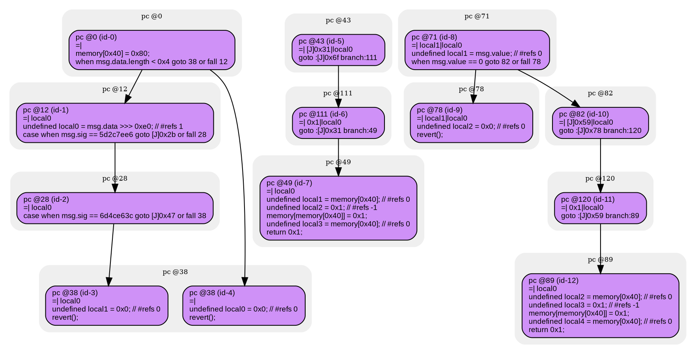
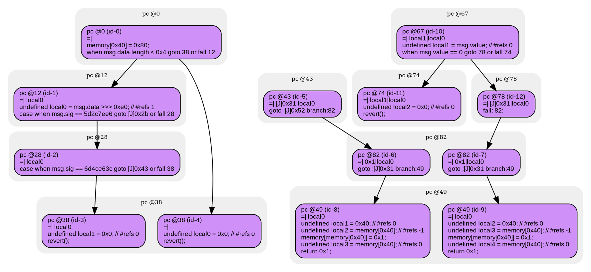

# contracts/dispatch/pure functions

```sol -no-opt
// SPDX-License-Identifier: UNLICENSED
// Metadata ipfs://QmRHsusWvnMjnuZciCkG6nDhuk1MKuqDGqGjTaJKWZu36c
pragma solidity 0.7.6;

contract Contract {

    fallback() external payable {
        if (~(msg.data.length < 0x4)) {
            undefined local0 = msg.data >>> 0xe0; // #refs 1
            if (msg.sig == 5d2c7ee6) {
                $5d2c7ee6();
            } else {
                if (msg.sig == 6d4ce63c) {
                    $6d4ce63c();
                } else {
                    revert();
                }
            }
        }
        revert();
    }

    function 5d2c7ee6() public payable returns (uint256) {
        return 0x1;
    }

    function get() public returns (uint256) {
        require(msg.value == 0);
        return 0x1;
    }

}

```

```yul -no-opt
object "runtime" {
    code {
        mstore(0x40, 0x80)
        if (not(lt(calldatasize(), 0x4))) {
            let local0 = shr(calldataload(0x0), 0xe0) // #refs 1
            if (eq(msg.sig, 5d2c7ee6)) {
                $5d2c7ee6();
            } else {
                if (eq(msg.sig, 6d4ce63c)) {
                    $6d4ce63c();
                } else {
                    let local1 = 0x0 // #refs 0
                    revert(local1, local1)
                }
            }
        }
        let local0 = 0x0 // #refs 0
        revert(local0, local0)

        function __$5d2c7ee6(/*unknown*/) { // public payable
            let local1 = mload(0x40) // #refs 0
            let local2 = 0x1 // #refs -1
            mstore(local1, local2)
            let local3 = mload(0x40) // #refs 0
            return(local3, sub(add(0x20, local1), local3)) // 0x1
        }

        function get() { // public
            let local1 = callvalue() // #refs 0
            require(iszero(local1));
            let local2 = mload(0x40) // #refs 0
            let local3 = 0x1 // #refs -1
            mstore(local2, local3)
            let local4 = mload(0x40) // #refs 0
            return(local4, sub(add(0x20, local2), local4)) // 0x1
        }

    }
}

```



```sol -opt
// SPDX-License-Identifier: UNLICENSED
// Metadata ipfs://QmageuWBk2AFaFebYDj6s8YjF6CWqQrsJ3FVvzXcJwQwsN
pragma solidity 0.7.6;

contract Contract {

    fallback() external payable {
        if (~(msg.data.length < 0x4)) {
            undefined local0 = msg.data >>> 0xe0; // #refs 1
            if (msg.sig == 5d2c7ee6) {
                $5d2c7ee6();
            } else {
                if (msg.sig == 6d4ce63c) {
                    $6d4ce63c();
                } else {
                    revert();
                }
            }
        }
        revert();
    }

    function 5d2c7ee6() public payable returns (uint256) {
        return 0x1;
    }

    function get() public returns (uint256) {
        require(msg.value == 0);
        return 0x1;
    }

}

```

```yul -opt
object "runtime" {
    code {
        mstore(0x40, 0x80)
        if (not(lt(calldatasize(), 0x4))) {
            let local0 = shr(calldataload(0x0), 0xe0) // #refs 1
            if (eq(msg.sig, 5d2c7ee6)) {
                $5d2c7ee6();
            } else {
                if (eq(msg.sig, 6d4ce63c)) {
                    $6d4ce63c();
                } else {
                    let local1 = 0x0 // #refs 0
                    revert(local1, local1)
                }
            }
        }
        let local0 = 0x0 // #refs 0
        revert(local0, local0)

        function __$5d2c7ee6(/*unknown*/) { // public payable
            let local1 = 0x40 // #refs 0
            let local2 = mload(local1) // #refs -1
            mstore(local2, 0x1)
            let local3 = mload(local1) // #refs 0
            return(local3, add(0x20, sub(local2, local3))) // 0x1
        }

        function get() { // public
            let local1 = callvalue() // #refs 0
            require(iszero(local1));
            let local2 = 0x40 // #refs 0
            let local3 = mload(local2) // #refs -1
            mstore(local3, 0x1)
            let local4 = mload(local2) // #refs 0
            return(local4, add(0x20, sub(local3, local4))) // 0x1
        }

    }
}

```


