# contracts/dispatch/symbols

```solidity -no-opt
// SPDX-License-Identifier: UNLICENSED
// Metadata ipfs://Qmd7ATY7CaHoxomQT2HNKAV3ePSYKeygcqLsFLWFF4aeeD
pragma solidity 0.7.6;

contract Contract {

    fallback() external payable {
        require(msg.value == 0);
        if ((msg.data.length < 0x4) == 0) {
            undefined local1 = msg.data >>> 0xe0; // #refs 2
            if (msg.sig == 9663f88f) {
                $9663f88f();
            } else {
                if (msg.sig == b8368615) {
                    $b8368615();
                } else {
                    if (msg.sig == f8b2cb4f) {
                        $f8b2cb4f();
                    } else {
                        revert();
                    }
                }
            }
        }
        revert();
    }

    function 9663f88f(/*no signature*/) public returns (bytes32) {
        return blockhash(0x7);
    }

    function b8368615(/*no signature*/) public returns (address) {
        return address(this);
    }

    function getBalance(address _arg0) public returns (uint256) {
        undefined local2 = 0x4; // #refs 3
        require((msg.data.length - local2 < 0x20) == 0);
        return _arg0.balance;
    }

}

```

```yul -no-opt
object "runtime" {
    code {
        mstore(0x40, 0x80)
        let local0 := callvalue() // #refs 0
        require(iszero(local0))
        if (iszero(lt(calldatasize(), 0x4))) {
            let local1 := shr(calldataload(0x0), 0xe0) // #refs 2
            if (eq(msg.sig, 9663f88f)) {
                $9663f88f();
            } else {
                if (eq(msg.sig, b8368615)) {
                    $b8368615();
                } else {
                    if (eq(msg.sig, f8b2cb4f)) {
                        $f8b2cb4f();
                    } else {
                        let local2 := 0x0 // #refs 0
                        revert(local2, local2)
                    }
                }
            }
        }
        let local1 := 0x0 // #refs 0
        revert(local1, local1)

        function __$9663f88f(/*unknown*/) { // public
            let local2 := mload(0x40) // #refs 0
            let local3 := blockhash(0x7) // #refs -1
            mstore(local2/*=0x80*/, local3)
            let local4 := mload(0x40) // #refs 0
            return(local4, sub(add(0x20, local2), local4)) // blockhash(0x7)
        }

        function __$b8368615(/*unknown*/) { // public
            let local2 := mload(0x40) // #refs 0
            let local3 := address(this)() // #refs 0
            mstore(local2/*=0x80*/, and(0xffffffffffffffffffffffffffffffffffffffff, local3))
            let local4 := mload(0x40) // #refs 0
            return(local4, sub(add(0x20, local2), local4)) // address(this)()
        }

        function getBalance(address _arg0) { // public
            let local2 := 0x4 // #refs 3
            let local3 := sub(calldatasize(), local2) // #refs 0
            require(iszero(lt(local3, 0x20)))
            let local4 := and(0xffffffffffffffffffffffffffffffffffffffff, calldataload(local2)) // #refs 0
            let local5 := mload(0x40) // #refs 0
            let local6 := and(0xffffffffffffffffffffffffffffffffffffffff, local4).balance // #refs -1
            mstore(local5/*=0x80*/, local6)
            let local7 := mload(0x40) // #refs 0
            return(local7, sub(add(0x20, local5), local7)) // calldataload(0x4).balance
        }

    }
}

```



```mermaid -no-opt
---
title: symbols-no-opt
---
flowchart TD
  classDef state text-align:left
  subgraph cluster_0 ["pc @0"]
    s_0[["pc @0 (#s_0)
=|local0
memory[0x40] = 0x80;
undefined local0 = msg.value; // #refs 0
when msg.value == 0 goto 16 or fall 12
"]]
    class s_0 state
    style s_0 fill:#471C21
  end
  subgraph cluster_12 ["pc @12"]
    s_1("pc @12 (#s_1)
=|local0
undefined local1 = 0x0; // #refs 0
revert();
")
    class s_1 state
  end
  subgraph cluster_16 ["pc @16"]
    s_2("pc @16 (#s_2)
=|
when msg.data.length < 0x4 goto 65 or fall 26
")
    class s_2 state
  end
  subgraph cluster_26 ["pc @26"]
    s_3("pc @26 (#s_3)
=|local1
undefined local1 = msg.data >>> 0xe0; // #refs 2
case when msg.sig == 9663f88f goto [J]0x46 or fall 43
")
    class s_3 state
  end
  subgraph cluster_43 ["pc @43"]
    s_4("pc @43 (#s_4)
=|local1
case when msg.sig == b8368615 goto [J]0x64 or fall 54
")
    class s_4 state
  end
  subgraph cluster_54 ["pc @54"]
    s_5("pc @54 (#s_5)
=|local1
case when msg.sig == f8b2cb4f goto [J]0x98 or fall 65
")
    class s_5 state
  end
  subgraph cluster_65 ["pc @65"]
    s_6("pc @65 (#s_6)
=|local1
undefined local2 = 0x0; // #refs 0
revert();
")
    class s_6 state
    s_7("pc @65 (#s_7)
=|
undefined local1 = 0x0; // #refs 0
revert();
")
    class s_7 state
  end
  subgraph cluster_70 ["pc @70"]
    s_8[["pc @70 (#s_8)
=|[J]0x4e|local1
goto :[J]0xf0 branch:240
"]]
    class s_8 state
    style s_8 fill:#5F021F
  end
  subgraph cluster_240 ["pc @240"]
    s_9("pc @240 (#s_9)
=|blockhash(0x7)|local1
goto :[J]0x4e branch:78
")
    class s_9 state
  end
  subgraph cluster_78 ["pc @78"]
    s_10("pc @78 (#s_10)
=|local1
undefined local2 = memory[0x40]; // #refs 0
bytes32 local3 = blockhash(0x7); // #refs -1
memory[memory[0x40]] = blockhash(0x7);
undefined local4 = memory[0x40]; // #refs 0
return blockhash(0x7);
")
    class s_10 state
  end
  subgraph cluster_100 ["pc @100"]
    s_11[["pc @100 (#s_11)
=|[J]0x6c|local1
goto :[J]0xfa branch:250
"]]
    class s_11 state
    style s_11 fill:#5F021F
  end
  subgraph cluster_250 ["pc @250"]
    s_12("pc @250 (#s_12)
=|address(this)()|local1
goto :[J]0x6c branch:108
")
    class s_12 state
  end
  subgraph cluster_108 ["pc @108"]
    s_13("pc @108 (#s_13)
=|local1
undefined local2 = memory[0x40]; // #refs 0
address local3 = address(this); // #refs 0
memory[memory[0x40]] = 0xffffffffffffffffffffffffffffffffffffffff & address(this);
undefined local4 = memory[0x40]; // #refs 0
return address(this);
")
    class s_13 state
  end
  subgraph cluster_152 ["pc @152"]
    s_14[["pc @152 (#s_14)
=|local3|local2|[J]0xda|local1
undefined local2 = 0x4; // #refs 3
undefined local3 = msg.data.length - local2; // #refs 0
when (msg.data.length - local2 < 0x20) == 0 goto 174 or fall 170
"]]
    class s_14 state
    style s_14 fill:#5F021F
  end
  subgraph cluster_170 ["pc @170"]
    s_15("pc @170 (#s_15)
=|local3|local2|[J]0xda|local1
undefined local4 = 0x0; // #refs 0
revert();
")
    class s_15 state
  end
  subgraph cluster_174 ["pc @174"]
    s_16("pc @174 (#s_16)
=|and(0xffffffffffffffffffffffffffffffffffffffff, calldataload(local2))|[J]0xda|local1
goto :[J]0x102 branch:258
")
    class s_16 state
  end
  subgraph cluster_258 ["pc @258"]
    s_17("pc @258 (#s_17)
=|and(0xffffffffffffffffffffffffffffffffffffffff, local4).balance|local1
undefined local4 = 0xffffffffffffffffffffffffffffffffffffffff & msg.data[local2]; // #refs 0
goto :[J]0xda branch:218
")
    class s_17 state
  end
  subgraph cluster_218 ["pc @218"]
    s_18("pc @218 (#s_18)
=|local1
undefined local5 = memory[0x40]; // #refs 0
uint256 local6 = 0xffffffffffffffffffffffffffffffffffffffff & 0xffffffffffffffffffffffffffffffffffffffff & msg.data[local2].balance; // #refs -1
memory[memory[0x40]] = 0xffffffffffffffffffffffffffffffffffffffff & 0xffffffffffffffffffffffffffffffffffffffff & msg.data[local2].balance;
undefined local7 = memory[0x40]; // #refs 0
return _arg0.balance;
")
    class s_18 state
  end
  s_0 == jumpi0_0 ==> s_2;
  s_0 -- fall --> s_1;
  s_2 == jumpi2_2 ==> s_7;
  s_2 -- fall --> s_3;
  s_3 -- fall --> s_4;
  s_4 -- fall --> s_5;
  s_5 -- fall --> s_6;
  s_8 == jump8_8 ==> s_9;
  s_9 == jump8_9 ==> s_10;
  s_8 -...- s_9;
  s_11 == jump11_11 ==> s_12;
  s_12 == jump11_12 ==> s_13;
  s_11 -...- s_12;
  s_14 == jumpi14_14 ==> s_16;
  s_14 -- fall --> s_15;
  s_16 == jump16_16 ==> s_17;
  s_17 == jump14_17 ==> s_18;
  s_14 -...- s_17;

```

```errors -no-opt
[]
```

```solidity -opt
// SPDX-License-Identifier: UNLICENSED
// Metadata ipfs://QmaL8yiEyCy7gvxUG6ypEjHtmNyg4zxmVJE179eC2q5GwZ
pragma solidity 0.7.6;

contract Contract {

    fallback() external payable {
        require(msg.value == 0);
        if ((msg.data.length < 0x4) == 0) {
            undefined local1 = msg.data >>> 0xe0; // #refs 2
            if (msg.sig == 9663f88f) {
                $9663f88f();
            } else {
                if (msg.sig == b8368615) {
                    $b8368615();
                } else {
                    if (msg.sig == f8b2cb4f) {
                        $f8b2cb4f();
                    } else {
                        revert();
                    }
                }
            }
        }
        revert();
    }

    function 9663f88f(/*no signature*/) public returns (bytes32) {
        return blockhash(0x7);
    }

    function b8368615(/*no signature*/) public returns (address) {
        return address(this);
    }

    function getBalance(address _arg0) public returns (uint256) {
        require((msg.data.length - 0x4 < 0x20) == 0);
        return _arg0.balance;
    }

}

```

```yul -opt
object "runtime" {
    code {
        mstore(0x40, 0x80)
        let local0 := callvalue() // #refs 0
        require(iszero(local0))
        if (iszero(lt(calldatasize(), 0x4))) {
            let local1 := shr(calldataload(0x0), 0xe0) // #refs 2
            if (eq(msg.sig, 9663f88f)) {
                $9663f88f();
            } else {
                if (eq(msg.sig, b8368615)) {
                    $b8368615();
                } else {
                    if (eq(msg.sig, f8b2cb4f)) {
                        $f8b2cb4f();
                    } else {
                        let local2 := 0x0 // #refs 0
                        revert(local2, local2)
                    }
                }
            }
        }
        let local1 := 0x0 // #refs 0
        revert(local1, local1)

        function __$9663f88f(/*unknown*/) { // public
            let local2 := 0x40 // #refs 0
            let local3 := mload(local2) // #refs -1
            mstore(local3/*=0x80*/, blockhash(0x7))
            let local4 := mload(local2) // #refs 0
            return(local4, add(0x20, sub(local3, local4))) // blockhash(0x7)
        }

        function __$b8368615(/*unknown*/) { // public
            let local2 := 0x40 // #refs 0
            let local3 := mload(local2) // #refs -1
            mstore(local3/*=0x80*/, and(address(this)(), sub(shl(0x1, 0xa0), 0x1)))
            let local4 := mload(local2) // #refs 0
            return(local4, add(0x20, sub(local3, local4))) // address(this)()
        }

        function getBalance(address _arg0) { // public
            let local2 := 0x4 // #refs 0
            let local3 := sub(calldatasize(), local2) // #refs 0
            require(iszero(lt(local3, 0x20)))
            let local4 := 0x40 // #refs 0
            let local5 := mload(local4) // #refs -1
            mstore(local5/*=0x80*/, and(sub(shl(0x1, 0xa0), 0x1), and(sub(shl(0x1, 0xa0), 0x1), calldataload(local2))).balance)
            let local6 := mload(local4) // #refs 0
            return(local6, add(0x20, sub(local5, local6))) // calldataload(0x4).balance
        }

    }
}

```



```mermaid -opt
---
title: symbols-opt
---
flowchart TD
  classDef state text-align:left
  subgraph cluster_0 ["pc @0"]
    s_0[["pc @0 (#s_0)
=|local0
memory[0x40] = 0x80;
undefined local0 = msg.value; // #refs 0
when msg.value == 0 goto 15 or fall 11
"]]
    class s_0 state
    style s_0 fill:#471C21
  end
  subgraph cluster_11 ["pc @11"]
    s_1("pc @11 (#s_1)
=|local0
undefined local1 = 0x0; // #refs 0
revert();
")
    class s_1 state
  end
  subgraph cluster_15 ["pc @15"]
    s_2("pc @15 (#s_2)
=|
when msg.data.length < 0x4 goto 60 or fall 24
")
    class s_2 state
  end
  subgraph cluster_24 ["pc @24"]
    s_3("pc @24 (#s_3)
=|local1
undefined local1 = msg.data >>> 0xe0; // #refs 2
case when msg.sig == 9663f88f goto [J]0x41 or fall 40
")
    class s_3 state
  end
  subgraph cluster_40 ["pc @40"]
    s_4("pc @40 (#s_4)
=|local1
case when msg.sig == b8368615 goto [J]0x59 or fall 50
")
    class s_4 state
  end
  subgraph cluster_50 ["pc @50"]
    s_5("pc @50 (#s_5)
=|local1
case when msg.sig == f8b2cb4f goto [J]0x7b or fall 60
")
    class s_5 state
  end
  subgraph cluster_60 ["pc @60"]
    s_6("pc @60 (#s_6)
=|local1
undefined local2 = 0x0; // #refs 0
revert();
")
    class s_6 state
    s_7("pc @60 (#s_7)
=|
undefined local1 = 0x0; // #refs 0
revert();
")
    class s_7 state
  end
  subgraph cluster_65 ["pc @65"]
    s_8[["pc @65 (#s_8)
=|[J]0x47|local1
goto :[J]0x9e branch:158
"]]
    class s_8 state
    style s_8 fill:#5F021F
  end
  subgraph cluster_158 ["pc @158"]
    s_9("pc @158 (#s_9)
=|blockhash(0x7)|local1
goto :[J]0x47 branch:71
")
    class s_9 state
  end
  subgraph cluster_71 ["pc @71"]
    s_10("pc @71 (#s_10)
=|local1
undefined local2 = 0x40; // #refs 0
undefined local3 = memory[0x40]; // #refs -1
memory[memory[0x40]] = blockhash(0x7);
undefined local4 = memory[0x40]; // #refs 0
return blockhash(0x7);
")
    class s_10 state
    s_18("pc @71 (#s_18)
=|local1
undefined local4 = 0x40; // #refs 0
undefined local5 = memory[0x40]; // #refs -1
memory[memory[0x40]] = (0x1 << 0xa0) - 0x1 & (0x1 << 0xa0) - 0x1 & msg.data[0x4].balance;
undefined local6 = memory[0x40]; // #refs 0
return _arg0.balance;
")
    class s_18 state
  end
  subgraph cluster_89 ["pc @89"]
    s_11[["pc @89 (#s_11)
=|[J]0x5f|local1
goto :[J]0xa4 branch:164
"]]
    class s_11 state
    style s_11 fill:#5F021F
  end
  subgraph cluster_164 ["pc @164"]
    s_12("pc @164 (#s_12)
=|address(this)()|local1
goto :[J]0x5f branch:95
")
    class s_12 state
  end
  subgraph cluster_95 ["pc @95"]
    s_13("pc @95 (#s_13)
=|local1
undefined local2 = 0x40; // #refs 0
undefined local3 = memory[0x40]; // #refs -1
memory[memory[0x40]] = address(this) & (0x1 << 0xa0) - 0x1;
undefined local4 = memory[0x40]; // #refs 0
return address(this);
")
    class s_13 state
  end
  subgraph cluster_123 ["pc @123"]
    s_14[["pc @123 (#s_14)
=|local3|local2|[J]0x47|local1
undefined local2 = 0x4; // #refs 0
undefined local3 = msg.data.length - 0x4; // #refs 0
when (msg.data.length - 0x4 < 0x20) == 0 goto 143 or fall 139
"]]
    class s_14 state
    style s_14 fill:#5F021F
  end
  subgraph cluster_139 ["pc @139"]
    s_15("pc @139 (#s_15)
=|local3|local2|[J]0x47|local1
undefined local4 = 0x0; // #refs 0
revert();
")
    class s_15 state
  end
  subgraph cluster_143 ["pc @143"]
    s_16("pc @143 (#s_16)
=|and(sub(shl(0x1, 0xa0), 0x1), calldataload(local2))|[J]0x47|local1
goto :[J]0xa8 branch:168
")
    class s_16 state
  end
  subgraph cluster_168 ["pc @168"]
    s_17("pc @168 (#s_17)
=|and(sub(shl(0x1, 0xa0), 0x1), and(sub(shl(0x1, 0xa0), 0x1), calldataload(local2))).balance|local1
goto :[J]0x47 branch:71
")
    class s_17 state
  end
  s_0 == jumpi0_0 ==> s_2;
  s_0 -- fall --> s_1;
  s_2 == jumpi2_2 ==> s_7;
  s_2 -- fall --> s_3;
  s_3 -- fall --> s_4;
  s_4 -- fall --> s_5;
  s_5 -- fall --> s_6;
  s_8 == jump8_8 ==> s_9;
  s_9 == jump8_9 ==> s_10;
  s_8 -...- s_9;
  s_11 == jump11_11 ==> s_12;
  s_12 == jump11_12 ==> s_13;
  s_11 -...- s_12;
  s_14 == jumpi14_14 ==> s_16;
  s_14 -- fall --> s_15;
  s_16 == jump16_16 ==> s_17;
  s_17 == jump14_17 ==> s_18;
  s_14 -...- s_17;

```

```errors -opt
[]
```
