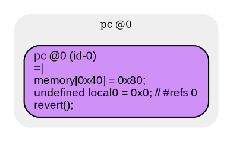

# contracts/empty/with no functions

```sol -no-opt
// SPDX-License-Identifier: UNLICENSED
// Metadata ipfs://Qmc7NUcdp12QQzhVAMQGPVCLb19V1ifakkLWL7SgvUoYkM
pragma solidity 0.7.6;

contract Contract {

    fallback() external payable {
        revert();
    }

}

```

```yul -no-opt
object "runtime" {
    code {
        mstore(0x40, 0x80)
        let local0 = 0x0 // #refs 0
        revert(local0, local0)

    }
}

```



```sol -opt
// SPDX-License-Identifier: UNLICENSED
// Metadata ipfs://QmbfibgUvdfkZYGTTwQsEqWF8srkJCoMFMsMyAjFSmGw4S
pragma solidity 0.7.6;

contract Contract {

    fallback() external payable {
        revert();
    }

}

```

```yul -opt
object "runtime" {
    code {
        mstore(0x40, 0x80)
        let local0 = 0x0 // #refs 0
        revert(local0, local0)

    }
}

```


