```mermaid -opt
---
title: no dedup local var-opt
---
flowchart TD
  classDef state text-align:left
  subgraph cluster_0 ["pc @0"]
    s_0[["pc @0 (s_0)
=|
undefined local0 = 0x80; // #refs -1
memory[0x40] = 0x80;
uint local1 = block.number; // #refs -1
memory[0x80] = block.number;
emit Deposit(block.number);
undefined local2 = 0x40; // #refs 0
undefined local3 = memory[0x40]; // #refs -1
memory[memory[0x40]] = block.number;
undefined local4 = memory[0x40]; // #refs 0
emit Deposit(block.number);
return;
"]]
    class s_0 state
    style s_0 fill:#471C21
  end

```

# contracts/locals/no dedup local var

```solidity -no-opt
// SPDX-License-Identifier: UNLICENSED
// Metadata ipfs://QmdxVs9n72jjdRhjvXStBXyiNMuCfWRoVywqnGpYnKhWJk
pragma solidity 0.7.6;

contract Contract {

    event Deposit(uint256 _arg0);

    fallback() external payable {
        uint local0 = block.number; // #refs 1
        emit Deposit(local0);
        emit Deposit(local0);
        return;
    }

}

```

```yul -no-opt
object "runtime" {
    code {
        mstore(0x40, 0x80)
        let local0 = number() // #refs 1
        let local1 = mload(0x40) // #refs 0
        mstore(local1, local0)
        let local2 = mload(0x40) // #refs 0
        log1(local2, sub(add(0x20, local1), local2), 0x4d6ce1e535dbade1c23defba91e23b8f791ce5edc0cc320257a2b364e4e38426)
        let local3 = mload(0x40) // #refs 0
        mstore(local3, local0)
        let local4 = mload(0x40) // #refs 0
        log1(local4, sub(add(0x20, local3), local4), 0x4d6ce1e535dbade1c23defba91e23b8f791ce5edc0cc320257a2b364e4e38426)
        stop()

    }
}

```



```mermaid -no-opt
---
title: no dedup local var-no-opt
---
flowchart TD
  classDef state text-align:left
  subgraph cluster_0 ["pc @0"]
    s_0[["pc @0 (s_0)
=|
memory[0x40] = 0x80;
uint local0 = block.number; // #refs 1
undefined local1 = memory[0x40]; // #refs 0
memory[memory[0x40]] = local0;
undefined local2 = memory[0x40]; // #refs 0
emit Deposit(local0);
undefined local3 = memory[0x40]; // #refs 0
memory[memory[0x40]] = local0;
undefined local4 = memory[0x40]; // #refs 0
emit Deposit(local0);
return;
"]]
    class s_0 state
    style s_0 fill:#471C21
  end

```

```solidity -opt
// SPDX-License-Identifier: UNLICENSED
// Metadata ipfs://QmQpUm3Zy5qLKhkS9KA8Sad6yUjZTvVB1adauVq2p1qxac
pragma solidity 0.7.6;

contract Contract {

    event Deposit(uint256 _arg0);

    fallback() external payable {
        emit Deposit(block.number);
        emit Deposit(block.number);
        return;
    }

}

```

```yul -opt
object "runtime" {
    code {
        let local0 = 0x80 // #refs -1
        mstore(0x40, local0)
        let local1 = number() // #refs -1
        mstore(local0, local1)
        log1(local0, 0x20, 0x4d6ce1e535dbade1c23defba91e23b8f791ce5edc0cc320257a2b364e4e38426)
        let local2 = 0x40 // #refs 0
        let local3 = mload(local2) // #refs -1
        mstore(local3, local1)
        let local4 = mload(local2) // #refs 0
        log1(local4, add(0x20, sub(local3, local4)), 0x4d6ce1e535dbade1c23defba91e23b8f791ce5edc0cc320257a2b364e4e38426)
        stop()

    }
}

```


