```graphviz -opt
digraph G {    
  color="#efefef";
  graph[fontsize=8];

  node[shape=box style="rounded,filled" fontsize=9 fontname="Arial" fillcolor="#efefef"];

  subgraph cluster_0 {
    style="filled,rounded";
    label = "pc @0";
    "id-0" [label="pc @0 (id-0)\l=| local0\lmemory[0x40] = 0x80;\lundefined local0 = msg.value; // #refs 0\lwhen msg.value == 0 goto 15 or fall 11\l" fillcolor="#cf91f7"];
  }

  subgraph cluster_11 {
    style="filled,rounded";
    label = "pc @11";
    "id-1" [label="pc @11 (id-1)\l=| local0\lundefined local1 = 0x0; // #refs 0\lrevert();\l" fillcolor="#cf91f7"];
  }

  subgraph cluster_15 {
    style="filled,rounded";
    label = "pc @15";
    "id-2" [label="pc @15 (id-2)\l=| \lwhen msg.data.length < 0x4 goto 50 or fall 24\l" fillcolor="#cf91f7"];
  }

  subgraph cluster_24 {
    style="filled,rounded";
    label = "pc @24";
    "id-3" [label="pc @24 (id-3)\l=| local1\lundefined local1 = msg.data >>> 0xe0; // #refs 1\lcase when msg.sig == 20965255 goto [J]0x37 or fall 40\l" fillcolor="#cf91f7"];
  }

  subgraph cluster_40 {
    style="filled,rounded";
    label = "pc @40";
    "id-4" [label="pc @40 (id-4)\l=| local1\lcase when msg.sig == dd62ed3e goto [J]0x4f or fall 50\l" fillcolor="#cf91f7"];
  }

  subgraph cluster_50 {
    style="filled,rounded";
    label = "pc @50";
    "id-5" [label="pc @50 (id-5)\l=| local1\lundefined local2 = 0x0; // #refs 0\lrevert();\l" fillcolor="#cf91f7"];
    "id-6" [label="pc @50 (id-6)\l=| \lundefined local1 = 0x0; // #refs 0\lrevert();\l" fillcolor="#cf91f7"];
  }

  subgraph cluster_55 {
    style="filled,rounded";
    label = "pc @55";
    "id-7" [label="pc @55 (id-7)\l=| [J]0x3d|local1\lgoto :[J]0x7a branch:122\l" fillcolor="#cf91f7"];
  }

  subgraph cluster_122 {
    style="filled,rounded";
    label = "pc @122";
    "id-8" [label="pc @122 (id-8)\l=| sload(keccak256(local2, local4 /*caller().keccak256(local2, local4 /*caller().0x0*/)*/)/*base0[caller()][caller()]*/)|local1\lundefined local2 = 0x0; // #refs 0\lmemory[0x0] = msg.sender;\lundefined local3 = 0x20; // #refs -2\lmemory[0x20] = 0x0;\lundefined local4 = 0x40; // #refs 0\lmemory[0x20] = keccak256(msg.sender, 0x0);\lgoto :[J]0x3d branch:61\l" fillcolor="#cf91f7"];
  }

  subgraph cluster_61 {
    style="filled,rounded";
    label = "pc @61";
    "id-9" [label="pc @61 (id-9)\l=| local1\lundefined local5 = 0x40; // #refs 0\lundefined local6 = memory[0x40]; // #refs -1\lmemory[memory[0x40]] = allowance[msg.sender][msg.sender];\lundefined local7 = memory[0x40]; // #refs 0\lreturn allowance[msg.sender][msg.sender];\l" fillcolor="#cf91f7"];
    "id-10" [label="pc @61 (id-10)\l=| local8|local1\lundefined local9 = 0x40; // #refs 0\lundefined local10 = memory[0x40]; // #refs -1\lmemory[memory[0x40]] = allowance[_arg0][_arg1];\lundefined local11 = memory[0x40]; // #refs 0\lreturn allowance[_arg0][_arg1];\l" fillcolor="#cf91f7"];
  }

  subgraph cluster_79 {
    style="filled,rounded";
    label = "pc @79";
    "id-11" [label="pc @79 (id-11)\l=| local3|local2|[J]0x3d|local1\lundefined local2 = 0x4; // #refs 1\lundefined local3 = msg.data.length - local2; // #refs 0\lwhen (msg.data.length - local2 < 0x40) == 0 goto 99 or fall 95\l" fillcolor="#cf91f7"];
  }

  subgraph cluster_95 {
    style="filled,rounded";
    label = "pc @95";
    "id-12" [label="pc @95 (id-12)\l=| local3|local2|[J]0x3d|local1\lundefined local4 = 0x0; // #refs 0\lrevert();\l" fillcolor="#cf91f7"];
  }

  subgraph cluster_99 {
    style="filled,rounded";
    label = "pc @99";
    "id-13" [label="pc @99 (id-13)\l=| and(calldataload(add(0x20, local2)), local4)|and(local4, calldataload(local2))|[J]0x3d|local1\lundefined local4 = (0x1 << 0xa0) - 0x1; // #refs 0\lgoto :[J]0x93 branch:147\l" fillcolor="#cf91f7"];
  }

  subgraph cluster_147 {
    style="filled,rounded";
    label = "pc @147";
    "id-14" [label="pc @147 (id-14)\l=| sload(keccak256(local5, local7 /*calldataload(0x24).keccak256(local5, local7 /*calldataload(0x4).0x0*/)*/)/*base0[calldataload(0x4)][calldataload(0x24)]*/)|local8|local1\lundefined local5 = 0x0; // #refs 0\lundefined local6 = 0x20; // #refs -2\lmemory[0x20] = 0x0;\lmemory[0x0] = (0x1 << 0xa0) - 0x1 & msg.data[local2];\lundefined local7 = 0x40; // #refs 0\lmemory[0x20] = keccak256(_arg0, 0x0);\lmemory[0x0] = msg.data[0x20 + local2] & (0x1 << 0xa0) - 0x1;\lundefined local8 = [J]0x3d; // #refs 0\lgoto :[J]0x3d branch:61\l" fillcolor="#cf91f7"];
  }

  "id-0" -> "id-2";
  "id-0" -> "id-1";
  "id-2" -> "id-6";
  "id-2" -> "id-3";
  "id-3" -> "id-4";
  "id-4" -> "id-5";
  "id-7" -> "id-8";
  "id-8" -> "id-9";
  "id-11" -> "id-13";
  "id-11" -> "id-12";
  "id-13" -> "id-14";
  "id-14" -> "id-10";

}

```

# contracts/mappings/public mapping

```sol -no-opt
// SPDX-License-Identifier: UNLICENSED
// Metadata ipfs://QmXUabbCeD7Lv8du5q45dZYekx8Qw9ACfgCuRRaMifyEU8
pragma solidity 0.7.6;

contract Contract {

mapping (address => mapping (address => unknown)) public allowance;

    fallback() external payable {
        require(msg.value == 0);
        if (~(msg.data.length < 0x4)) {
            undefined local1 = msg.data >>> 0xe0; // #refs 1
            if (msg.sig == 20965255) {
                $20965255();
            } else {
                if (msg.sig == dd62ed3e) {
                    $dd62ed3e();
                } else {
                    revert();
                }
            }
        }
        revert();
    }

    function getValue() public returns (unknown) {
        return allowance[msg.sender][msg.sender];
    }

    function allowance(address _arg0, address _arg1) public returns (unknown) {
        undefined local2 = 0x4; // #refs 3
        require((msg.data.length - local2 < 0x40) == 0);
        return allowance[_arg0][_arg1];
    }

}

```

```yul -no-opt
object "runtime" {
    code {
        mstore(0x40, 0x80)
        let local0 = callvalue() // #refs 0
        require(iszero(local0));
        if (not(lt(calldatasize(), 0x4))) {
            let local1 = shr(calldataload(0x0), 0xe0) // #refs 1
            if (eq(msg.sig, 20965255)) {
                $20965255();
            } else {
                if (eq(msg.sig, dd62ed3e)) {
                    $dd62ed3e();
                } else {
                    let local2 = 0x0 // #refs 0
                    revert(local2, local2)
                }
            }
        }
        let local1 = 0x0 // #refs 0
        revert(local1, local1)

        function getValue() { // public
            let local2 = 0x0 // #refs -1
            let local3 = 0x0 // #refs -1
            mstore(local3, and(0xffffffffffffffffffffffffffffffffffffffff, and(0xffffffffffffffffffffffffffffffffffffffff, caller())))
            let local4 = add(0x20, local3) // #refs -1
            mstore(local4, local2)
            let local5 = 0x0 // #refs -1
            mstore(local5, and(0xffffffffffffffffffffffffffffffffffffffff, and(0xffffffffffffffffffffffffffffffffffffffff, caller())))
            let local6 = add(0x20, local5) // #refs -1
            mstore(local6, keccak256(0x0, add(0x20, local4) /*caller().0x0*/))
            let local7 = mload(0x40) // #refs 0
            let local8 = sload(keccak256(0x0, add(0x20, local6) /*caller().keccak256(0x0, add(0x20, local4) /*caller().0x0*/)*/)/*base0[caller()][caller()]*/) // #refs -1
            mstore(local7, local8)
            let local9 = mload(0x40) // #refs 0
            return(local9, sub(add(0x20, local7), local9)) // sload(keccak256(0x0, add(0x20, local6) /*caller().keccak256(0x0, add(0x20, local4) /*caller().0x0*/)*/)/*base0[caller()][caller()]*/)
        }

        function allowance(address,address) { // public
            let local2 = 0x4 // #refs 3
            let local3 = sub(calldatasize(), local2) // #refs 0
            require(iszero(lt(local3, 0x40)));
            let local4 = add(0x20, local2) // #refs 0
            mstore(0x20, 0x0)
            let local5 = and(0xffffffffffffffffffffffffffffffffffffffff, calldataload(local2)) // #refs -1
            mstore(0x0, local5)
            mstore(0x20, keccak256(0x0, 0x40 /*calldataload(0x4).0x0*/))
            let local6 = and(0xffffffffffffffffffffffffffffffffffffffff, calldataload(local4)) // #refs -1
            mstore(0x0, local6)
            let local7 = [J]0xbb // #refs 0
            let local8 = mload(0x40) // #refs 0
            let local9 = sload(keccak256(0x0, 0x40 /*calldataload(0x24).keccak256(0x0, 0x40 /*calldataload(0x4).0x0*/)*/)/*base0[calldataload(0x4)][calldataload(0x24)]*/) // #refs -1
            mstore(local8, local9)
            let local10 = mload(0x40) // #refs 0
            return(local10, sub(add(0x20, local8), local10)) // sload(keccak256(0x0, 0x40 /*calldataload(0x24).keccak256(0x0, 0x40 /*calldataload(0x4).0x0*/)*/)/*base0[calldataload(0x4)][calldataload(0x24)]*/)
        }

    }
}

```



```graphviz -no-opt
digraph G {    
  color="#efefef";
  graph[fontsize=8];

  node[shape=box style="rounded,filled" fontsize=9 fontname="Arial" fillcolor="#efefef"];

  subgraph cluster_0 {
    style="filled,rounded";
    label = "pc @0";
    "id-0" [label="pc @0 (id-0)\l=| local0\lmemory[0x40] = 0x80;\lundefined local0 = msg.value; // #refs 0\lwhen msg.value == 0 goto 16 or fall 12\l" fillcolor="#cf91f7"];
  }

  subgraph cluster_12 {
    style="filled,rounded";
    label = "pc @12";
    "id-1" [label="pc @12 (id-1)\l=| local0\lundefined local1 = 0x0; // #refs 0\lrevert();\l" fillcolor="#cf91f7"];
  }

  subgraph cluster_16 {
    style="filled,rounded";
    label = "pc @16";
    "id-2" [label="pc @16 (id-2)\l=| \lwhen msg.data.length < 0x4 goto 54 or fall 26\l" fillcolor="#cf91f7"];
  }

  subgraph cluster_26 {
    style="filled,rounded";
    label = "pc @26";
    "id-3" [label="pc @26 (id-3)\l=| local1\lundefined local1 = msg.data >>> 0xe0; // #refs 1\lcase when msg.sig == 20965255 goto [J]0x3b or fall 43\l" fillcolor="#cf91f7"];
  }

  subgraph cluster_43 {
    style="filled,rounded";
    label = "pc @43";
    "id-4" [label="pc @43 (id-4)\l=| local1\lcase when msg.sig == dd62ed3e goto [J]0x59 or fall 54\l" fillcolor="#cf91f7"];
  }

  subgraph cluster_54 {
    style="filled,rounded";
    label = "pc @54";
    "id-5" [label="pc @54 (id-5)\l=| local1\lundefined local2 = 0x0; // #refs 0\lrevert();\l" fillcolor="#cf91f7"];
    "id-6" [label="pc @54 (id-6)\l=| \lundefined local1 = 0x0; // #refs 0\lrevert();\l" fillcolor="#cf91f7"];
  }

  subgraph cluster_59 {
    style="filled,rounded";
    label = "pc @59";
    "id-7" [label="pc @59 (id-7)\l=| [J]0x43|local1\lgoto :[J]0xd1 branch:209\l" fillcolor="#cf91f7"];
  }

  subgraph cluster_209 {
    style="filled,rounded";
    label = "pc @209";
    "id-8" [label="pc @209 (id-8)\l=| sload(keccak256(0x0, add(0x20, local6) /*caller().keccak256(0x0, add(0x20, local4) /*caller().0x0*/)*/)/*base0[caller()][caller()]*/)|local1\lundefined local2 = 0x0; // #refs -1\lundefined local3 = 0x0; // #refs -1\lmemory[0x0] = 0xffffffffffffffffffffffffffffffffffffffff & 0xffffffffffffffffffffffffffffffffffffffff & msg.sender;\lundefined local4 = 0x20 + 0x0; // #refs -1\lmemory[0x20 + 0x0] = 0x0;\lundefined local5 = 0x0; // #refs -1\lmemory[0x0] = 0xffffffffffffffffffffffffffffffffffffffff & 0xffffffffffffffffffffffffffffffffffffffff & msg.sender;\lundefined local6 = 0x20 + 0x0; // #refs -1\lmemory[0x20 + 0x0] = keccak256(msg.sender, 0x0);\lgoto :[J]0x43 branch:67\l" fillcolor="#cf91f7"];
  }

  subgraph cluster_67 {
    style="filled,rounded";
    label = "pc @67";
    "id-9" [label="pc @67 (id-9)\l=| local1\lundefined local7 = memory[0x40]; // #refs 0\lundefined local8 = allowance[msg.sender][msg.sender]; // #refs -1\lmemory[memory[0x40]] = allowance[msg.sender][msg.sender];\lundefined local9 = memory[0x40]; // #refs 0\lreturn allowance[msg.sender][msg.sender];\l" fillcolor="#cf91f7"];
  }

  subgraph cluster_89 {
    style="filled,rounded";
    label = "pc @89";
    "id-10" [label="pc @89 (id-10)\l=| local3|local2|[J]0xbb|local1\lundefined local2 = 0x4; // #refs 3\lundefined local3 = msg.data.length - local2; // #refs 0\lwhen (msg.data.length - local2 < 0x40) == 0 goto 111 or fall 107\l" fillcolor="#cf91f7"];
  }

  subgraph cluster_107 {
    style="filled,rounded";
    label = "pc @107";
    "id-11" [label="pc @107 (id-11)\l=| local3|local2|[J]0xbb|local1\lundefined local4 = 0x0; // #refs 0\lrevert();\l" fillcolor="#cf91f7"];
  }

  subgraph cluster_111 {
    style="filled,rounded";
    label = "pc @111";
    "id-12" [label="pc @111 (id-12)\l=| and(0xffffffffffffffffffffffffffffffffffffffff, calldataload(local4))|and(0xffffffffffffffffffffffffffffffffffffffff, calldataload(local2))|[J]0xbb|local1\lundefined local4 = 0x20 + local2; // #refs 0\lgoto :[J]0x154 branch:340\l" fillcolor="#cf91f7"];
  }

  subgraph cluster_340 {
    style="filled,rounded";
    label = "pc @340";
    "id-13" [label="pc @340 (id-13)\l=| sload(keccak256(0x0, 0x40 /*calldataload(0x24).keccak256(0x0, 0x40 /*calldataload(0x4).0x0*/)*/)/*base0[calldataload(0x4)][calldataload(0x24)]*/)|local7|local1\lmemory[0x20] = 0x0;\lundefined local5 = 0xffffffffffffffffffffffffffffffffffffffff & msg.data[local2]; // #refs -1\lmemory[0x0] = 0xffffffffffffffffffffffffffffffffffffffff & msg.data[local2];\lmemory[0x20] = keccak256(_arg0, 0x0);\lundefined local6 = 0xffffffffffffffffffffffffffffffffffffffff & msg.data[0x20 + local2]; // #refs -1\lmemory[0x0] = 0xffffffffffffffffffffffffffffffffffffffff & msg.data[0x20 + local2];\lundefined local7 = [J]0xbb; // #refs 0\lgoto :[J]0xbb branch:187\l" fillcolor="#cf91f7"];
  }

  subgraph cluster_187 {
    style="filled,rounded";
    label = "pc @187";
    "id-14" [label="pc @187 (id-14)\l=| local7|local1\lundefined local8 = memory[0x40]; // #refs 0\lundefined local9 = allowance[_arg0][_arg1]; // #refs -1\lmemory[memory[0x40]] = allowance[_arg0][_arg1];\lundefined local10 = memory[0x40]; // #refs 0\lreturn allowance[_arg0][_arg1];\l" fillcolor="#cf91f7"];
  }

  "id-0" -> "id-2";
  "id-0" -> "id-1";
  "id-2" -> "id-6";
  "id-2" -> "id-3";
  "id-3" -> "id-4";
  "id-4" -> "id-5";
  "id-7" -> "id-8";
  "id-8" -> "id-9";
  "id-10" -> "id-12";
  "id-10" -> "id-11";
  "id-12" -> "id-13";
  "id-13" -> "id-14";

}

```

```sol -opt
// SPDX-License-Identifier: UNLICENSED
// Metadata ipfs://QmSrjZkbwKtEg7uMhwXX3nW2nesTsmJYYH2ns4jkXWmEqs
pragma solidity 0.7.6;

contract Contract {

mapping (address => mapping (address => unknown)) public allowance;

    fallback() external payable {
        require(msg.value == 0);
        if (~(msg.data.length < 0x4)) {
            undefined local1 = msg.data >>> 0xe0; // #refs 1
            if (msg.sig == 20965255) {
                $20965255();
            } else {
                if (msg.sig == dd62ed3e) {
                    $dd62ed3e();
                } else {
                    revert();
                }
            }
        }
        revert();
    }

    function getValue() public returns (unknown) {
        return allowance[msg.sender][msg.sender];
    }

    function allowance(address _arg0, address _arg1) public returns (unknown) {
        undefined local2 = 0x4; // #refs 1
        require((msg.data.length - local2 < 0x40) == 0);
        return allowance[_arg0][_arg1];
    }

}

```

```yul -opt
object "runtime" {
    code {
        mstore(0x40, 0x80)
        let local0 = callvalue() // #refs 0
        require(iszero(local0));
        if (not(lt(calldatasize(), 0x4))) {
            let local1 = shr(calldataload(0x0), 0xe0) // #refs 1
            if (eq(msg.sig, 20965255)) {
                $20965255();
            } else {
                if (eq(msg.sig, dd62ed3e)) {
                    $dd62ed3e();
                } else {
                    let local2 = 0x0 // #refs 0
                    revert(local2, local2)
                }
            }
        }
        let local1 = 0x0 // #refs 0
        revert(local1, local1)

        function getValue() { // public
            let local2 = 0x0 // #refs 0
            mstore(local2, caller())
            let local3 = 0x20 // #refs -2
            mstore(local3, local2)
            let local4 = 0x40 // #refs 0
            mstore(local3, keccak256(local2, local4 /*caller().0x0*/))
            let local5 = 0x40 // #refs 0
            let local6 = mload(local5) // #refs -1
            mstore(local6, sload(keccak256(local2, local4 /*caller().keccak256(local2, local4 /*caller().0x0*/)*/)/*base0[caller()][caller()]*/))
            let local7 = mload(local5) // #refs 0
            return(local7, add(0x20, sub(local6, local7))) // sload(keccak256(local2, local4 /*caller().keccak256(local2, local4 /*caller().0x0*/)*/)/*base0[caller()][caller()]*/)
        }

        function allowance(address,address) { // public
            let local2 = 0x4 // #refs 1
            let local3 = sub(calldatasize(), local2) // #refs 0
            require(iszero(lt(local3, 0x40)));
            let local4 = sub(shl(0x1, 0xa0), 0x1) // #refs 0
            let local5 = 0x0 // #refs 0
            let local6 = 0x20 // #refs -2
            mstore(local6, local5)
            mstore(local5, and(local4, calldataload(local2)))
            let local7 = 0x40 // #refs 0
            mstore(local6, keccak256(local5, local7 /*calldataload(0x4).0x0*/))
            mstore(local5, and(calldataload(add(0x20, local2)), local4))
            let local8 = [J]0x3d // #refs 0
            let local9 = 0x40 // #refs 0
            let local10 = mload(local9) // #refs -1
            mstore(local10, sload(keccak256(local5, local7 /*calldataload(0x24).keccak256(local5, local7 /*calldataload(0x4).0x0*/)*/)/*base0[calldataload(0x4)][calldataload(0x24)]*/))
            let local11 = mload(local9) // #refs 0
            return(local11, add(0x20, sub(local10, local11))) // sload(keccak256(local5, local7 /*calldataload(0x24).keccak256(local5, local7 /*calldataload(0x4).0x0*/)*/)/*base0[calldataload(0x4)][calldataload(0x24)]*/)
        }

    }
}

```


