# contracts/memory/invalidate-memory-args

```solidity -no-opt
// SPDX-License-Identifier: UNLICENSED
// Metadata ipfs://QmTgsWbt2buM7iEawc7WcBj4yqjzXnTi7EDW6Bqg6zSneV
pragma solidity 0.7.6;

contract Contract {

    fallback() external payable {
        require(msg.value == 0);
        if ((msg.data.length < 0x4) == 0) {
            if (msg.sig == a8f9b693) {
                $a8f9b693();
            } else {
                revert();
            }
        }
        revert();
    }

    function a8f9b693(/*no signature*/) public returns (unknown) {
        undefined local4 = memory[0x40]; // #refs 1
        undefined local6 = 0xffffffffffffffffffffffffffffffffffffffff & 0xdac17f958d2ee523a2206206994597c13d831ec7; // #refs 1
        require(address(local6).code.length == 0 == 0);
        require(staticcall(gasleft(),local6,local4,0x4 + memory[0x40] - local4,local4,0x20) == 0 == 0);
        require((returndatasize() < 0x20) == 0);
        undefined local10 = memory[0x40]; // #refs 2
        return 0xa ** memory[0x80];
    }

}

```

```yul -no-opt
object "runtime" {
    code {
        mstore(0x40, 0x80)
        let local0 := callvalue() // #refs 0
        require(iszero(local0))
        if (iszero(lt(calldatasize(), 0x4))) {
            let local1 := shr(calldataload(0x0), 0xe0) // #refs 0
            if (eq(msg.sig, a8f9b693)) {
                $a8f9b693();
            } else {
                let local2 := 0x0 // #refs 0
                revert(local2, local2)
            }
        }
        let local1 := 0x0 // #refs 0
        revert(local1, local1)

        function __$a8f9b693(/*unknown*/) { // public
            let local2 := 0x313ce567 // #refs 0
            let local3 := mload(0x40) // #refs -1
            mstore(local3/*=0x80*/, shl(and(0xffffffff, local2), 0xe0))
            let local4 := mload(0x40) // #refs 1
            let local5 := add(0x4, local3) // #refs 0
            let local6 := and(0xffffffffffffffffffffffffffffffffffffffff, 0xdac17f958d2ee523a2206206994597c13d831ec7) // #refs 1
            let local7 := iszero(address(local6).code.length) // #refs 0
            require(iszero(local7))
            let local8 := iszero(staticcall(gasleft()(), local6, local4, sub(local5, local4), local4, 0x20)) // #refs 0
            require(iszero(local8))
            let local9 := returndatasize()() // #refs 0
            require(iszero(lt(local9, 0x20)))
            let local10 := mload(0x40) // #refs 2
            let local11 := mload(0x40) // #refs 0
            let local12 := exp(0xa, mload(local10)) // #refs -1
            mstore(local11/*=0x80*/, local12)
            let local13 := mload(0x40) // #refs 0
            return(local13, sub(add(0x20, local11), local13)) // exp(0xa, mload(0x80))
        }

    }
}

```



```mermaid -no-opt
---
title: invalidate-memory-args-no-opt
---
flowchart TD
  classDef state text-align:left
  subgraph cluster_0 ["pc @0"]
    s_0[["pc @0 (#s_0)
=|local0
memory[0x40] = 0x80;
undefined local0 = msg.value; // #refs 0
when msg.value == 0 goto 15 or fall 11
"]]
    class s_0 state
    style s_0 fill:#471C21
  end
  subgraph cluster_11 ["pc @11"]
    s_1("pc @11 (#s_1)
=|local0
undefined local1 = 0x0; // #refs 0
revert();
")
    class s_1 state
  end
  subgraph cluster_15 ["pc @15"]
    s_2("pc @15 (#s_2)
=|
when msg.data.length < 0x4 goto 40 or fall 24
")
    class s_2 state
  end
  subgraph cluster_24 ["pc @24"]
    s_3("pc @24 (#s_3)
=|local1
undefined local1 = msg.data >>> 0xe0; // #refs 0
case when msg.sig == a8f9b693 goto [J]0x2d or fall 40
")
    class s_3 state
  end
  subgraph cluster_40 ["pc @40"]
    s_4("pc @40 (#s_4)
=|local1
undefined local2 = 0x0; // #refs 0
revert();
")
    class s_4 state
    s_5("pc @40 (#s_5)
=|
undefined local1 = 0x0; // #refs 0
revert();
")
    class s_5 state
  end
  subgraph cluster_45 ["pc @45"]
    s_6[["pc @45 (#s_6)
=|[J]0x33|local1
goto :[J]0x49 branch:73
"]]
    class s_6 state
    style s_6 fill:#5F021F
  end
  subgraph cluster_73 ["pc @73"]
    s_7("pc @73 (#s_7)
=|local7|local6|local4|sub(local5, local4)|local4|0x20|local5|local2|local6|0x0|[J]0x33|local1
undefined local2 = 0x313ce567; // #refs 0
undefined local3 = memory[0x40]; // #refs -1
memory[memory[0x40]] = (0xffffffff & 0x313ce567) << 0xe0;
undefined local4 = memory[0x40]; // #refs 1
undefined local5 = 0x4 + memory[0x40]; // #refs 0
undefined local6 = 0xffffffffffffffffffffffffffffffffffffffff & 0xdac17f958d2ee523a2206206994597c13d831ec7; // #refs 1
undefined local7 = address(local6).code.length == 0; // #refs 0
when address(local6).code.length == 0 == 0 goto 164 or fall 160
")
    class s_7 state
  end
  subgraph cluster_160 ["pc @160"]
    s_8("pc @160 (#s_8)
=|local7|local6|local4|sub(local5, local4)|local4|0x20|local5|local2|local6|0x0|[J]0x33|local1
undefined local8 = 0x0; // #refs 0
revert();
")
    class s_8 state
  end
  subgraph cluster_164 ["pc @164"]
    s_9("pc @164 (#s_9)
=|local8|local5|local2|local6|0x0|[J]0x33|local1
undefined local8 = staticcall(gasleft(),local6,local4,0x4 + memory[0x40] - local4,local4,0x20) == 0; // #refs 0
when staticcall(gasleft(),local6,local4,0x4 + memory[0x40] - local4,local4,0x20) == 0 == 0 goto 183 or fall 174
")
    class s_9 state
  end
  subgraph cluster_174 ["pc @174"]
    s_10("pc @174 (#s_10)
=|local8|local5|local2|local6|0x0|[J]0x33|local1
undefined local9 = 0x0; // #refs 0
revert(memory[0x0:(0x0+returndatasize())]);
")
    class s_10 state
  end
  subgraph cluster_183 ["pc @183"]
    s_11("pc @183 (#s_11)
=|local9|mload(0x40)|0x0|[J]0x33|local1
uint local9 = returndatasize(); // #refs 0
when (returndatasize() < 0x20) == 0 goto 204 or fall 200
")
    class s_11 state
  end
  subgraph cluster_200 ["pc @200"]
    s_12("pc @200 (#s_12)
=|local9|mload(0x40)|0x0|[J]0x33|local1
undefined local10 = 0x0; // #refs 0
revert();
")
    class s_12 state
  end
  subgraph cluster_204 ["pc @204"]
    s_13("pc @204 (#s_13)
=|exp(0xa, mload(local10))|local1
undefined local10 = memory[0x40]; // #refs 2
goto :[J]0x33 branch:51
")
    class s_13 state
  end
  subgraph cluster_51 ["pc @51"]
    s_14("pc @51 (#s_14)
=|local1
undefined local11 = memory[0x40]; // #refs 0
undefined local12 = 0xa ** memory[local10]; // #refs -1
memory[memory[0x40]] = 0xa ** memory[local10];
undefined local13 = memory[0x40]; // #refs 0
return 0xa ** memory[0x80];
")
    class s_14 state
  end
  s_0 == jumpi0_0 ==> s_2;
  s_0 -- fall --> s_1;
  s_2 == jumpi2_2 ==> s_5;
  s_2 -- fall --> s_3;
  s_3 -- fall --> s_4;
  s_6 == jump6_6 ==> s_7;
  s_7 == jumpi7_7 ==> s_9;
  s_7 -- fall --> s_8;
  s_9 == jumpi9_9 ==> s_11;
  s_9 -- fall --> s_10;
  s_11 == jumpi11_11 ==> s_13;
  s_11 -- fall --> s_12;
  s_13 == jump6_13 ==> s_14;
  s_6 -...- s_13;

```

```errors -no-opt
[]
```

```solidity -opt
// SPDX-License-Identifier: UNLICENSED
// Metadata ipfs://QmcmkJGi2STve6NTeVNbUtNUoC4rqNWsRmL4xhYbdnmmfz
pragma solidity 0.7.6;

contract Contract {

    fallback() external payable {
        require(msg.value == 0);
        if ((msg.data.length < 0x4) == 0) {
            if (msg.sig == a8f9b693) {
                $a8f9b693();
            } else {
                revert();
            }
        }
        revert();
    }

    function a8f9b693(/*no signature*/) public returns (unknown) {
        undefined local4 = memory[0x40]; // #refs 1
        undefined local6 = (0x1 << 0xa0) - 0x1 & 0xdac17f958d2ee523a2206206994597c13d831ec7; // #refs 1
        require(address(local6).code.length == 0 == 0);
        require(staticcall(gasleft(),local6,local4,0x4 + memory[0x40] - local4,local4,0x20) == 0 == 0);
        require((returndatasize() < 0x20) == 0);
        return 0xa ** memory[0x80];
    }

}

```

```yul -opt
object "runtime" {
    code {
        mstore(0x40, 0x80)
        let local0 := callvalue() // #refs 0
        require(iszero(local0))
        if (iszero(lt(calldatasize(), 0x4))) {
            let local1 := shr(calldataload(0x0), 0xe0) // #refs 0
            if (eq(msg.sig, a8f9b693)) {
                $a8f9b693();
            } else {
                let local2 := 0x0 // #refs 0
                revert(local2, local2)
            }
        }
        let local1 := 0x0 // #refs 0
        revert(local1, local1)

        function __$a8f9b693(/*unknown*/) { // public
            let local2 := 0x313ce567 // #refs 0
            let local3 := mload(0x40) // #refs -1
            mstore(local3/*=0x80*/, shl(and(0xffffffff, local2), 0xe0))
            let local4 := mload(0x40) // #refs 1
            let local5 := add(0x4, local3) // #refs 0
            let local6 := and(sub(shl(0x1, 0xa0), 0x1), 0xdac17f958d2ee523a2206206994597c13d831ec7) // #refs 1
            let local7 := iszero(address(local6).code.length) // #refs 0
            require(iszero(local7))
            let local8 := iszero(staticcall(gasleft()(), local6, local4, sub(local5, local4), local4, 0x20)) // #refs 0
            require(iszero(local8))
            let local9 := returndatasize()() // #refs 0
            require(iszero(lt(local9, 0x20)))
            let local10 := 0x40 // #refs 0
            let local11 := mload(local10) // #refs -1
            mstore(local11/*=0x80*/, exp(0xa, mload(mload(0x40))))
            let local12 := mload(local10) // #refs 0
            return(local12, add(0x20, sub(local11, local12))) // exp(0xa, mload(0x80))
        }

    }
}

```


```errors -opt
[]
```
