# contracts/system/create-codecopy

```solidity -no-opt
// SPDX-License-Identifier: UNLICENSED
// Metadata ipfs://QmTz9xerKDRmnQnVkit4ixqmpn2e7x2gnYWTQTxZ4Pszpy
pragma solidity 0.7.6;

contract Contract {

    fallback() external payable {
        require(new Contract(memory[memory[0x40]..memory[0x40]+0x91 + memory[0x40] - memory[0x40]]).value(0x0).address == 0 == 0);
        return;
    }

}

```

```yul -no-opt
object "runtime" {
    code {
        mstore(0x40, 0x80)
        let local0 := 0x91 // #refs 0
        let local1 := mload(0x40) // #refs 0
        let local2 := mload(0x40) // #refs 0
        let local3 := create(0x0, local2, sub(add(local0, local1), local2)) // #refs 0
        let local4 := iszero(local3) // #refs 0
        require(iszero(local4));
        stop()

    }
}

```



```mermaid -no-opt
---
title: create-codecopy-no-opt
---
flowchart TD
  classDef state text-align:left
  subgraph cluster_0 ["pc @0"]
    s_0[["pc @0 (#s_0)
=|mload(0x40)|[J]0xe
memory[0x40] = 0x80;
goto :[J]0x2d branch:45
"]]
    class s_0 state
    style s_0 fill:#471C21
  end
  subgraph cluster_45 ["pc @45"]
    s_1("pc @45 (#s_1)
=|add(local0, local1)
undefined local0 = 0x91; // #refs 0
undefined local1 = memory[0x40]; // #refs 0
goto :[J]0xe branch:14
")
    class s_1 state
  end
  subgraph cluster_14 ["pc @14"]
    s_2("pc @14 (#s_2)
=|local4|local3
undefined local2 = memory[0x40]; // #refs 0
address local3 = new Contract(memory[memory[0x40]..memory[0x40]+0x91 + memory[0x40] - memory[0x40]]).value(0x0).address; // #refs 0
undefined local4 = new Contract(memory[memory[0x40]..memory[0x40]+0x91 + memory[0x40] - memory[0x40]]).value(0x0).address == 0; // #refs 0
when new Contract(memory[memory[0x40]..memory[0x40]+0x91 + memory[0x40] - memory[0x40]]).value(0x0).address == 0 == 0 goto 41 or fall 32
")
    class s_2 state
  end
  subgraph cluster_32 ["pc @32"]
    s_3("pc @32 (#s_3)
=|local4|local3
undefined local5 = 0x0; // #refs 0
revert(memory[0x0:(0x0+returndatasize())]);
")
    class s_3 state
  end
  subgraph cluster_41 ["pc @41"]
    s_4("pc @41 (#s_4)
=|
return;
")
    class s_4 state
  end
  s_0 == jump0_0 ==> s_1;
  s_1 == jump0_1 ==> s_2;
  s_0 -...- s_1;
  s_2 == jumpi2_2 ==> s_4;
  s_2 -- fall --> s_3;

```

```errors -no-opt
[]
```

```solidity -opt
// SPDX-License-Identifier: UNLICENSED
// Metadata ipfs://QmQx6MzXJjQ5dFxQ3isaAk2EweqhDot29JGayS3KWk9rPD
pragma solidity 0.7.6;

contract Contract {

    fallback() external payable {
        require(new Contract(memory[memory[0x40]..memory[0x40]+0x85 + memory[0x40] - memory[0x40]]).value(0x0).address == 0 == 0);
        return;
    }

}

```

```yul -opt
object "runtime" {
    code {
        mstore(0x40, 0x80)
        let local0 := 0x85 // #refs 0
        let local1 := mload(0x40) // #refs 0
        let local2 := mload(0x40) // #refs 0
        let local3 := create(0x0, local2, sub(add(local0, local1), local2)) // #refs 0
        let local4 := iszero(local3) // #refs 0
        require(iszero(local4));
        stop()

    }
}

```


```errors -opt
[]
```
