# contracts/system/selfdestruct

```solidity -no-opt
// SPDX-License-Identifier: UNLICENSED
// Metadata ipfs://QmVxFdWfLZNK7URjamqvyzq2oL29wiXKHQ9VVPnLgu5xoG
pragma solidity 0.7.6;

contract Contract {

    fallback() external payable {
        selfdestruct(0xffffffffffffffffffffffffffffffffffffffff & msg.sender);
    }

}

```

```yul -no-opt
object "runtime" {
    code {
        mstore(0x40, 0x80)
        selfdestruct(and(0xffffffffffffffffffffffffffffffffffffffff, caller()))

    }
}

```



```mermaid -no-opt
---
title: selfdestruct-no-opt
---
flowchart TD
  classDef state text-align:left
  subgraph cluster_0 ["pc @0"]
    s_0[["pc @0 (s_0)
=|
memory[0x40] = 0x80;
selfdestruct(0xffffffffffffffffffffffffffffffffffffffff & msg.sender);
"]]
    class s_0 state
    style s_0 fill:#471C21
  end

```

```errors -no-opt
[]
```

```solidity -opt
// SPDX-License-Identifier: UNLICENSED
// Metadata ipfs://QmTYoyy7D6orDPjDivuJFhPvSFdRUnpJnq7jYhSE61Nsot
pragma solidity 0.7.6;

contract Contract {

    fallback() external payable {
        selfdestruct(msg.sender);
    }

}

```

```yul -opt
object "runtime" {
    code {
        mstore(0x40, 0x80)
        selfdestruct(caller())

    }
}

```



```mermaid -opt
---
title: selfdestruct-opt
---
flowchart TD
  classDef state text-align:left
  subgraph cluster_0 ["pc @0"]
    s_0[["pc @0 (s_0)
=|
memory[0x40] = 0x80;
selfdestruct(msg.sender);
"]]
    class s_0 state
    style s_0 fill:#471C21
  end

```

```errors -opt
[]
```
