# contracts/variables/public unused var

```solidity -no-opt
// SPDX-License-Identifier: UNLICENSED
// Metadata ipfs://QmZKoZh1yTU3cJ9G62m3LSnPEUEpA9KEVQ5S2ytyqTopYT
pragma solidity 0.7.6;

contract Contract {

    unknown public value; // Slot #0

    fallback() external payable {
        require(msg.value == 0);
        if (~(msg.data.length < 0x4)) {
            if (msg.sig == 3fa4f245) {
                $3fa4f245();
            } else {
                revert();
            }
        }
        revert();
    }

    function value() public returns (unknown) {
        return value;
    }

}

```

```yul -no-opt
object "runtime" {
    code {
        mstore(0x40, 0x80)
        let local0 = callvalue() // #refs 0
        require(iszero(local0));
        if (not(lt(calldatasize(), 0x4))) {
            let local1 = shr(calldataload(0x0), 0xe0) // #refs 0
            if (eq(msg.sig, 3fa4f245)) {
                $3fa4f245();
            } else {
                let local2 = 0x0 // #refs 0
                revert(local2, local2)
            }
        }
        let local1 = 0x0 // #refs 0
        revert(local1, local1)

        function value() { // public
            let local2 = [J]0x33 // #refs 0
            let local3 = mload(0x40) // #refs 0
            let local4 = sload(0x0) // #refs -1
            mstore(local3, local4)
            let local5 = mload(0x40) // #refs 0
            return(local5, sub(add(0x20, local3), local5)) // sload(0x0)
        }

    }
}

```



```mermaid -no-opt
---
title: public unused var-no-opt
---
flowchart TD
  classDef state text-align:left
  subgraph cluster_0 ["pc @0"]
    s_0[["pc @0 (s_0) #0
=|local0
memory[0x40] = 0x80;
undefined local0 = msg.value; // #refs 0
when msg.value == 0 goto 15 or fall 11
"]]
    class s_0 state
    style s_0 fill:#471C21
  end
  subgraph cluster_11 ["pc @11"]
    s_1("pc @11 (s_1) #1
=|local0
undefined local1 = 0x0; // #refs 0
revert();
")
    class s_1 state
  end
  subgraph cluster_15 ["pc @15"]
    s_2("pc @15 (s_2) #2
=|
when msg.data.length < 0x4 goto 40 or fall 24
")
    class s_2 state
  end
  subgraph cluster_24 ["pc @24"]
    s_3("pc @24 (s_3) #3
=|local1
undefined local1 = msg.data >>> 0xe0; // #refs 0
case when msg.sig == 3fa4f245 goto [J]0x2d or fall 40
")
    class s_3 state
  end
  subgraph cluster_40 ["pc @40"]
    s_4("pc @40 (s_4) #4
=|local1
undefined local2 = 0x0; // #refs 0
revert();
")
    class s_4 state
    s_5("pc @40 (s_5) #5
=|
undefined local1 = 0x0; // #refs 0
revert();
")
    class s_5 state
  end
  subgraph cluster_45 ["pc @45"]
    s_6[["pc @45 (s_6) #6
=|[J]0x33|local1
goto :[J]0x49 branch:73
"]]
    class s_6 state
    style s_6 fill:#5F021F
  end
  subgraph cluster_73 ["pc @73"]
    s_7("pc @73 (s_7) #7
=|sload(0x0)|local2|local1
undefined local2 = [J]0x33; // #refs 0
goto :[J]0x33 branch:51
")
    class s_7 state
  end
  subgraph cluster_51 ["pc @51"]
    s_8("pc @51 (s_8) #8
=|local2|local1
undefined local3 = memory[0x40]; // #refs 0
undefined local4 = value; // #refs -1
memory[memory[0x40]] = value;
undefined local5 = memory[0x40]; // #refs 0
return value;
")
    class s_8 state
  end
  s_0 -- jumpi --> s_2;
  s_0 -. fall .-> s_1;
  s_2 -- jumpi --> s_5;
  s_2 -. fall .-> s_3;
  s_3 -. fall .-> s_4;
  s_6 -- jump --> s_7;
  s_7 -- jump --> s_8;

```

```errors -no-opt
[]
```

```solidity -opt
// SPDX-License-Identifier: UNLICENSED
// Metadata ipfs://QmUQ8if61g5d8rmVV12XMNHsoVfGMw8EAE5Rf7ppH7bDzd
pragma solidity 0.7.6;

contract Contract {

    unknown public value; // Slot #0

    fallback() external payable {
        require(msg.value == 0);
        if (~(msg.data.length < 0x4)) {
            if (msg.sig == 3fa4f245) {
                $3fa4f245();
            } else {
                revert();
            }
        }
        revert();
    }

    function value() public returns (unknown) {
        return value;
    }

}

```

```yul -opt
object "runtime" {
    code {
        mstore(0x40, 0x80)
        let local0 = callvalue() // #refs 0
        require(iszero(local0));
        if (not(lt(calldatasize(), 0x4))) {
            let local1 = shr(calldataload(0x0), 0xe0) // #refs 0
            if (eq(msg.sig, 3fa4f245)) {
                $3fa4f245();
            } else {
                let local2 = 0x0 // #refs 0
                revert(local2, local2)
            }
        }
        let local1 = 0x0 // #refs 0
        revert(local1, local1)

        function value() { // public
            let local2 = [J]0x33 // #refs 0
            let local3 = 0x40 // #refs 0
            let local4 = mload(local3) // #refs -1
            mstore(local4, sload(0x0))
            let local5 = mload(local3) // #refs 0
            return(local5, add(0x20, sub(local4, local5))) // sload(0x0)
        }

    }
}

```



```mermaid -opt
---
title: public unused var-opt
---
flowchart TD
  classDef state text-align:left
  subgraph cluster_0 ["pc @0"]
    s_0[["pc @0 (s_0) #0
=|local0
memory[0x40] = 0x80;
undefined local0 = msg.value; // #refs 0
when msg.value == 0 goto 15 or fall 11
"]]
    class s_0 state
    style s_0 fill:#471C21
  end
  subgraph cluster_11 ["pc @11"]
    s_1("pc @11 (s_1) #1
=|local0
undefined local1 = 0x0; // #refs 0
revert();
")
    class s_1 state
  end
  subgraph cluster_15 ["pc @15"]
    s_2("pc @15 (s_2) #2
=|
when msg.data.length < 0x4 goto 40 or fall 24
")
    class s_2 state
  end
  subgraph cluster_24 ["pc @24"]
    s_3("pc @24 (s_3) #3
=|local1
undefined local1 = msg.data >>> 0xe0; // #refs 0
case when msg.sig == 3fa4f245 goto [J]0x2d or fall 40
")
    class s_3 state
  end
  subgraph cluster_40 ["pc @40"]
    s_4("pc @40 (s_4) #4
=|local1
undefined local2 = 0x0; // #refs 0
revert();
")
    class s_4 state
    s_5("pc @40 (s_5) #5
=|
undefined local1 = 0x0; // #refs 0
revert();
")
    class s_5 state
  end
  subgraph cluster_45 ["pc @45"]
    s_6[["pc @45 (s_6) #6
=|[J]0x33|local1
goto :[J]0x45 branch:69
"]]
    class s_6 state
    style s_6 fill:#5F021F
  end
  subgraph cluster_69 ["pc @69"]
    s_7("pc @69 (s_7) #7
=|sload(0x0)|local2|local1
undefined local2 = [J]0x33; // #refs 0
goto :[J]0x33 branch:51
")
    class s_7 state
  end
  subgraph cluster_51 ["pc @51"]
    s_8("pc @51 (s_8) #8
=|local2|local1
undefined local3 = 0x40; // #refs 0
undefined local4 = memory[0x40]; // #refs -1
memory[memory[0x40]] = value;
undefined local5 = memory[0x40]; // #refs 0
return value;
")
    class s_8 state
  end
  s_0 -- jumpi --> s_2;
  s_0 -. fall .-> s_1;
  s_2 -- jumpi --> s_5;
  s_2 -. fall .-> s_3;
  s_3 -. fall .-> s_4;
  s_6 -- jump --> s_7;
  s_7 -- jump --> s_8;

```

```errors -opt
[]
```
