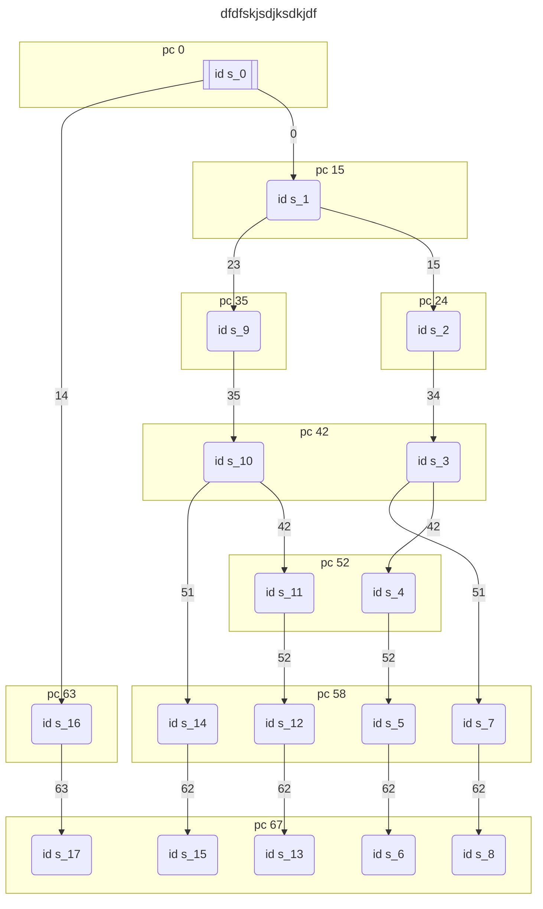
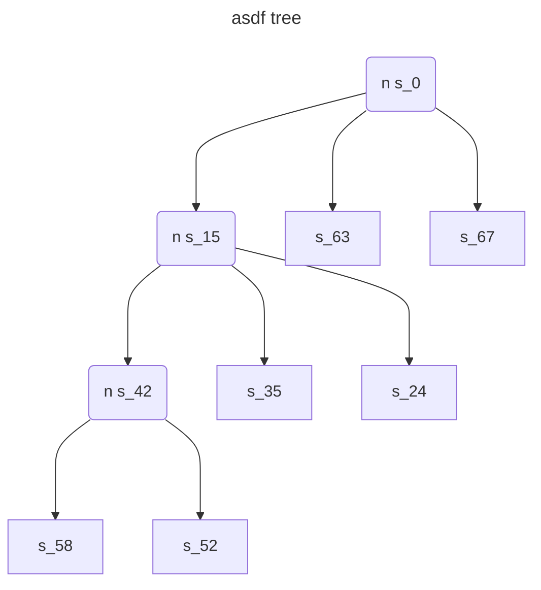

```mermaid states ::forks > nested-if-else-dif-stacks
---
title: dfdfskjsdjksdkjdf
---
flowchart TD
  classDef state text-align:left
  subgraph block_0 ["pc 0"]
    s_0[["id s_0"]]
    class s_0 state
  end
  subgraph block_15 ["pc 15"]
    s_1("id s_1")
    class s_1 state
  end
  subgraph block_24 ["pc 24"]
    s_2("id s_2")
    class s_2 state
  end
  subgraph block_42 ["pc 42"]
    s_3("id s_3")
    class s_3 state
    s_10("id s_10")
    class s_10 state
  end
  subgraph block_52 ["pc 52"]
    s_4("id s_4")
    class s_4 state
    s_11("id s_11")
    class s_11 state
  end
  subgraph block_58 ["pc 58"]
    s_5("id s_5")
    class s_5 state
    s_7("id s_7")
    class s_7 state
    s_12("id s_12")
    class s_12 state
    s_14("id s_14")
    class s_14 state
  end
  subgraph block_67 ["pc 67"]
    s_6("id s_6")
    class s_6 state
    s_8("id s_8")
    class s_8 state
    s_13("id s_13")
    class s_13 state
    s_15("id s_15")
    class s_15 state
    s_17("id s_17")
    class s_17 state
  end
  subgraph block_35 ["pc 35"]
    s_9("id s_9")
    class s_9 state
  end
  subgraph block_63 ["pc 63"]
    s_16("id s_16")
    class s_16 state
  end
  s_0 --14--> s_16
  s_0 --0--> s_1
  s_1 --23--> s_9
  s_1 --15--> s_2
  s_2 --34--> s_3
  s_3 --51--> s_7
  s_3 --42--> s_4
  s_10 --51--> s_14
  s_10 --42--> s_11
  s_4 --52--> s_5
  s_11 --52--> s_12
  s_5 --62--> s_6
  s_7 --62--> s_8
  s_12 --62--> s_13
  s_14 --62--> s_15
  s_9 --35--> s_10
  s_16 --63--> s_17

```

```mermaid tree ::forks > nested-if-else-dif-stacks
---
title: asdf tree
---
flowchart TD
  classDef state text-align:left
    s_0("n s_0")
    s_15("n s_15")
    s_42("n s_42")
  s_0 ---> s_63
  s_0 ---> s_15
  s_0 ---> s_67
  s_15 ---> s_35
  s_15 ---> s_24
  s_15 ---> s_42
  s_42 ---> s_58
  s_42 ---> s_52

```
